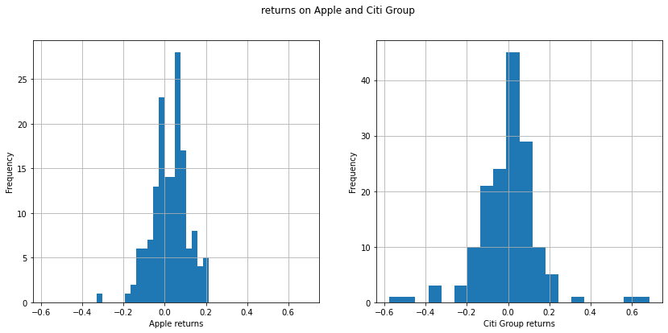
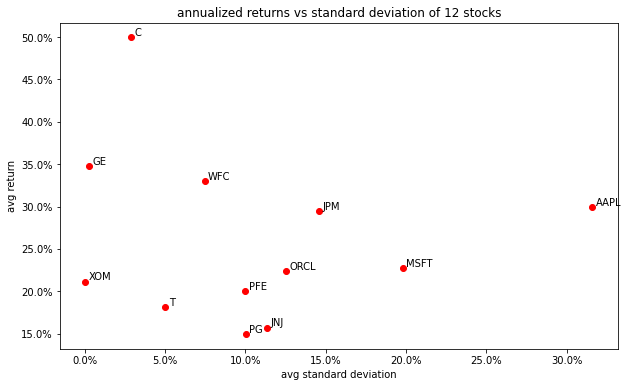

<style TYPE="text/css">
code.has-jax {font: inherit; font-size: 200%; background: inherit; border: inherit;}
</style>
<script type="text/x-mathjax-config">
MathJax.Hub.Config({
    tex2jax: {
        inlineMath: [['$','$'], ['\\(','\\)']],
         chtml: {
            scale: 1.3
        },
        svg: {
            scale: 1.3
        },
        skipTags: ['script', 'noscript', 'style', 'textarea', 'pre'] // removed 'code' entry
    }
});
MathJax.Hub.Queue(function() {
    var all = MathJax.Hub.getAllJax(), i;
    for(i = 0; i < all.length; i += 1) {
        all[i].SourceElement().parentNode.className += ' has-jax';
    }
});
</script>
<script type="text/javascript" src="https://cdnjs.cloudflare.com/ajax/libs/mathjax/2.7.4/MathJax.js?config=TeX-AMS_HTML-full"></script>

Under construction.

---

First we load the data from yahoo, we use yfinance to do so. In tickers we specify which stocks to load, start and end simply denotes the time window we are interested in, in our case we chose a twelwe-year period between 2008 and 2020. The parameter interval is set to 1m , this will load one data point in each month (the first business day of each month), for twelve years it is 156 data points per stock. We are only interested in the closing price after adjustments so we take the columns Adjusted Close from our dataframe.

```python
from functools import partial
import matplotlib.pyplot as plt
import matplotlib.ticker as mtick
import numpy as np
import pandas as pd
from scipy import optimize
import yfinance as yf

tickers = ['aapl', 'jnj', 'jpm', 'pg', 'xom', 'pfe', 'msft', 't', 'c', 'orcl', 'ge', 'wfc']
df = yf.download(tickers, data_source='yahoo', start='2008-01-01', end='2020-12-31', interval='1mo')['Adj Close'].dropna()
stocks = [t.upper() for t in tickers]

```

We can calculate the monthly realized returns with the formula $\huge{R_{t+1}=\frac{P_{t+1}}{P_{t}} - 1}$. If we invest in a stock at time t and the quantity $\huge{R_{t+1}}$ is bigger than 0, then we made a profit and the return on our investment is $\huge{R_{t+1}}$ percent. Now we can approximate the annualized return by $\huge{R_{annual} =12 \overline{R}_{monthly} }$, where $\huge{\overline{R}}$ denotes the average realized return. Now we have one quantity for each stock, which tells us based on historical data how well did that stock performed on average. 
    
```python
returns = df / df.shift(1) - 1
annualized_mean = returns.mean() * 12
```
    
If we look at the returns of *1* and *2* we see that the returns of *1* is not that spread out as the return on *2*, which we could win more if investing in *2*, but there is a bigger chance of getting negative returns as well. 

```python
f, ax = plt.subplots(1,2, figsize=(14, 6),sharex=True)
f.suptitle('returns on Apple and Citi Group')
ax[0].set(ylabel='Frequency', xlabel='Apple returns')
ax[1].set(ylabel='Frequency', xlabel='Citi Group returns')
returns['AAPL'].hist(ax=ax[0], bins=20)
returns['C'].hist(ax=ax[1], bins=20)
```



This property of an investment called the risk and measured by the standard deviation of the underlying random variable. We again use the empirical distribution of the realized returns to estimate the variance 
<center>
 $$\huge{\sigma_{monthly}=\frac{1}{T-1}\sum_{t=1}^T (R_t-\overline{R})^2}$$
</center>
where $\huge{\overline{R}}$ denotes the average realized return. To convert it to annualized value we multiply it by $\huge{\sqrt{12}\sigma_{monthly}}$.
    
```python
std = returns.std()
annualized_std = std*np.sqrt(12)
```
We can visualize the results on a scatterplot
    
```python    
f, ax = plt.subplots(1, figsize=(10,6))
ax.set(xlabel='avg standard deviation', ylabel='avg return', title='annualized returns vs standard deviation of 12 stocks')
ax.scatter(y=annualized_std*100, x=annualized_mean*100, color='red')

for i, idx in enumerate(annualized_std.index):
    ax.annotate(idx, (annualized_mean[i]*100 + 0.2, annualized_std[i]*100 + 0.2))

#setting the axes to %
ax.yaxis.set_major_formatter(mtick.PercentFormatter())
ax.xaxis.set_major_formatter(mtick.PercentFormatter())
```
    



TODO: introducing portfolio weights

<center>
    $$\huge{\min_w w^T \Sigma w \\
    w.r.t. \mu_0 = w^T \mu ~~~ 1 = \mathbb{1}^T w$}$$
</center>

```python
def weight_cons(w):
    """the weights of our portfolio should be equal to 1"""
    return w.sum() -1 

def expected_return_cons(w, returns, target):
    """the expected return of our portfolio should be equal to 'target'"""
    return w.T @ returns - target

def minimize_volatility(w):
    """we wish to minimize the volatility of our portfolio, using the covariance matrix"""
    return w.T @ Sigma @ w

# if short sales are NOT allowed the parameters should be in tha range (0, \infty)
no_short_sale = [(0, None) for _ in range(12)]
```
