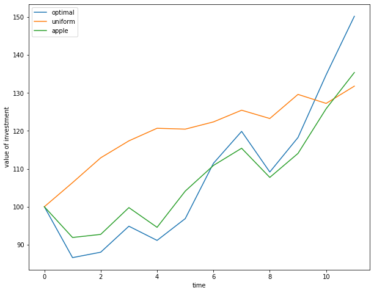

<style TYPE="text/css">
code.has-jax {font: inherit; font-size: 200%; background: inherit; border: inherit;}
</style>
<script type="text/x-mathjax-config">
MathJax.Hub.Config({
    tex2jax: {
        inlineMath: [['$','$'], ['\\(','\\)']],
         chtml: {
            scale: 1.3
        },
        svg: {
            scale: 1.3
        },
        skipTags: ['script', 'noscript', 'style', 'textarea', 'pre'] // removed 'code' entry
    }
});
MathJax.Hub.Queue(function() {
    var all = MathJax.Hub.getAllJax(), i;
    for(i = 0; i < all.length; i += 1) {
        all[i].SourceElement().parentNode.className += ' has-jax';
    }
});
</script>
<script type="text/javascript" src="https://cdnjs.cloudflare.com/ajax/libs/mathjax/2.7.4/MathJax.js?config=TeX-AMS_HTML-full"></script>

    
This assignment was made as part of the course [FIN-401 Introduction to Finance](https://edu.epfl.ch/coursebook/en/introduction-to-finance-FIN-401) at EPFL (fall 2021). You can read more about risk and return in Corporate Finance (Berk & DeMarzo).


---

First we load the data from yahoo, we use yfinance to do so. In tickers we specify which stocks to load, start and end simply denotes the time window we are interested in, in our case we chose a twelve-year period between 2008 and 2020. The parameter interval is set to 1m , this will load one data point in each month (the first business day of each month), for twelve years it is 156 data points per stock. We are only interested in the closing price after adjustments so we take the columns Adjusted Close from our dataframe.

```python
from functools import partial
import matplotlib.pyplot as plt
import matplotlib.ticker as mtick
import numpy as np
import pandas as pd
from scipy import optimize
import yfinance as yf
```
    
```python
tickers = ['aapl', 'jnj', 'jpm', 'pg', 'xom', 'pfe', 'msft', 't', 'c', 'orcl', 'ge', 'wfc']
df = yf.download(tickers, data_source='yahoo', start='2008-01-01', end='2020-12-31', interval='1mo')['Adj Close'].dropna()
stocks = [t.upper() for t in tickers]
```

We can calculate the monthly realized returns with the formula $\huge{R_{t+1}=\frac{P_{t+1}}{P_{t}} - 1}$. If we invest in a stock at time t and the quantity $\huge{R_{t+1}}$ is bigger than 0, then we made a profit and the return on our investment is $\huge{R_{t+1}}$ percent. Now we can approximate the annualized return by $\huge{R_{annual} =12 \overline{R}_{monthly} }$, where $\huge{\overline{R}}$ denotes the average realized return. Now we have one quantity for each stock, which tells us based on historical data how well did that stock performed on average. 
    
```python
returns = df / df.shift(1) - 1
annualized_mean = returns.mean() * 12
```
    
If we look at the returns of Apple and Citi Group we see that the returns on Apple are not that spread out as the returns on Citi Group stocks. If investing in Citi Group we might het higher return, but there is a bigger chance of getting negative returns as well. 

```python
f, ax = plt.subplots(1,2, figsize=(14, 6),sharex=True)
f.suptitle('returns on Apple and Citi Group')
ax[0].set(ylabel='Frequency', xlabel='Apple returns')
ax[1].set(ylabel='Frequency', xlabel='Citi Group returns')
returns['AAPL'].hist(ax=ax[0], bins=20)
returns['C'].hist(ax=ax[1], bins=20)
```


This property of an investment called the risk and measured by the standard deviation of the underlying random variable. We again use the empirical distribution of the realized returns to estimate the variance 
<center>
 $$\huge{\sigma_{monthly}=\frac{1}{T-1}\sum_{t=1}^T (R_t-\overline{R})^2}$$
</center>
where $\huge{\overline{R}}$ denotes the average realized return. To convert it to annualized value we multiply it by $\huge{\sqrt{12}\sigma_{monthly}}$.
    
```python
std = returns.std()
annualized_std = std*np.sqrt(12)
```
We can visualize the results on a scatterplot
    
```python    
f, ax = plt.subplots(1, figsize=(10,6))
ax.set(xlabel='avg standard deviation', ylabel='avg return', title='annualized returns vs standard deviation of 12 stocks')
ax.scatter(y=annualized_std*100, x=annualized_mean*100, color='red')

for i, idx in enumerate(annualized_std.index):
    ax.annotate(idx, (annualized_mean[i]*100 + 0.2, annualized_std[i]*100 + 0.2))

#setting the axes to %
ax.yaxis.set_major_formatter(mtick.PercentFormatter())
ax.xaxis.set_major_formatter(mtick.PercentFormatter())
```
    


From the stocks above we can construct a portfolio, by deciding the the fraction of the total investment in
the portfolio held in each individual stock. This $\huge{w\in\mathbb{R}^{12}}$ will determine our investment strategy. Note that our weights can be negative as well, this correspond to short selling. For a given weight vector, we can determine the the expected return of the portfolio, which is the weighted average of the returns
<center>
 $$\huge{R_p=\sum_{i}w_i R_i = w^T\mu}$$.
</center>
For example we could construct the uniform portfolio, which means we invest $$\huge{\frac{1}{12}}$$ of our money in each stock. Our goal is to determine the best possible allocation of our money. For this we will revisit the notion of risk. We need to know the degree to which the stocks face common risks and their returns move together. We can estimate the covariance from historical data with
<center>
    $$\huge{Cov(R_i,R_j)=\frac{1}{T-1}\sum_{t=1}^T (R_{i,t}-\overline{R_i})(R_{j,t}-\overline{R_j})}$$
</center>
Finally, we derive a formula for estimating the risk for a weighted portfolio
<center>
    $$\huge{Var(R_p)=Cov(R_p,R_p)=Cov(\sum_{i}w_i R_i, \sum_{j}w_j R_j)= \sum_{i,j} w_i Cov(R_i,R_j) w_j = w^T \Sigma w}$$.
</center>
So we can formalize our goal as a quadratic optimization problem. For a determined desired return we wish to minimize the risk of our investment by choosing our portfolio weight vectors optimally. 
<center>
    $$\huge{\min_w w^T \Sigma w \\
    w.r.t. ~~~ \mu_0 = w^T \mu ~~~ 1 = 1^T w}$$
</center>
If we allow short sales a constraint should be added $\huge{w \geq 0}$. Now we can move on and calculate the covariance matrix for our data.

```python
Sigma = returns.cov() * 12
```
We will use the *optimize* function from scipy package. This needs the objective function and the constraints as inputs, which we define below.

```python
def weight_cons(w):
    """the weights of our portfolio should be equal to 1"""
    return w.sum() - 1 

def expected_return_cons(w, returns, target):
    """the expected return of our portfolio should be equal to 'target'"""
    return w.T @ returns - target

def minimize_volatility(w):
    """we wish to minimize the volatility of our portfolio, using the covariance matrix"""
    return w.T @ Sigma @ w

# if short sales are NOT allowed the parameters should be in tha range (0, \infty)
no_short_sale = [(0, None) for _ in range(12)]
```

Now we choose the desired returns, and save the results in a dataframe called optimals.

```python
target_returns = [0.05, 0.09, 0.11, 0.13, 0.15, 0.20, 0.25, 0.30]

optimal_volatilities = []
optimal_weights = []
shorts_sales_allowed = []

weights = 1/12 * np.ones(12) #initialize weights

for target in target_returns:
    # define constraints and objective
    return_cons = partial(expected_return_cons, returns=annualized_mean, target=target)
    cons = [{'type':'eq', 'fun': weight_cons}, {'type':'eq', 'fun': return_cons}]

    #optimize without short sales
    res = optimize.minimize(fun=minimize_volatility, x0=weights ,constraints=cons ,method='SLSQP', bounds=no_short_sale)
    optimal_volatilities.append(res.fun)
    optimal_weights.append(res.x)
    shorts_sales_allowed.append(0)

    #optimize with short sales
    res = optimize.minimize(fun=minimize_volatility, x0=weights ,constraints=cons ,method='SLSQP')
    optimal_volatilities.append(res.fun)
    optimal_weights.append(res.x)
    shorts_sales_allowed.append(1)

#save results
optimals = pd.DataFrame(data=optimal_weights, columns=stocks)
optimals['volatility'] = np.sqrt(optimal_volatilities)
optimals['short_sales_allowed'] = shorts_sales_allowed
optimals['target_returns'] = list(np.repeat(target_returns, 2))
```

We plot the results in the same scatterplot fashion as we did before. We see that the optimal portfolios lie on a parabola called the efficient frontier. These portfolios offer the highest expected return for a given level of volatility.

```python
f, ax = plt.subplots(1, figsize=(10,6))

f.suptitle('optimal portfolio')
ax.set_xlabel('avg volatility')
ax.set_ylabel('avg return')

sns.scatterplot(
    y=optimals[optimals['short_sales_allowed'] == 1]['target_returns']*100, x=optimals[optimals['short_sales_allowed'] == 1]['volatility']*100, 
    ax=ax,
     color='red', 
     label='with short sales')
sns.scatterplot(
    y=optimals[optimals['short_sales_allowed'] == 0]['target_returns']*100, x=optimals[optimals['short_sales_allowed'] == 0]['volatility']*100, 
    ax=ax, 
    color='green', 
    label='without short sales')

sns.scatterplot(
    y=annualized_mean*100, x=annualized_std*100, 
    ax=ax, 
    color='blue', 
    label='individual stocks')

ax.yaxis.set_major_formatter(mtick.PercentFormatter())
ax.xaxis.set_major_formatter(mtick.PercentFormatter())
```


We can observe the weights of the resulting portfolio with a target return of 5%.

```python
f, ax = plt.subplots(nrows=1, ncols=1, figsize=(10,8))
ax.set(title='optimal portfolio weights for mu_0=0.05', ylabel='weight', xlabel='stocks')
optimals_05 = optimals[optimals.index.isin([0,1])].T[:12]
sns.barplot(x=optimals_05.index, y=optimals_05[1], color='blue', label='with short sales',ax=ax)
```


Finally let's play a bit. Suppose we try out our investment strategy and evaluate our constructed portfolio on the 2021 data. Similarly we can download the monthly adjusted closed prices from yahoo using yfinance. Again we can calculate the returns on the individual stocks, with two additional changes: firstly we do not subtract one from the returns so a 10% return will be present as 1.1 in our dataframe, second we also set the returns on the first month equal to one. In this way it will be easier to accumulate the returns.  

```python
tickers = ['aapl', 'jnj', 'jpm', 'pg', 'xom', 'pfe', 'msft', 't', 'c', 'orcl', 'ge', 'wfc']
df = yf.download(tickers, data_source='yahoo', start='2021-01-01', end='2021-12-31', interval='1mo')['Adj Close'].dropna()
stocks = [t.upper() for t in tickers]
returns = df / df.shift(1) 
returns = returns.fillna(1)
```

The question is now how can we calculate for a given weight vector $\huge{w}$ the returns in each month. For that we will accumulate the returns on the stocks, such that $\huge{R_{ij} = (1+R_i,1)(1+R_i,2)\ldots(1+R_i,j)}$. This gives us tha matrix $\huge{R}. We can calculate the monthly return for a given portfolio choice with the matrix multiplication $\huge{Rw}$.

```python
R = returns.cumprod().to_numpy()
```

We will evaluate three different portfolio choices. First we evaluate the optimal portfolio with short sales for a target return of 30%. We also check the uniform portfolio, which corresponds to a $\huge{\frac{1}{12}}$ weight to each stock. We can also check what happens if we invest only in the most profitable stock on its own, Apple. This corresponds to the vector $\huge{(1,0,\ldots,0)}$.

```python
w = optimals[(optimals['short_sales_allowed'] == 1) & (optimals['target_returns'] == 0.3)][stocks].to_numpy()
w_uniform = np.ones(12) / 12

w_apple = np.zeros(12)
w_apple[0] = 1
```

We evaluate the performances and plot the results. It seems that we are lucky and the optimal portfolio indeed outperformes both Apple and the uniform portfolio.

```python
f, ax = plt.subplots(nrows=1, ncols=1, figsize=(10,8))
ax.plot((R @ w.T * 100), label='optimal')
ax.plot((R @ w_uniform.T * 100), label='uniform')
ax.plot((R @ w_apple.T * 100), label='apple')
ax.set(ylabel='value of investment', xlabel='time')
ax.legend()
```

