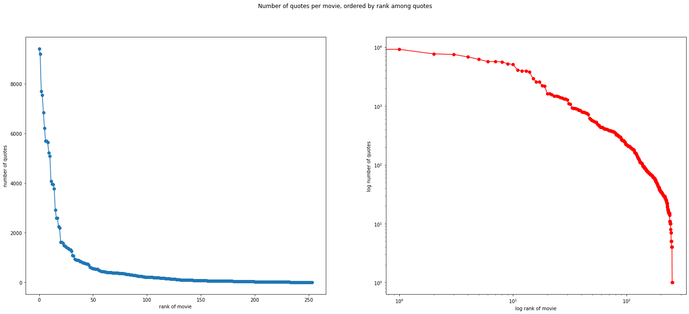
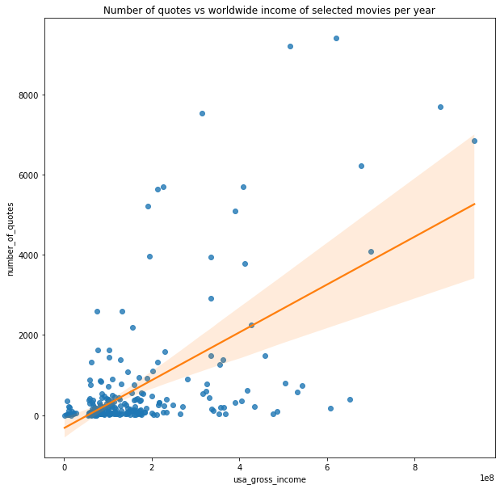
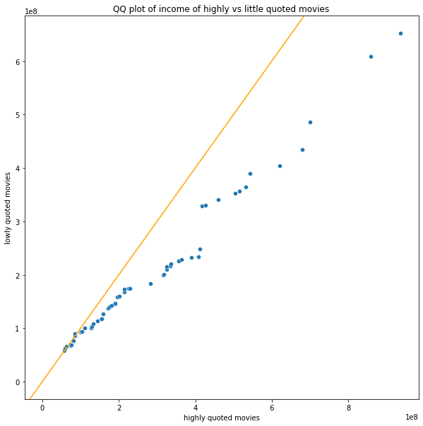
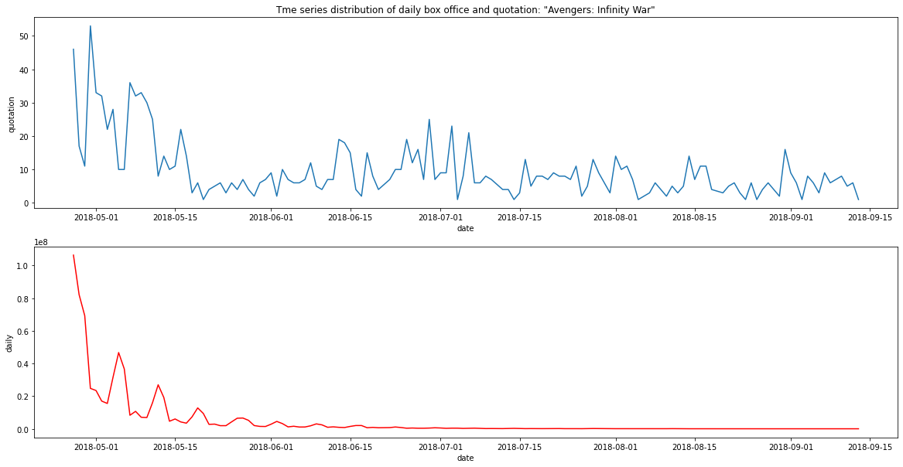
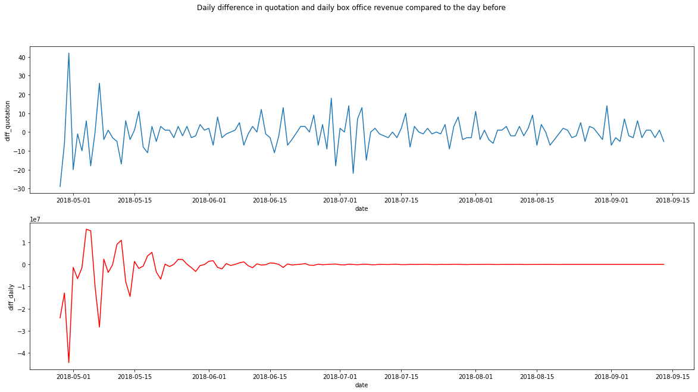
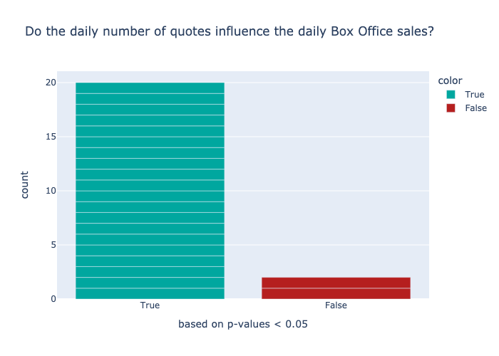

   
UNDER CONSTRUCTION!

This data story was made as part of the course [CS-401 Applied Data Analysis](https://dlab.epfl.ch/teaching/fall2021/cs401/) at EPFL (fall 2021). 
We investigated the correlation between quotes about movies made by people in news articles, IMDB rating and movie box office revenue. We would like to acredit the authors of [Quotebank](https://dlab.epfl.ch/people/west/pub/Vaucher-Spitz-Catasta-West_WSDM-21.pdf), the [IMDb data set](https://www.kaggle.com/stefanoleone992/imdb-extensive-dataset?select=IMDb+ratings.csv), [Box Office Mojo](https://www.boxofficemojo.com/daily/) and [WikiData](https://www.wikidata.org/wiki/Wikidata:Main_Page).
    
This markdown file contains a summary of our analysis of the quotes and movies. I left out some part of our work to make this post easier to read. If you are interested in the preprocessing, sentiment analysis and our full report, feel free to check out the project on <a href="https://github.com/hbenedek/ada-2021-project-f-jab">Github</a> and read the <a href="https://albertkjoller.github.io/QuotesNMovies/">data story</a>.
    
Special thanks to my teammates: Albert Kjøller Jacobsen, Felix Borum Burmester & Julian Schnitzler. I learned a lof from them and it was really fun to work on this project!

TODO:
- fix latex parts
- write introduction on the project
- fix plots and notebook outputs
- fix dataframe outputs

---

# Table of Contents
* [RQ1: Relation between Box Office sales and number of quotes of a movie](#chapter1) 
    * [1.1. Linear regression between total number of quotes on a movie and domestic box office revenue](#chapter11)
    * [1.2. Observational study with propensity score matching](#chapter12)
* [RQ2: An Investigation into Time Series Box Office and Quotes in a Few Movies](#chapter2)
    * [2.1. Checking correlation and Granger causality](#chapter22)
* [RQ3: Sentiment analysis in quotes about movies over time](#chapter3)
    * [3.1 Sentiment and Box Office](#chapter31)
    * [3.2. Sentiment and IMDb - (WIP)](#chapter32)
* [RQ4: Searching for a bias in the data](#chapter4)
    * [4.1. Are quotes in Quotebank regarding movies biased?](#chapter41)
    * [4.2. Bias in Internet Movie Database ratings ](#chapter42)
* [RQ5: The effect of COVID on media coverage of movies](#chapter5)
    * [5.1. Calculate mean number of quotes on movies between 2015-2019 on a daily basis, calculate confidence intervals (bootstrapping), compare with 2020 data](#chapter51)
    * [5.2. Use regression for comparison of the mean number of quotes across movies in covid and non-covid period, use t-test for comparison of means](#chapter52)

  
Quotebank is a dataset of 235 million unique, speaker-attributed quotations that were extracted from 196 million English news articles. 
We wanted to investigate the quotes made on movies and wheter they have some casual effect or correlation with the imdb scores or box office revenues. 
First we used the IMDb dataset to gather 275 relevant movies made in the USA.
Second, we filtered the Quotebank dataset between 2015-2020. We iterated through all the quotes and counted how many quotes contained the title or the subtitle of a given movie. Here are the winners
  
1. Star Wars: Episode VIII - The Last Jedi, 9402
2. Star Wars: Episode IX - The Rise of Skywalker, 9197
3. Avengers: Endgame, 7692
4. Thor: Ragnarok, 7537
5. Star Wars: Episode VII - The Force Awakens, 6837
6. Avengers: Infinity War, 6215
  

Now we are ready to apply some models to our data and find answers to our questions.
    
# RQ1 Relation between Box Office sales and number of quotes of a movie 
## Is there a tendency between number of sold tickets and the 'hype' about a movie as it appears in the news paper media?

For this question, we will only consider the total number of quotes on a movie found in the Quotebank dataset. We start with the IMDb movie dataset and filter out the top 50 movies in terms of *usa_gross_income*. Then we filter the Quotebank dataset on the titles of these movies and count the occurences.

## Proposed method: 
## 1.1 Linear regression between total number of quotes on a movie and domestic box office revenue 

We run a linear regression to investigate whether more popular movies tend to have higher media coverage or not. We use statsmodels ols function to do so.

                                OLS Regression Results                            
    ==============================================================================
    Dep. Variable:       usa_gross_income   R-squared:                       0.345
    Model:                            OLS   Adj. R-squared:                  0.342
    Method:                 Least Squares   F-statistic:                     132.6
    Date:                Fri, 17 Dec 2021   Prob (F-statistic):           6.25e-25
    Time:                        18:31:26   Log-Likelihood:                -5081.7
    No. Observations:                 254   AIC:                         1.017e+04
    Df Residuals:                     252   BIC:                         1.017e+04
    Df Model:                           1                                         
    Covariance Type:            nonrobust                                         
    ====================================================================================
                           coef    std err          t      P>|t|      [0.025      0.975]
    ------------------------------------------------------------------------------------
    Intercept         1.242e+08   8.12e+06     15.299      0.000    1.08e+08     1.4e+08
    number_of_quotes  5.787e+04   5025.890     11.515      0.000     4.8e+04    6.78e+04
    ==============================================================================
    Omnibus:                       90.719   Durbin-Watson:                   0.866
    Prob(Omnibus):                  0.000   Jarque-Bera (JB):              238.822
    Skew:                           1.643   Prob(JB):                     1.38e-52
    Kurtosis:                       6.430   Cond. No.                     1.76e+03
    ==============================================================================
    
    Notes:
    [1] Standard Errors assume that the covariance matrix of the errors is correctly specified.
    [2] The condition number is large, 1.76e+03. This might indicate that there are
    strong multicollinearity or other numerical problems.

We can conclude that the predictor *number_of_quotes* is indeed significant, since its small p-value. So in general the more successful a movie, the more media coverage it gets. We plot the result on a scatterplot and we can observe that indeed the *number_of_quotes* is a good predictor, it does not really 'explain' tha data itself.

    

    
---
    
## 1.2. Observational study with propensity score matching 

Now we move on to propensity score matching approach. The idea is to try to answer the question if highly quoted movies will have in general more box office revenue or not. We do this by creating two groups: highly quoted and lowely quoted movies, by a threshold of 500 quotes. There will be far more movies below 500 uotes as we seen from the first plot. So we have to somehow balance out our dataset. That's where propensity score matching helps us. It will map all movies based on attributes from the IMDb dataset to a real number. We will use this weight to balance out the two datasets, discarding irrelevant movies. We will make our final analysis on the banaced dataset.
    
We calculate the propensity score with logistic regression, based on movie attributes on IMDb data on little quoted vs highly quote movies and compare the results with the box office data. We will add the following features from the IMDb dataset: *avg_vote*, *budget*, *duration*, *metascore*, *votes*. We could create a *genres* one hot feature as well if we want. We want to study whether the number of quotes on a movie will have an effect on its performance in the box office, so we will regress the categorical variable highly_quoted against covariates from the IMDb dataset. Note, that we do not include usa_gross_income as covariate, since this is our target variable, in the end we are interested in the effect on this variabe. 
    
Based on the propensity score we calculate the similarity between the two gropus and make a bipartite graph. The edge weight between two nodes are the similarity scores. We want to find a maximal weight matching between the two groups (highly_quoted and lowly_quoted). The matching is found using the Hungarian algorithm.
Now we have a matching, it’s time to check the means and the distributions of our filtered data.
    
 - mean usa gross income on highly quotes moves: 288705109.7,    95%-CI: [236888379.1, 341240220.2] 
 - mean usa gross income on lowly quotes moves: 206249748.6,     95%-CI: [173626216.5, 242641074.4]
    
More quoted movies have higher mean gross income, the confidence intervals point out they do differ significantly, we conclude that quotes have a significant positive effect on the gross income.

    
Finally we investigate if the samples are from the same distribution. We make a QQ plot and a Kolmogorov-Smirnoff test.
    
 - KstestResult(statistic=0.236, pvalue=0.093)
    
    

 
Even though the QQ plot suggest otherwise, we cannot reject the null hypothesis that the two samples came from the same distribution.
    
---

# RQ2: An Investigation into Time Series Box Office and Quotes in a Few Movies 

## 2.1. Checking correlation between distribution of quotes over time and box office time series data 

We should not accumulate the quotes at all. Since we have dates on all the quotations we can build a time series data for each movies: at each day we count the number of quotations on a movie. We have a similar data from Box Office Mojo as well: for each day we can exemine the revenue a movie made in the USA.    
We are interested in whether the time series of quotes and time series of box office relate to each other in some sense. First, we will transform the time series to become stationary. Then we propose two models:
- We fit a VAR (Vector autoregression) model on the data and check the correlation of the residuals.
- We perform a Granger Causality test 

Analysis based on this [blog post](https://towardsdatascience.com/a-quick-introduction-on-granger-causality-testing-for-time-series-analysis-7113dc9420d2).

First, we make a step-by-step tutorial on our approach on the movie **Avengers: Infinity War**. Then we apply the analysis to multiple movies.
We gather the quotes and daily box office data on Avengers and plot them.

    
We will transform our time series with the difference method to become stationary. Time difference method simply takes into account the change between consecutive observations in the original series, it can be used to remove the series dependence on time, so-called temporal dependence.
 

    
We will use the VAR model fist (Vector autoregression). The VAR class assumes that the passed time series are stationary.

A VAR model describes the evolution of a set of k variables, over time. The variables are collected in a vector, $\huge{y_t}$, which is of length k. The vector is modelled as a linear function of its previous value. The last term is the error term. $\huge{y_t=A_1 y_{t−1}+A_2 y_{t−2}+\ldots + A_p y_{t−p} + \epsilon}$
The hyperparameter of the model is the number of coefficients we use, basically this means how far we are looking into the past. In Time Series analysis this is called the number of lags. We will try models with different lags, The best model will be selected by the minimum AIC score. If we have a model with k parameters, and L is the maximum value of the likelihood function for the model then the AIC score is given by: $\huge{AIC=2k−2log(L)}$.
    
Now we perform a Granger Causality Test. The Granger causality is a statistical hypothesis test for determining whether one time series is useful in forecasting another. We say that a variable $X$ that evolves over time Granger-causes another evolving variable $Y$ if predictions of the value of $Y$ based on its own past values **and** on the past values of $X$ are better than predictions of $Y$ based only on $Y$'s own past values.

Formally let $\mathcal{F}(t)$ be the filtration w.r.t. $X$ and $Y$ and let $\mathcal{G}(t)$ be the sub-filtration w.r.t. only $Y$. ($\mathcal{F}(t)$ has more information than $\mathcal{G}(t)$). We want to test the hypothesis that $\mathcal{P}(Y(t+1)\in A| \mathcal{F}(t)) \neq \mathcal{P}(X(t+1)\in A | \mathcal{G}(t))$ for arbitrary measurable set $A$.

In practise we undertake the following steps:
- fit a VAR model to $Y$, that is $y_t=\sum a_i y_{t-i} + \epsilon$
- fit a second VAR model to $Y$ using the information from $X$ as well $y_t =\sum a_i y_{t-i} + \epsilon + \sum b_j x_{t-j} $
- Test the null hypothesis that the coefficients corresponding to past values of the second time series are zero. (We will use chi2 test to do so, another popular option is to use a series of t and F tests)
- We reject the null hypothesis if there exists a significant predictor, in this case we say that $X$ Granger causes $Y$.
    
We get  p-value: 0.0, so we can reject the null hypothesis and conclude that diff_quotation Granger causes diff_daily.

We can redo our analysis for multiple movies and we plot the results. Ance again, we are interested in whether the daily number of quotes Granger causes the box. office sales.
    

    
 ---

# RQ 3 - Sentiment, Ratings and Box Office  
