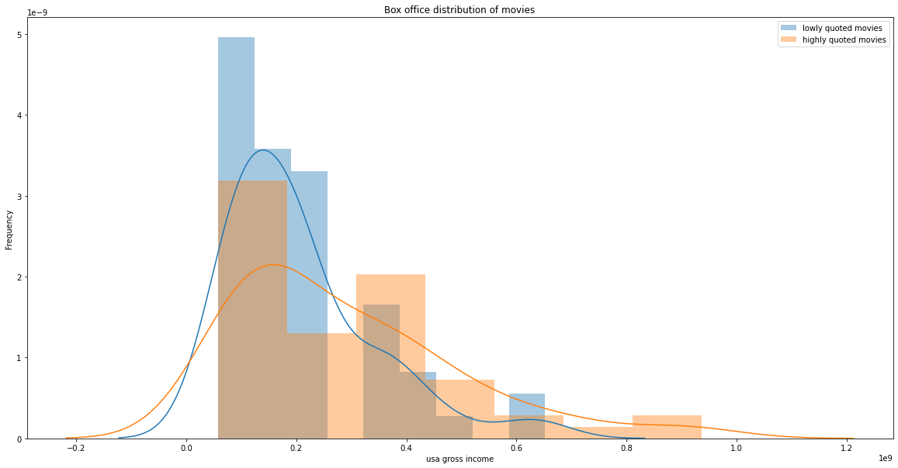

   

This data story was made as part of the course [CS-401 Applied Data Analysis](https://dlab.epfl.ch/teaching/fall2021/cs401/) at EPFL (fall 2021). 
We investigated the correlation between quotes about movies made by people in news articles, IMDB rating and movie box office revenue. We would like to acredit the authors of [Quotebank](https://dlab.epfl.ch/people/west/pub/Vaucher-Spitz-Catasta-West_WSDM-21.pdf), the [IMDb data set](https://www.kaggle.com/stefanoleone992/imdb-extensive-dataset?select=IMDb+ratings.csv), [Box Office Mojo](https://www.boxofficemojo.com/daily/) and [WikiData](https://www.wikidata.org/wiki/Wikidata:Main_Page).
    
This markdown file contains a summary of our analysis of the quotes and movies. If you are interested in the preprocessing, sentiment analysis and our full report, feel free to check out the project on <a href="https://github.com/hbenedek/ada-2021-project-f-jab">Github</a> and read the <a href="https://albertkjoller.github.io/QuotesNMovies/">data story</a>.
    
### Created by Albert Kjøller Jacobsen, Benedek Harsanyi, Felix Borum Burmester & Julian Schnitzler

TODO:
- fix latex parts
- write introduction on the project
- fix plots and notebook outputs
- fix dataframe outputs

---

# Table of Contents
* [RQ1: Relation between Box Office sales and number of quotes of a movie](#chapter1) 
    * [1.1. Linear regression between total number of quotes on a movie and domestic box office revenue](#chapter11)
    * [1.2. Observational study with propensity score matching](#chapter12)
* [RQ2: An Investigation into Time Series Box Office and Quotes in a Few Movies](#chapter2)
    * [2.1. Visualization and Kolmogorov-Smirnov test](#chapter21)
    * [2.2. Checking correlation and Granger causality](#chapter22)
* [RQ3: Sentiment analysis in quotes about movies over time](#chapter3)
    * [3.1 Sentiment and Box Office](#chapter31)
    * [3.2. Sentiment and IMDb - (WIP)](#chapter32)
* [RQ4: Searching for a bias in the data](#chapter4)
    * [4.1. Are quotes in Quotebank regarding movies biased?](#chapter41)
    * [4.2. Bias in Internet Movie Database ratings ](#chapter42)
* [RQ5: The effect of COVID on media coverage of movies](#chapter5)
    * [5.1. Calculate mean number of quotes on movies between 2015-2019 on a daily basis, calculate confidence intervals (bootstrapping), compare with 2020 data](#chapter51)
    * [5.2. Use regression for comparison of the mean number of quotes across movies in covid and non-covid period, use t-test for comparison of means](#chapter52)

  
Quotebank is a dataset of 235 million unique, speaker-attributed quotations that were extracted from 196 million English news articles. 
We wanted to investigate the quotes made on movies and wheter they have some casual effect or correlation with the imdb scores or box office revenues. 
First we used the IMDb dataset to gather 275 relevant movies made in the USA.
Second, we filtered the Quotebank dataset between 2015-2020. We iterated through all the quotes and counted how many quotes contained the title or the subtitle of a given movie. Here are the winners
  
1. Star Wars: Episode VIII - The Last Jedi, 9402
2. Star Wars: Episode IX - The Rise of Skywalker, 9197
3. Avengers: Endgame, 7692
4. Thor: Ragnarok, 7537
5. Star Wars: Episode VII - The Force Awakens, 6837
6. Avengers: Infinity War, 6215
  

Now we are ready to apply some models to our data and find answers to our questions.
    
# RQ1 Relation between Box Office sales and number of quotes of a movie 
## Is there a tendency between number of sold tickets and the 'hype' about a movie as it appears in the news paper media?

For this question, we will only consider the total number of quotes on a movie found in the Quotebank dataset. We start with the IMDb movie dataset and filter out the top 50 movies in terms of *usa_gross_income*. Then we filter the Quotebank dataset on the titles of these movies and count the occurences.

## Proposed method: 
## 1.1 Linear regression between total number of quotes on a movie and domestic box office revenue 

We run a linear regression to investigate whether more popular movies tend to have higher media coverage or not. We use statsmodels ols function to do so.

                                OLS Regression Results                            
    ==============================================================================
    Dep. Variable:       usa_gross_income   R-squared:                       0.345
    Model:                            OLS   Adj. R-squared:                  0.342
    Method:                 Least Squares   F-statistic:                     132.6
    Date:                Fri, 17 Dec 2021   Prob (F-statistic):           6.25e-25
    Time:                        18:31:26   Log-Likelihood:                -5081.7
    No. Observations:                 254   AIC:                         1.017e+04
    Df Residuals:                     252   BIC:                         1.017e+04
    Df Model:                           1                                         
    Covariance Type:            nonrobust                                         
    ====================================================================================
                           coef    std err          t      P>|t|      [0.025      0.975]
    ------------------------------------------------------------------------------------
    Intercept         1.242e+08   8.12e+06     15.299      0.000    1.08e+08     1.4e+08
    number_of_quotes  5.787e+04   5025.890     11.515      0.000     4.8e+04    6.78e+04
    ==============================================================================
    Omnibus:                       90.719   Durbin-Watson:                   0.866
    Prob(Omnibus):                  0.000   Jarque-Bera (JB):              238.822
    Skew:                           1.643   Prob(JB):                     1.38e-52
    Kurtosis:                       6.430   Cond. No.                     1.76e+03
    ==============================================================================
    
    Notes:
    [1] Standard Errors assume that the covariance matrix of the errors is correctly specified.
    [2] The condition number is large, 1.76e+03. This might indicate that there are
    strong multicollinearity or other numerical problems.

We can conclude that the predictor *number_of_quotes* is indeed significant, since its small p-value. So in general the more successful a movie, the more media coverage it gets. We plot the result on a scatterplot and we can observe that indeed the *number_of_quotes* is a good predictor, it does not really 'explain' tha data itself.

    

    
---
    
## 1.2. Observational study with propensity score matching 

Now we move on to propensity score matching approach. The idea is to try to answer the question if highly quoted movies will have in general more box office revenue or not. We do this by creating two groups: highly quoted and lowely quoted movies, by a threshold of 500 quotes. There will be far more movies below 500 uotes as we seen from the first plot. So we have to somehow balance out our dataset. That's where propensity score matching helps us. It will map all movies based on attributes from the IMDb dataset to a real number. We will use this weight to balance out the two datasets, discarding irrelevant movies. We will make our final analysis on the banaced dataset.
    
We calculate the propensity score with logistic regression, based on movie attributes on IMDb data on little quoted vs highly quote movies and compare the results with the box office data. We will add the following features from the IMDb dataset: *avg_vote*, *budget*, *duration*, *metascore*, *votes*. We could create a *genres* one hot feature as well if we want. We want to study whether the number of quotes on a movie will have an effect on its performance in the box office, so we will regress the categorical variable highly_quoted against covariates from the IMDb dataset. Note, that we do not include usa_gross_income as covariate, since this is our target variable, in the end we are interested in the effect on this variabe. 
    
Based on the propensity score we calculate the similarity between the two gropus and make a bipartite graph. The edge weight between two nodes are the similarity scores. We want to find a maximal weight matching between the two groups (highly_quoted and lowly_quoted). The matching is found using the Hungarian algorithm.
Now we have a matching, it’s time to check the means and the distributions of our filtered data.
    
 - mean usa gross income on highly quotes moves: 288705109.7,    95%-CI: [236888379.1, 341240220.2] 
 - mean usa gross income on lowly quotes moves: 206249748.6,     95%-CI: [173626216.5, 242641074.4]
    
More quoted movies have higher mean gross income, the confidence intervals point out they do differ significantly, we conclude that quotes have a significant positive effect on the gross income.

    
Finally we investigate if the samples are from the same distribution. We make a QQ plot and a Kolmogorov-Smirnoff test.
    
 - KstestResult(statistic=0.236, pvalue=0.093)
    
    

 
Even though the QQ plot suggest otherwise, we cannot reject the null hypothesis that the two samples came from the same distribution.
