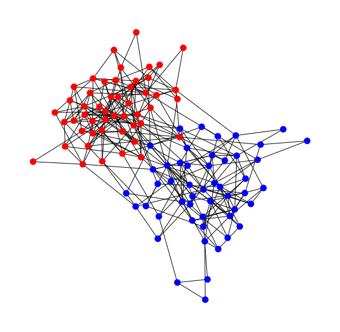
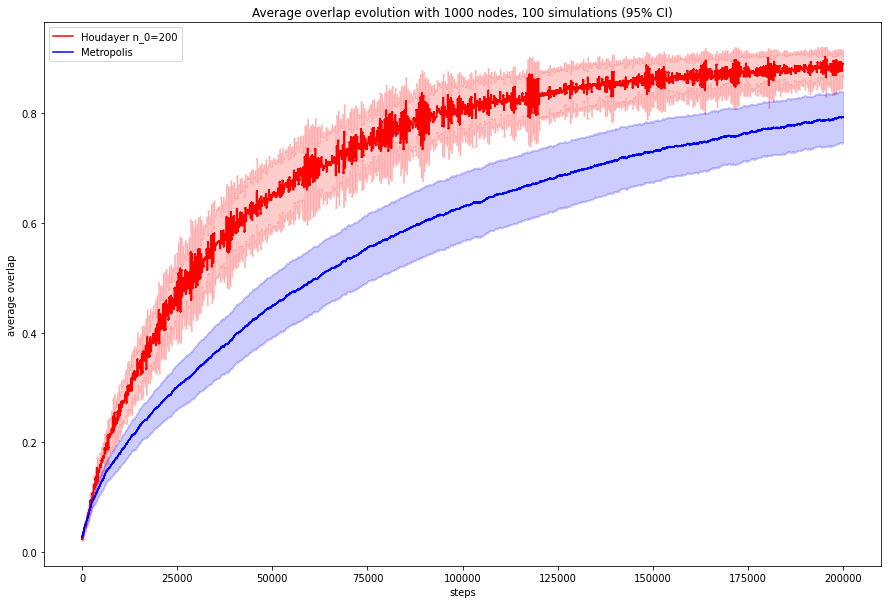

<style TYPE="text/css">
code.has-jax {font: inherit; font-size: 100%; background: inherit; border: inherit;}
</style>
<script type="text/x-mathjax-config">
MathJax.Hub.Config({
    tex2jax: {
        inlineMath: [['$','$'], ['\\(','\\)']],
        skipTags: ['script', 'noscript', 'style', 'textarea', 'pre'] // removed 'code' entry
    }
});
MathJax.Hub.Queue(function() {
    var all = MathJax.Hub.getAllJax(), i;
    for(i = 0; i < all.length; i += 1) {
        all[i].SourceElement().parentNode.className += ' has-jax';
    }
});
</script>
<script type="text/javascript" src="https://cdnjs.cloudflare.com/ajax/libs/mathjax/2.7.4/MathJax.js?config=TeX-AMS_HTML-full"></script>

Under construction!    
    
This project was part of the course [COM-516 Markov Chains and Algorithmic Applications](https://edu.epfl.ch/coursebook/en/markov-chains-and-algorithmic-applications-COM-516) at EPFL fall 2021. We aimed to apply variants of the Metroplois-Hasting algorithm to one of the simplest models of the community detection problem (Stochastic Block Model) and to compute the perforemence and properties of these methods.

Check out the project on [Github](https://github.com/hbenedek/mcmc-community-detection). Special thanks to my teammates Daniel Suter and Guilhem Sicard.

    
TODO:
    - include image of example graph
    - fix latex
 
---
 
# Problem formulation and the Stochastic Block Model

We assume we are given an observation graph $\huge{G=(V, E)}$ and we aim to revocer two communities, that is we are looking for a vector $\huge{x^*\in \\{-1,1\\}^{\lvert V \rvert}}$. We use the [Stochastic Block Model](https://en.wikipedia.org/wiki/Stochastic_block_model) to explain how the graph was generated. First each node is assigned to one of the communities with $\huge{\frac{1}{2}}$ probability, if the number of nodes is large enough, the two communities are similar in size. Then we generate edges between the nodes $\huge{i}$ and $\huge{j}$ with the probabilities   
    <center>
    $$\huge{\mathbb{P}(e_{ij}\in E| x^*_i x^*_j = +1 )=\frac{a}{N} \\
    \mathbb{P}(e_{ij}\in E| x^*_ix^*_j = -1)=\frac{b}{N}}$$ 
    </center>
where $\huge{a}$ and $\huge{b}$ are real numbers.

<center>
    
    <figcaption>Randomly generated SBM graph with 100 nodes, a=10 and b=1 </figcaption>
</center>

We can generate such graph using the networkx package

```python     
def generate_sbm_graph(size_1, size_2, a, b):
    sizes = [size_1, size_2]
    N = sum(sizes)
    probes = [[a / N, b / N], [b / N, a / N]]
    return nx.generators.community.stochastic_block_model(sizes, probes)
    
def networkx_to_adjacency(G):
    return nx.linalg.graphmatrix.adjacency_matrix(G)
```
    
We will follow a Bayesian approach for our model, that is we will derive the posterior distribution of the community vectors given the edges in our graph
    <center>
    $$\huge{\mathbb{P}(x| E) = \frac{\mathbb{P}(E |x)\mathbb{P}(x)}{\mathbb{P}(E)}} = \frac{\prod_{i,j}\mathbb{P}(e_{ij}|x_i x_j)\prod_i \mathbb{P}(x_i)}{\sum_{x }\prod_{i,j} \mathbb{P}(e_{ij}|x_i x_j)\prod_i \mathbb{P}(x_i)}$$
    </center>
Plugging in the probabilities for the edges and doing some algebraic manipulation we can arrive at the expression
    <center>
        $$\huge{\mathbb{P}(x| E) =\frac{\prod_{i,j} exp(h_{ij} x_i x_j)}{\sum_{x}\prod_{i,j} exp(h_{ij} x_i x_j)}}$$
    </center>
where $\huge{h_{ij}}$ is the energy between two nodes.

We can store the energy in a modified adjacency matrix.
    
```python
def adjacency_to_h(A, N, a, b):
    h = np.zeros((N, N))
    h[A==1] = np.log(a) - np.log(b)
    h[A==0] = np.log(1 - a / N) - np.log(1 - b / N)
    return h    
```
    
Now our goal is to sample from this distribution and estimate the communities as the empirical mean of the samples.
    
We need some metrics, loss function to evaluate our estimates. We define the quantity, called overlap, which counts the number of nodes, for which we predicted the community correctly. We add an absolute value to the overlap function, since we cannot differenciate the two communities. We are interested in only finding the communities and not their values.
    <center>
        $$\huge{q = \frac{1}{\lvert V \rvert} \left\lvert \sum_{i=1}^{\lvert V \rvert} x_i x_i^* \right\rvert} $$
        </center>
Here $$\huge{x^*}$$ denotes the true communities, while $$\huge{x}$$ refers to our current estimation. It can be seen, that $$\huge{q} \in [0, 1]$$. If our estimator is perfect $$\huge{q=1}$$, while $$\huge{q=0}$$ means our prediction is totally random. Note that because of the absolute value, if our prediction is exactly the opposite of $$\huge{x^*}$$, our overlap is still one.
    
# Monte Carlo approach
 
This distribution is really hard to sample from, since it requires to calculate the denominator which ranges over all possible graph colorings. We will ust the [Metropolis-Hastings algorithm](https://en.wikipedia.org/wiki/Metropolis%E2%80%93Hastings_algorithm) to overcome this difficulty. The algorithm performs random walks on the space of colorings: at each step we choose a node randomly and recolor it with some acceptance probabilities, we let the walker evolve for a long time. After simulating various walks, we take the empirical average of the results to get our estimators. But how do we contstruct the acceptance probabilities? We chose them such that the limiting distribution of our chain will be our desired posterior ditribution. 

For one iteration of the algorithm, we store our estimate and the overlap in a result object. 

```python     
class Result():
    def __init__(self, name):
        self.name = name
        self.overlaps1 = []
        self.overlaps2 = []
        self.x = None
```
A possible python implementation can be seen below.
    
```python 
 def metropolis_step(x):
    #propose step
    i = np.random.randint(0, N) 

    #calculate acceptance prob
    acceptance = min(1, np.exp(- x[i] * x @ h[i]))   
    
    if random.random() < acceptance:
        #move on Metropolis chain
        x[i] = - x[i]   
    
 def run_metropolis(max_run, max_iter):
    results = [] # list containing the results of MCMC results
    for run in range(max_run):
        
        result = Result(run) #initialize result object
        x = np.random.choice((-1,1), N) #initial state    

        for iter in range(max_iter):
                                    
            metropolis_step(x)
    
            # save results 
            result.x = x
            results.append(result)

    return results
```
# Houdayer algorithm

We can improve our MCMC algoritmh by making exploration steps from time to time. These steps help us explore the state space more quickly, making sure we do not stuck at local minimums. Such variant is called the [Houdayer cluster move](https://en.wikipedia.org/wiki/Replica_cluster_move) and it operates as follows.
  1. We initialize two configuration vectors $\huge{(x^{(1)}, x^{(2)})}$. 
  2. For every node we compute the local overlap, which is equal to 1 if the corresponding community of the node is the same in both configurations.
  3. This overlap defines a cluster: take the connected component of $G$ where the local overlap is -1. Flip this cluster in $\huge{x^{(1)}}$ and in $\huge{x^{(2)}}$.
                                   
```python                                 
def houdayer_step(x1, x2):
                                    
    mask = (x1 != x2)
    potential_nodes = np.where(x1 != x2)
    #propose flip
    if mask.any():
        proposed_node = np.random.choice(potential_nodes[0], 1)
        H = G.subgraph(potential_nodes[0])
        target_nodes = list(nx.node_connected_component(H, int(proposed_node)))

        #perform houdayer move
        x1[target_nodes] = - x1[target_nodes]
        x2[target_nodes] = - x2[target_nodes]

def houdayer(max_run, max_iter, n):
    results = [] # list containing the results of MCMC results

    for run in range(max_run):
       
        result = Result(run) #initialize result object

        #initial states
        x1 = np.random.choice((-1,1), N)    
        x2 = np.random.choice((-1,1), N)  

        for iter in range(max_iter):
                                    
                if iter % n == 0:
                      houdayer_step(x1, x2)
    
                #perform metropolis steps
                metropolis_step(x1)
                metropolis_step(x2)

        # save results 
        result.x1 = x1
        result.x2 = x2
        results.append(result)

    return results     
```
      
Finally we can run some simulations and plot the average overlaps to compare the Houdayer algorithm with the Metropolis-Hastings. For the simulations I used a graph with 1000 nodes, a=5.9 and b=0.1. It can be seen from the plot that the Houdayer flips achived quicker convergence time.                                    
<center>
    
    <figcaption> Overlap evolution </figcaption>
</center>


