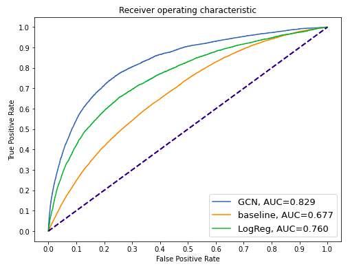

   

Under construction.

This project was made as part of the course [CS-401 Machine Learning](https://edu.epfl.ch/coursebook/en/machine-learning-CS-433) at EPFL (fall 2021). Unclear relationships between politicians and lob-byists are a problem in a democratic political framework. Usingvarious  methods,  we  attempt  to  detect  links  between  Twitter activity  of  Members  of  the  European  Parliament  and  lobbygroups. 

Special thanks to my teammates Kamil Czerniak and Mohamed Allouch. I would like to acredit our supervisor, Aswin Suresh and the [Information and Network Dynamics Lab](https://indy.epfl.ch/) for making this project possible.

---

# The dataset

### Contstructing the tweet graph

The   dataset   contains   tweets   of   677   Members   of   the European  Parliament  (MEPs)  of  8th  term  (2014-2019)  and 3024  lobby  groups,  alongside  metadata  related  to  tweetsand referenced tweets. A tweet can be referenced by eitherrepublishing  it  without  comment  (retweet),  republishing  itwith  a  comment  (quote  retweet)  or  replying  to  it.  As  thedataset contains all tweets made by given users in the years 2014-2019, we also have a lot of tweets that do not refer toanyone  or  refer  to  accounts  outside  of  our  interest  (in  this situation:  MEP  accounts  for  lobby  tweets  and  vice  versa). On this base, the retweet graph has been built as follows:

- The tweet must have originated from an MEP accountand referenced a lobby account or the tweet must have originated  from  a  lobby  account  and  referenced  an MEP account
- When such a tweet is found, we create two nodes in the  graph  (if  they  do  not  exist  already),  named  after Twitter  handles  of  both  tweet  creator  and  referenced person. We create an edge between the nodes.

### Preprocessing the tweets

We restricted ourselves for English-language tweets, mak-ing  5143438  observations  in  total.  The  dataset  consists  oftwo  parts,  there  are  474361  tweets  from  Members  of  theEuropean  Parliament  and  4669077  tweets  from  lobbies.The  mean  character  length  of  the  tweets  is  132.42  with  astandard deviation of 60.92. Firstly preprocessed the textual data  using  the  Natural  Language  Toolkit  (nltk)  library. The preprocessing pipeline consists of case-folding, lemmatization,  tokenization,  stopword,  and  punctuation  removal. A  popular  idea  in  machine  learning  is  to  represent  wordsby  vectors  this  technique  is  called  embedding.  The  mainadvantage of pre-trained embeddings is that they can be usedfor basically any desired ML algorithm. We decided to use fastText for this step in our pipeline, which produces aword  embedding  of 300 dimensions.  The  embedding  of  a tweet is given by the sum of the embeddings of the words in it.

# Link prediction on the tweet graph
 
 Our goal is to build a machine learning model that, based on  the  tweets  of  two  users,  can  accurately  predict  if  aretweet link exists between them. Given 580 MEPs and 1731 lobbyists,  there  are  1003980  possible  retweet  link  but  we only observed 13632 actual links, which means our dataset is  really  unbalanced. 
 
### Inner product classifier
    
 First we use  a  classical  supervised  binary classification approach. We consider each MEP-lobby pair a training example let us denote the set of MEPs with $\huge{U}$ and the set of lobby groups with the set $\huge{V}$. The tweet embeddings are given by the matrices $\huge{X_u \in \mathbb{R}^{d_u \times 300}}$ and $\huge{X_v\in \mathbb{R}^{d_v \times 300}}$, where $\huge{d_u}$ and $\huge{d_v}$ are the number of tweets of the user. We define the weight between these two nodes by the maximum similarity distance between the tweets' of the users, that is 
    
   

    $$\huge{w_{uv}=\max(X_u X_v^T)}$$
   

 
Note that our baseline model does not require any learning,we can use the resulting weights for classification on all the data, with a given $\huge{\theta}$ threshold. Our classifier can be written as $\huge{f(u,v)=1_{w_{uv} \geq \theta}}$
    
### Logistic Regression
    
Similar  to  the  baseline  model  we  will  construct  an  edge feature  vector  out  of  the  tweet  matrixes.  Let  us  denote  the sum  embedding  of  the ith  tweet  of  user $\huge{u}$ with  the  vector $\huge{x_{ui}}\in \mathbb{R}^{300}$. For a given node we define $\huge{w_u}=\sum_{i}x_{ui}$, that  is  the  sum  of  embeddings  of  tweets  made  by  a  given user. When considering an edge, we can stack these weight vectors,  resulting  in  a  edge  weight  between  users $\huge{u}$ and $\huge{v}$ being $\huge{w_{uv}\in\mathbb{R}^{600}}$.  Using  these  edge  weights  we  can classify edges using logistic regression. Real-world examples of graphs are usually sparse, meaning  there  will  be  significantly  more  non-edge  examples  in our dataset. We hide 20% of  the  edges  from  the  graph  and  treat  them as  test  edges.  In  order  to  balance  this  set,  we  will  sample the same amount of negative edges and include them in the test set as well. The remaining graph will be considered as our  training  set.  
 
### Graph Convolutional Network
    
In  our  two  previous  model  we  did  not  take  into  consideration  the  underlying  graph  structure,  we  dealt  with  theedge  prediction  task  independently  for  every  edge.  One possible  approach  of  managing  ML  tasks  on  non-Euclidan structured  data  is  using  a  so  called  Graph  Convolutional Network ([GCN](https://tkipf.github.io/graph-convolutional-networks/)). Given  a  graph $\huge{G= (V,E)}$,  let  us  denote  the  adjacency matrix  with $\huge{A\in\mathbb{R}^{N \times N}}$,  the  node  features  of $\huge{G}$ with $\huge{X\in\mathbb{R}^{N\times D}}$,  where N is the number of nodes and D is  the  number  of features. By adding self-connections we define $\huge{\tilde{A}=A+I}$ and  the  corresponding  diagonal node degree  matrix  is $\huge{\tilde{D}}$.  The GCN  layer  is  defined  as  function $\huge{f_W(X,A)}$ parametrized with $\huge{W\in\mathbb{R}^{D\times C}}$,   where C indicates the   number of channels. Let us denote  the output vector corresponding to node i with $\huge{h_i}$, the propagation rule for a node can be written as
    

    $$\huge{h_i = \sigma \left(b+\sum_{j\in N(i)}\frac{e_{ij}}{\sqrt{d_i d_j}}x_j W  \right)}$$    

 
 where $\huge{d_i}$ is  the ith  diagonal  element  of  $\huge{\tilde{D}}$,  and $\huge{\sigma}$ is  the activation function. Using matrix notation we can rewrite it as 
    

    $$\huge{f_W(X,A)=H=\sigma(\tilde{D}^{-\frac{1}{2}}\tilde{A}\tilde{D}^{-\frac{1}{2}}XW)}.$$ 

    
It is possible to stack multiple layers on top of one another. The  GCN  layer  creates  node  embeddings  by  aggregating neighborhood  information  from  previous  layers.  The  node representations  can  be  used  for  link  prediction,  the  probability  of  the  existence  of  an  edge  between  node i and j is given  by  the  score  function $\huge{\phi(h_i,h_j) =y_{ij}}$,  which  can  bea  simple  inner product  or  a  neural  network,  which  input  is the concatenation of the two vectors. We pass the embeddings to the GCN and use the score functions for prediction. The model is trained with the binary cross-entropy loss similar to the logistic regression approach with negative sampling.

    
# Results
 
    
All of our models output can be considered as probability vectors of the binary label, meaning with different classification thresholds we get different results. In order to evaluate the models, we compute the true-false positive rates for different thresholds and plot the receiving operating characteristics. We use the maximum value of the geometric mean of true-false positive rates to determine the best threshold. We report the f1-score, the area under the model's ROC curve (AUC) and the accuracy achieved with our chosen threshold. The hyperparamteres of the models were selected with cross-validation.

 
    

   
    

 
    
The  AUC  metric  is  significantly  greater  than  0.5  lets  us conclude that even our baseline model performs better than predicting randomly. Applying deep learning methods to the task  seems  to  be  the  most  beneficial  approach,  although  it is  easier  to  interpret  a  logistic  regression  model.  There  are many possible benchmark frameworks for dealing with non-Euclidean  data.  GCN  is  one  of  the  simplest  models  from the  rich  family  of  message  passing based  graph  models.  A further  improvement  in  our  model  could  be  to  change  the convolutional  layer  to  another  state-of-the-art  layer,  such as  GraphSage,  Graph  Attention  Networks  or  Weisfeiler-Lehman   GNN. Another  limitation  is  determining the  initial  node  embeddings  on  our  graph.  The  danger  of taking the average embeddings is that we might lose a lot of important information.
    
| Method| f1-score | AUC   | Accuracy |
|---------------------|----------|-------|----------|
| Inner product       | 0.043    | 0.677 | 0.627    |
| Logistic Regression | 0.363    | 0.760 | 0.702    |
| GCN                 | 0.465    | 0.829 | 0.757    | 
    
We implemented the models using the Deep Graph Library package, here is a [tutorial](https://docs.dgl.ai/en/0.6.x/guide/training-link.html) on link-prediction task using DGL.

