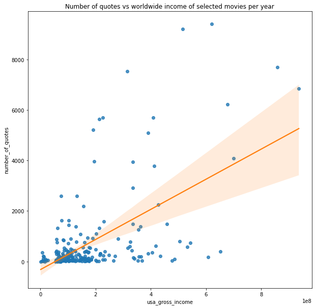
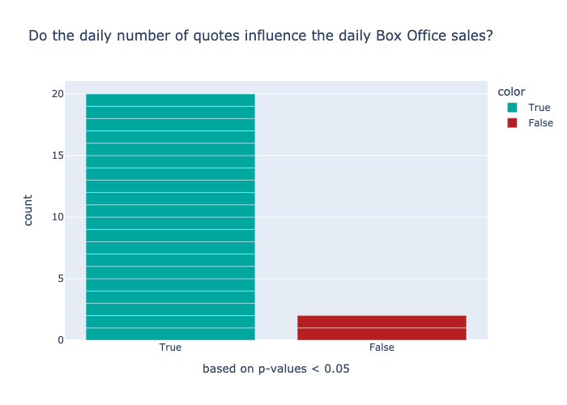

This data story was made as part of the course [CS-401 Applied Data Analysis](https://dlab.epfl.ch/teaching/fall2021/cs401/) at EPFL (fall 2021). 
We investigated the correlation between quotes about movies made by people in news articles, IMDB rating and movie box office revenue. We would like to acredit the authors of [Quotebank](https://dlab.epfl.ch/people/west/pub/Vaucher-Spitz-Catasta-West_WSDM-21.pdf), the [IMDb data set](https://www.kaggle.com/stefanoleone992/imdb-extensive-dataset?select=IMDb+ratings.csv), [Box Office Mojo](https://www.boxofficemojo.com/daily/) and [WikiData](https://www.wikidata.org/wiki/Wikidata:Main_Page).

Read the <a href="https://albertkjoller.github.io/QuotesNMovies/">data story</a> and check out the project on <a href="https://github.com/hbenedek/ada-2021-project-f-jab">Github</a>.

### Created by Albert Kjøller Jacobsen, Benedek Harsanyi, Felix Borum Burmester & Julian Schnitzler

TODO:
- fix images
- fix back backgrounds
- fix latex parts
- write introduction on the project

---

# Table of Contents
* [RQ1: Relation between Box Office sales and number of quotes of a movie](#chapter1) 
    * [1.1. Linear regression between total number of quotes on a movie and domestic box office revenue](#chapter11)
    * [1.2. Observational study with propensity score matching](#chapter12)
* [RQ2: An Investigation into Time Series Box Office and Quotes in a Few Movies](#chapter2)
    * [2.1. Visualization and Kolmogorov-Smirnov test](#chapter21)
    * [2.2. Checking correlation and Granger causality](#chapter22)
* [RQ3: Sentiment analysis in quotes about movies over time](#chapter3)
    * [3.1 Sentiment and Box Office](#chapter31)
    * [3.2. Sentiment and IMDb - (WIP)](#chapter32)
* [RQ4: Searching for a bias in the data](#chapter4)
    * [4.1. Are quotes in Quotebank regarding movies biased?](#chapter41)
    * [4.2. Bias in Internet Movie Database ratings ](#chapter42)
* [RQ5: The effect of COVID on media coverage of movies](#chapter5)
    * [5.1. Calculate mean number of quotes on movies between 2015-2019 on a daily basis, calculate confidence intervals (bootstrapping), compare with 2020 data](#chapter51)
    * [5.2. Use regression for comparison of the mean number of quotes across movies in covid and non-covid period, use t-test for comparison of means](#chapter52)

# Imports


```python
from collections import Counter, OrderedDict, defaultdict
import datetime as dt
import numpy as np
import networkx as nx
import matplotlib.pyplot as plt
import pandas as pd
import plotly.express as px
import plotly
import plotly.io as pio
from scipy import stats
from scipy.stats import kstest, ttest_1samp, pearsonr, ttest_ind
import seaborn as sns
from statsmodels.stats.multitest import multipletests
import statsmodels.api as sm
import statsmodels.formula.api as smf
from statsmodels.tsa.api import VAR
from statsmodels.tsa.stattools import adfuller, grangercausalitytests
from wikidata.client import Client

import json
import os
import pickle
from tqdm.notebook import tqdm
from datetime import date

import warnings
warnings.filterwarnings('ignore')
```

# Loading the data


```python
def load_json(file):
    with open(file) as handle:
        data = json.load(handle)
    return data
```


```python
data_dir = os.getcwd() + os.sep + f'exploratory{os.sep}data'

# load pickled data
df_Quotebank = pd.read_pickle(rf"{data_dir}{os.sep}Quotebank_sentiment.pkl") 
df_boxOffice = pd.read_pickle(rf"{data_dir}{os.sep}boxOffice.pkl")   

# load IMDb csv-files and merge
movies = pd.read_csv(rf"{data_dir}{os.sep}IMDb{os.sep}IMDb movies.csv", low_memory=False)
ratings = pd.read_csv(rf"{data_dir}{os.sep}IMDb{os.sep}IMDb ratings.csv")
top10_movies = load_json(rf"{data_dir}{os.sep}rq1/top_10.json")

```

We do a preprocessing on the imdb dataset. Transforming years, incomes and budgest to integers, publisd dates to datetime object.


```python
def clean_imdb(df):
    imdb = df.rename(columns = {'worlwide_gross_income':'worldwide_gross_income'})
    imdb = imdb.drop(imdb.index[83917])
    imdb['year'] = imdb['year'].astype(np.int64)
    imdb = imdb[imdb['year']>2014]
    imdb = imdb.dropna()
    imdb['budget'] = imdb['budget'].map(lambda x: x.lstrip('$EURCZKNYGBPWILSADMXNJPYOP')).astype(np.int64)
    imdb['worldwide_gross_income'] = imdb['worldwide_gross_income'].map(lambda x: x.lstrip('$EURCZKNYGBPWILSADMXNJPYOP')).astype(np.int64)
    imdb['usa_gross_income'] = imdb['usa_gross_income'].map(lambda x: x.lstrip('$EURCZKNYGBPWILSADMXNJPYOP')).astype(np.int64)
    imdb['date_published'] = pd.to_datetime(imdb['date_published'])
    return imdb

imdb = clean_imdb(movies)
df_imdb = imdb.merge(ratings, on='imdb_title_id')
```

There are movie titles which might be really frequent in the Quotebank dataset, the corresponding quote might come from different context, making our analysis biased so we filter them out, the result is a dictionary with the relevant movie titles, we run them through our Quotebank filter pipeline. 


```python
ignore = {2015: ['Home',  'Spy', 'Sisters',  'Joy'],
2016: ['Sing', 'Trolls',  'Split'],
2017: ['It',   'Coco'],
2018: ['Halloween'],
2019: ['Us', 'Glass', 'Yesterday',  'Midway'],
2020: ['Tesla',  'Emma.', 'Wendy']}

relevant_movies = []
titles_by_year = defaultdict(list)
for year in range(2015, 2021):
    titles_by_year[year] = list(imdb[imdb['year']==year].nlargest(50, columns='usa_gross_income')['original_title'])
    relevant_movies.append(imdb[imdb['year']==year].nlargest(50, columns='usa_gross_income')[['original_title', 'usa_gross_income', 'year']])
    for title in ignore[year]:
        titles_by_year[year].remove(title)

movies_df = pd.concat(relevant_movies)
```

For a movie released in year \\( x \\) $x$, we look for quotes containing the title (or subtitle) of the movie in year \ x \ and \ x + 1 \. In this way we will have information about the hype before the publish date and see the afterlife as well. The filtering happened using in a different python script, we just load the json files containing the results.


```python
quotes_by_movies_by_year = defaultdict(list)

for i in range(2015, 2021):
    path = f'./exploratory/data/rq1/final_movie_quotes{i}.json'
    data = load_json(path)
    for (k, v) in data.items():
        quotes_by_movies_by_year[k].append(v)

quotes_by_movies = defaultdict(list)

for (k,v) in quotes_by_movies_by_year.items():
    quotes_by_movies[k] = sum(v)

quotes_by_movies = OrderedDict(sorted(quotes_by_movies.items(), key=lambda t: -t[1]))
```


```python
for i, (k,v) in enumerate(quotes_by_movies.items()):
    if i < 10:
        print(f"{k}, {v}")
```

    Men in Black: International, 38245
    Kong: Skull Island, 16395
    Mission: Impossible - Fallout, 11447
    Star Wars: Episode VIII - The Last Jedi, 9402
    Star Wars: Episode IX - The Rise of Skywalker, 9197
    Avengers: Endgame, 7692
    Thor: Ragnarok, 7537
    Star Wars: Episode VII - The Force Awakens, 6837
    Avengers: Infinity War, 6215
    Logan, 5692


We delete the top 3 element, since the quotes containing the words *Kong*, *International* and *Impossible* are likely to come from non-movie related context.


```python
del quotes_by_movies['Men in Black: International']
del quotes_by_movies['Kong: Skull Island']
del quotes_by_movies['Mission: Impossible - Fallout']
```


```python
fig, ax = plt.subplots(nrows=1, ncols=2, figsize=(25,10)) # here we should decide a split (0-50 vs 50-100?)
fig.suptitle('Number of quotes per movie, ordered by rank among quotes')
ax[0].plot(quotes_by_movies.values(), marker='o')
ax[0].set_ylabel('number of quotes')
ax[0].set_xlabel('rank of movie')
ax[1].loglog(quotes_by_movies.values(), marker='o', color='red')
ax[1].set_ylabel('log number of quotes')
ax[1].set_xlabel('log rank of movie');
```
<center>

</center>


Now decide how many movies to use for the detailed analysis of the quotes. The 500 total quotes seems a reasonable threshold (meaning at least around 2 quotes per day). This gives us 55 movies. In order to be representative in time as well we will include the top 10 movies from each year

```python
x = np.array(list(quotes_by_movies.values()))
len(x[x>500])
```


    55


We sort the movies by number of quotes and visualize the distribution. It looks like a power low, but if we change to log-log axes, we can see it is clearly not a straight line.

Now we megre the information about quotes into our *movies_df* dataframe.


```python
numOccurrences = pd.DataFrame()
numOccurrences['original_title'] = quotes_by_movies.keys()
numOccurrences['number_of_quotes'] = quotes_by_movies.values()
movies_df= pd.merge(movies_df,numOccurrences, how='left', on='original_title') 
movies_df
```


<div>
<style scoped>
    .dataframe tbody tr th:only-of-type {
        vertical-align: middle;
    }

    .dataframe tbody tr th {
        vertical-align: top;
    }

    .dataframe thead th {
        text-align: right;
    }
</style>
<table border="1" class="dataframe">
  <thead>
    <tr style="text-align: right;">
      <th></th>
      <th>original_title</th>
      <th>usa_gross_income</th>
      <th>year</th>
      <th>number_of_quotes</th>
    </tr>
  </thead>
  <tbody>
    <tr>
      <th>0</th>
      <td>Star Wars: Episode VII - The Force Awakens</td>
      <td>936662225</td>
      <td>2015</td>
      <td>6837.0</td>
    </tr>
    <tr>
      <th>1</th>
      <td>Jurassic World</td>
      <td>652270625</td>
      <td>2015</td>
      <td>389.0</td>
    </tr>
    <tr>
      <th>2</th>
      <td>Avengers: Age of Ultron</td>
      <td>459005868</td>
      <td>2015</td>
      <td>1493.0</td>
    </tr>
    <tr>
      <th>3</th>
      <td>Inside Out</td>
      <td>356921711</td>
      <td>2015</td>
      <td>187.0</td>
    </tr>
    <tr>
      <th>4</th>
      <td>Fast &amp; Furious 7</td>
      <td>353007020</td>
      <td>2015</td>
      <td>29.0</td>
    </tr>
    <tr>
      <th>...</th>
      <td>...</td>
      <td>...</td>
      <td>...</td>
      <td>...</td>
    </tr>
    <tr>
      <th>270</th>
      <td>The Rhythm Section</td>
      <td>5437971</td>
      <td>2020</td>
      <td>10.0</td>
    </tr>
    <tr>
      <th>271</th>
      <td>The Tax Collector</td>
      <td>942666</td>
      <td>2020</td>
      <td>1.0</td>
    </tr>
    <tr>
      <th>272</th>
      <td>Cut Throat City</td>
      <td>507436</td>
      <td>2020</td>
      <td>NaN</td>
    </tr>
    <tr>
      <th>273</th>
      <td>Wendy</td>
      <td>143518</td>
      <td>2020</td>
      <td>NaN</td>
    </tr>
    <tr>
      <th>274</th>
      <td>Tesla</td>
      <td>76263</td>
      <td>2020</td>
      <td>NaN</td>
    </tr>
  </tbody>
</table>
<p>275 rows × 4 columns</p>
</div>


---

# RQ1 Relation between Box Office sales and number of quotes of a movie <a class="anchor" id="chapter1"></a>
## Is there a tendency between number of sold tickets and the 'hype' about a movie as it appears in the news paper media?

For this question, we will only consider the total number of quotes on a movie found in the Quotebank dataset. We start with the IMDb movie dataset and filter out the top 50 movies in terms of *usa_gross_income*. Then we filter the Quotebank dataset on the titles of these movies and count the occurences.

## Proposed method: 
## 1.1 Linear regression between total number of quotes on a movie and domestic box office revenue <a class="anchor" id="chapter11"></a>

We run a linear regression to investigate whether more popular movies tend to have higher media coverage or not. We use statsmodels ols function to do so.


```python
res = smf.ols(formula='usa_gross_income ~ number_of_quotes', data=movies_df).fit()
print(res.summary())
```

                                OLS Regression Results                            
    ==============================================================================
    Dep. Variable:       usa_gross_income   R-squared:                       0.345
    Model:                            OLS   Adj. R-squared:                  0.342
    Method:                 Least Squares   F-statistic:                     132.6
    Date:                Fri, 17 Dec 2021   Prob (F-statistic):           6.25e-25
    Time:                        18:31:26   Log-Likelihood:                -5081.7
    No. Observations:                 254   AIC:                         1.017e+04
    Df Residuals:                     252   BIC:                         1.017e+04
    Df Model:                           1                                         
    Covariance Type:            nonrobust                                         
    ====================================================================================
                           coef    std err          t      P>|t|      [0.025      0.975]
    ------------------------------------------------------------------------------------
    Intercept         1.242e+08   8.12e+06     15.299      0.000    1.08e+08     1.4e+08
    number_of_quotes  5.787e+04   5025.890     11.515      0.000     4.8e+04    6.78e+04
    ==============================================================================
    Omnibus:                       90.719   Durbin-Watson:                   0.866
    Prob(Omnibus):                  0.000   Jarque-Bera (JB):              238.822
    Skew:                           1.643   Prob(JB):                     1.38e-52
    Kurtosis:                       6.430   Cond. No.                     1.76e+03
    ==============================================================================
    
    Notes:
    [1] Standard Errors assume that the covariance matrix of the errors is correctly specified.
    [2] The condition number is large, 1.76e+03. This might indicate that there are
    strong multicollinearity or other numerical problems.


We conclude that the predictor *number_of_quotes* is indeed significant, since its small p-value. So in general the more successful a movie, the more media coverage it gets. 


```python
plt.figure(figsize = (10,10))
plt.title('Number of quotes vs worldwide income of selected movies per year')
sns.regplot(data=movies_df, x='usa_gross_income', y='number_of_quotes', line_kws = {'color': 'C1'});
```


    

    


---

## Proposed Method:
## 1.2. Observational study with propensity score matching <a class="anchor" id="chapter12"></a>

We calculate the propensity score with logistic regression, based on movie attributes on IMDb data on little quoted vs highly quote movies and compare the results with the box office data.

We will add the following features from the IMDb dataset: *avg_vote*, *budget*, *duration*, *metascore*, *votes*. Furthermore, we create a *genres* one hot feature as well.


```python
movies_df = movies_df.merge(imdb[['original_title', 'avg_vote', 'budget','duration', 'metascore', 'votes','genre']], how='left', on='original_title')
movies_df
```


<div>
<style scoped>
    .dataframe tbody tr th:only-of-type {
        vertical-align: middle;
    }

    .dataframe tbody tr th {
        vertical-align: top;
    }

    .dataframe thead th {
        text-align: right;
    }
</style>
<table border="1" class="dataframe">
  <thead>
    <tr style="text-align: right;">
      <th></th>
      <th>original_title</th>
      <th>usa_gross_income</th>
      <th>year</th>
      <th>number_of_quotes</th>
      <th>avg_vote</th>
      <th>budget</th>
      <th>duration</th>
      <th>metascore</th>
      <th>votes</th>
      <th>genre</th>
    </tr>
  </thead>
  <tbody>
    <tr>
      <th>0</th>
      <td>Star Wars: Episode VII - The Force Awakens</td>
      <td>936662225</td>
      <td>2015</td>
      <td>6837.0</td>
      <td>7.9</td>
      <td>245000000</td>
      <td>138</td>
      <td>80.0</td>
      <td>845102</td>
      <td>Action, Adventure, Sci-Fi</td>
    </tr>
    <tr>
      <th>1</th>
      <td>Jurassic World</td>
      <td>652270625</td>
      <td>2015</td>
      <td>389.0</td>
      <td>7.0</td>
      <td>150000000</td>
      <td>124</td>
      <td>59.0</td>
      <td>569512</td>
      <td>Action, Adventure, Sci-Fi</td>
    </tr>
    <tr>
      <th>2</th>
      <td>Avengers: Age of Ultron</td>
      <td>459005868</td>
      <td>2015</td>
      <td>1493.0</td>
      <td>7.3</td>
      <td>250000000</td>
      <td>141</td>
      <td>66.0</td>
      <td>722685</td>
      <td>Action, Adventure, Sci-Fi</td>
    </tr>
    <tr>
      <th>3</th>
      <td>Inside Out</td>
      <td>356921711</td>
      <td>2015</td>
      <td>187.0</td>
      <td>8.1</td>
      <td>175000000</td>
      <td>95</td>
      <td>94.0</td>
      <td>592575</td>
      <td>Animation, Adventure, Comedy</td>
    </tr>
    <tr>
      <th>4</th>
      <td>Fast &amp; Furious 7</td>
      <td>353007020</td>
      <td>2015</td>
      <td>29.0</td>
      <td>7.1</td>
      <td>190000000</td>
      <td>137</td>
      <td>67.0</td>
      <td>353562</td>
      <td>Action, Adventure, Thriller</td>
    </tr>
    <tr>
      <th>...</th>
      <td>...</td>
      <td>...</td>
      <td>...</td>
      <td>...</td>
      <td>...</td>
      <td>...</td>
      <td>...</td>
      <td>...</td>
      <td>...</td>
      <td>...</td>
    </tr>
    <tr>
      <th>270</th>
      <td>The Rhythm Section</td>
      <td>5437971</td>
      <td>2020</td>
      <td>10.0</td>
      <td>5.2</td>
      <td>50000000</td>
      <td>109</td>
      <td>45.0</td>
      <td>8816</td>
      <td>Action, Drama, Mystery</td>
    </tr>
    <tr>
      <th>271</th>
      <td>The Tax Collector</td>
      <td>942666</td>
      <td>2020</td>
      <td>1.0</td>
      <td>4.7</td>
      <td>30000000</td>
      <td>95</td>
      <td>22.0</td>
      <td>4862</td>
      <td>Action, Crime, Drama</td>
    </tr>
    <tr>
      <th>272</th>
      <td>Cut Throat City</td>
      <td>507436</td>
      <td>2020</td>
      <td>NaN</td>
      <td>4.3</td>
      <td>8000000</td>
      <td>123</td>
      <td>67.0</td>
      <td>141</td>
      <td>Action, Crime, Drama</td>
    </tr>
    <tr>
      <th>273</th>
      <td>Wendy</td>
      <td>143518</td>
      <td>2020</td>
      <td>NaN</td>
      <td>5.7</td>
      <td>6000000</td>
      <td>111</td>
      <td>54.0</td>
      <td>1405</td>
      <td>Drama, Fantasy</td>
    </tr>
    <tr>
      <th>274</th>
      <td>Tesla</td>
      <td>76263</td>
      <td>2020</td>
      <td>NaN</td>
      <td>5.1</td>
      <td>5000000</td>
      <td>102</td>
      <td>68.0</td>
      <td>2277</td>
      <td>Biography, Drama</td>
    </tr>
  </tbody>
</table>
<p>275 rows × 10 columns</p>
</div>


We transform our continous variable **number_of_quotes** into a categorical one. To do so, we chose a threshold for $500$ (approx $20\%$ of the data), if a movie has more quotes than the threshold, we categorize it as highly_quoted, denoted with the dummy variable **highly_quoted**. 

Note: this is the same threshold we use for the rest of our analysis on box office and sentiments.


```python
movies_df['highly_quoted'] = 0
threshold = 500 
movies_df.loc[movies_df['number_of_quotes']> threshold, 'highly_quoted'] = 1
```

In order to calculate propensity scores, we perform a logistic regression using the statsmodel library. We want to study whether the number of quotes on a movie will have an effect on its performance in the box office, so we will regress the categorical variable *highly_quoted* against covariates from the IMDb dataset. Note, that we do not include *usa_gross_income* as covariate, since this is our target variable, in the end we are interested in the effect on this variabe.


```python
columns = list(set(list(movies_df.columns)) - set(['original_title','usa_gross_income', 'number_of_quotes','highly_quoted', 'genre']))
mod = sm.Logit(movies_df['highly_quoted'], movies_df[columns])

res = mod.fit()

# Extract the estimated propensity scores
movies_df['Propensity_score'] = res.predict()

print(res.summary())
```

    Optimization terminated successfully.
             Current function value: 0.364218
             Iterations 7
                               Logit Regression Results                           
    ==============================================================================
    Dep. Variable:          highly_quoted   No. Observations:                  275
    Model:                          Logit   Df Residuals:                      269
    Method:                           MLE   Df Model:                            5
    Date:                Fri, 17 Dec 2021   Pseudo R-squ.:                  0.2721
    Time:                        18:31:26   Log-Likelihood:                -100.16
    converged:                       True   LL-Null:                       -137.61
    Covariance Type:            nonrobust   LLR p-value:                 9.755e-15
    ==============================================================================
                     coef    std err          z      P>|z|      [0.025      0.975]
    ------------------------------------------------------------------------------
    year          -0.0017      0.001     -1.592      0.111      -0.004       0.000
    votes       5.118e-06   1.34e-06      3.817      0.000    2.49e-06    7.75e-06
    avg_vote      -0.0706      0.367     -0.192      0.848      -0.791       0.650
    budget      1.003e-08   2.81e-09      3.576      0.000    4.53e-09    1.55e-08
    metascore     -0.0098      0.018     -0.554      0.580      -0.045       0.025
    duration       0.0059      0.012      0.482      0.630      -0.018       0.030
    ==============================================================================


```python
movies_df['Propensity_score'].hist(bins=20)
```


    <AxesSubplot:>


    

    


```python
def get_similarity(propensity_score1, propensity_score2):
    '''Calculate similarity for instances with given propensity scores'''
    return 1-np.abs(propensity_score1-propensity_score2)
```

Based on the propensity score we calculate the similarity between the two gropus and make a bipartite graph. The edge weight between two nodes are the similarity scores. We want to find a maximal weight matching between the two groups (**highly_quoted** and **lowly_quoted**). The matching is found using the Hungarian algorithm, the graph is stored in a **networkx** object.


```python
# Separate the two groups
highly_quoted_df = movies_df[movies_df['highly_quoted'] == 1]
lowly_quoted_df = movies_df[movies_df['highly_quoted'] == 0]

G = nx.Graph()

# Loop through all the pairs of instances
for l_id, l_row in lowly_quoted_df.iterrows():
    for h_id, h_row in highly_quoted_df.iterrows():

        similarity = get_similarity(l_row['Propensity_score'],h_row['Propensity_score'])

        # Add an edge between the two instances weighted by the similarity between them
        G.add_weighted_edges_from([(l_id, h_id, similarity)])

# Generate the maximum weight matching 
matching = nx.max_weight_matching(G)

# Make a 'mask' of the indexes of the matched movies
matched = [i[0] for i in list(matching)] + [i[1] for i in list(matching)]
```

Now we have a matching, it's time to check the means and the distributions of our filtered data.


```python
balanced_df = movies_df.loc[matched]
balanced_highly_quoted_df = balanced_df[balanced_df['highly_quoted'] == 1]
balanced_lowly_quoted_df = balanced_df[balanced_df['highly_quoted'] == 0]
```

We check the propensity scores, now it seems more balanced compared to the previous plot.


```python
balanced_df['Propensity_score'].hist(bins=20)
```


    <AxesSubplot:>


    

    


```python
def bootstrap_CI(data, nbr_draws):
    means = np.zeros(nbr_draws)
    data = np.array(data)

    for n in range(nbr_draws):
        indices = np.random.randint(0, len(data), len(data))
        data_tmp = data[indices] 
        means[n] = np.nanmean(data_tmp)

    return [np.nanpercentile(means, 2.5),np.nanpercentile(means, 97.5)]
```


```python
high_CI = bootstrap_CI(balanced_highly_quoted_df['usa_gross_income'], 1000)
low_CI = bootstrap_CI(balanced_lowly_quoted_df['usa_gross_income'], 1000)
high_mean = balanced_highly_quoted_df['usa_gross_income'].mean()
low_mean = balanced_lowly_quoted_df['usa_gross_income'].mean()

print(f'mean usa gross income on highly quotes moves: {high_mean},    95%-CI: {high_CI} ')
print(f'mean usa gross income on lowly quotes moves: {low_mean},     95%-CI:  {low_CI}')
```

    mean usa gross income on highly quotes moves: 288705109.74545455,    95%-CI: [236888379.13136363, 341240220.17454547] 
    mean usa gross income on lowly quotes moves: 206249748.6,     95%-CI:  [173626216.495, 242641074.4431818]


```python
stats.ttest_ind(balanced_highly_quoted_df['usa_gross_income'], balanced_lowly_quoted_df['usa_gross_income'], equal_var=False)
```


    Ttest_indResult(statistic=2.492717014276856, pvalue=0.0144448363191324)


More quoted movies have higher mean gross income, the t-test and the confidence intervals point out they do differ significantly, we conclude that quotes have a significant positive effect on the gross income.


```python
fig, ax = plt.subplots(figsize =(20,10))
sns.distplot(balanced_lowly_quoted_df['usa_gross_income'], hist=True, label='lowly quoted movies', ax=ax)
sns.distplot(balanced_highly_quoted_df['usa_gross_income'], hist=True, label='highly quoted movies', ax=ax)
ax.set(title='Box office distribution of movies',xlabel='usa gross income', ylabel='Frequency')
plt.legend()
plt.show()
```


    

    


Finally we investigate if the samples are from the same distribution. We make a QQ plot and a Kolmogorov-Smirnoff test


```python
high = np.sort(balanced_highly_quoted_df['usa_gross_income'])
low = np.sort(balanced_lowly_quoted_df['usa_gross_income'])

fig, ax = plt.subplots(figsize =(10,10))
sns.scatterplot(high, low, ax=ax)
ax.set(xlabel="highly quoted movies", ylabel="lowly quoted movies", title="QQ plot of income of highly vs little quoted movies")
ax.axline((1, 1), slope=1, color='orange');
```


    

    


```python
kstest(balanced_lowly_quoted_df['usa_gross_income'],balanced_highly_quoted_df['usa_gross_income'])

```


    KstestResult(statistic=0.23636363636363636, pvalue=0.09251790142202007)


Even though the QQ plot suggest otherwise, we cannot reject the null hypothesis that the two samples came from the same distribution.

---

# RQ2: An Investigation into Time Series Box Office and Quotes in a Few Movies <a class="anchor" id="chapter2"></a>

## Proposed method: 
## 2.1. Visualization and Kolmogorov-Smirnov test <a class="anchor" id="chapter21"></a>

In this section, we will investigate the relationship between the boxOffice dataset and the Quotes in X movies.


```python
quotes = df_Quotebank
quotes['date'] = pd.to_datetime(quotes['date'])
```

To figure out which movies to use, we found that for movies with few quotes, the distribution in time obviously has little to no evidence on the success of the movie. Below there is an example with Dolittle, which we personally enjoyed, but has little quotes within quotebank. 


```python
from plotly.subplots import make_subplots
import plotly.graph_objects as go
fig = make_subplots(rows=2, cols=1, shared_xaxes=True,
                    vertical_spacing=0.02)

fig.append_trace(go.Bar(x=df_boxOffice[df_boxOffice.movie=='Dolittle'].days, y = df_boxOffice[df_boxOffice.movie=='Dolittle'].daily, name='boxOffice'), row=1, col=1)
fig.append_trace(go.Bar(x=quotes[quotes.movie=='Dolittle'].date, y = quotes[quotes.movie=='Dolittle'].numOccurrences, name = 'Quotes'), row=2, col=1)
fig.update_layout(title_text="Dolittle")
fig.update_layout(width=1600, height=500)
fig.show('png')
```


    

    


Instead we decided to take the three most quoted movies. The cell below shows how we sorted the movies:


```python
movies, freq_unsorted = np.unique(quotes.movie, return_counts=True)
freq, movies = np.array(list(zip(*sorted(zip(freq_unsorted, movies), reverse=True))))

print("Three top quoted movies: ")
list(zip(movies, freq))[:3]
```

    Three top quoted movies: 


    [('Star Wars: Episode VIII - The Last Jedi', '8368'),
     ('Star Wars: Episode VII - The Force Awakens', '7812'),
     ('Thor: Ragnarok', '6849')]


There you have it. We will do similar plots to the one above with Dolittle, however, we will only plot the period in which the movies were in theaters. This will come in handy when we test the distributions. The cells below will filter the data and plot it:


```python
#Get the min and max day for all three films
min_day_sw_VIII = list(df_boxOffice[df_boxOffice.movie=='Star Wars: Episode VIII - The Last Jedi'].days)[0]
max_day_sw_VIII = list(df_boxOffice[df_boxOffice.movie=='Star Wars: Episode VIII - The Last Jedi'].days)[-1]

min_day_sw_VII = list(df_boxOffice[df_boxOffice.movie=='Star Wars: Episode VII - The Force Awakens'].days)[0]
max_day_sw_VII = list(df_boxOffice[df_boxOffice.movie=='Star Wars: Episode VII - The Force Awakens'].days)[-1]

min_day_thor = list(df_boxOffice[df_boxOffice.movie=='Thor: Ragnarok'].days)[0]
max_day_thor = list(df_boxOffice[df_boxOffice.movie=='Thor: Ragnarok'].days)[-1]

#Define new dataframes, where we can drop all quotes outside of our scope
sw_VIII = quotes[quotes.movie=='Star Wars: Episode VIII - The Last Jedi']
sw_VII = quotes[quotes.movie=='Star Wars: Episode VII - The Force Awakens']
thor = quotes[quotes.movie=='Thor: Ragnarok']

#Drop all quotes outside of our time periods:
sw_VIII=sw_VIII[sw_VIII.date>=min_day_sw_VIII]
sw_VIII=sw_VIII[sw_VIII.date<=max_day_sw_VIII]

sw_VII=sw_VII[sw_VII.date>=min_day_sw_VII]
sw_VII=sw_VII[sw_VII.date<=max_day_sw_VII]

thor=thor[thor.date>=min_day_thor]
thor=thor[thor.date<=max_day_thor]
```


```python
#Star Wars: Episode VIII - The Last Jedi:
fig = make_subplots(rows=2, cols=1, shared_xaxes=True,
                    vertical_spacing=0.02)

fig.append_trace(go.Bar(x=df_boxOffice[df_boxOffice.movie=='Star Wars: Episode VIII - The Last Jedi'].days, y = df_boxOffice[df_boxOffice.movie=='Star Wars: Episode VIII - The Last Jedi'].daily, name='boxOffice'), row=1, col=1)
fig.append_trace(go.Bar(x=sw_VIII.date, y = sw_VIII.numOccurrences, name = 'Quotes'), row=2, col=1)
fig.update_layout(title_text="Star Wars: Episode VIII - The Last Jedi")
fig.update_layout(width=1600, height=500)
fig.show('png')
```


    

    


```python
#Star Wars: Episode VII - The Force Awakens
fig = make_subplots(rows=2, cols=1, shared_xaxes=True,
                    vertical_spacing=0.02)

fig.append_trace(go.Bar(x=df_boxOffice[df_boxOffice.movie=='Star Wars: Episode VII - The Force Awakens'].days, y = df_boxOffice[df_boxOffice.movie=='Star Wars: Episode VII - The Force Awakens'].daily, name='boxOffice'), row=1, col=1)
fig.append_trace(go.Bar(x=sw_VII.date, y = sw_VII.numOccurrences, name = 'Quotes'), row=2, col=1)
fig.update_layout(title_text="Star Wars: Episode VII - The Force Awakens")
fig.update_layout(width=1600, height=500)
fig.update_layout( width=1600, height=500)
fig.show('png')
```


    

    


```python
#Thor: Ragnarok
fig = make_subplots(rows=2, cols=1, shared_xaxes=True,
                    vertical_spacing=0.02)

fig.append_trace(go.Bar(x=df_boxOffice[df_boxOffice.movie=='Thor: Ragnarok'].days, y = df_boxOffice[df_boxOffice.movie=='Thor: Ragnarok'].daily, name='boxOffice'), row=1, col=1)
fig.append_trace(go.Bar(x=thor.date, y = thor.numOccurrences, name = 'Quotes'), row=2, col=1)
fig.update_layout(title_text="Thor: Ragnarok")
fig.update_layout( width=1600, height=500)
fig.show('png')
```


    

    


It does not look like there is a relationship between the boxOffice and quotes, but let's test it! We start by scaling everything into the range [0,1]. This is done in the next cell:


```python
sw_VIII_box = df_boxOffice[df_boxOffice.movie=='Star Wars: Episode VII - The Force Awakens'].daily
sw_VII_box = df_boxOffice[df_boxOffice.movie=='Star Wars: Episode VIII - The Last Jedi'].daily
thor_box = sw_VIII_box = df_boxOffice[df_boxOffice.movie=='Thor: Ragnarok'].daily

sw_VIII_box = list((sw_VIII_box - sw_VIII_box.min()) / (sw_VIII_box.max() - sw_VIII_box.min()))
sw_VII_box = list((sw_VII_box - sw_VII_box.min()) / (sw_VII_box.max() - sw_VII_box.min()))
thor_box = list((thor_box - thor_box.min()) / (thor_box.max() - thor_box.min()))

sw_VIII = sw_VIII.groupby('date').numOccurrences.sum()
sw_VII = sw_VII.groupby('date').numOccurrences.sum()
thor = thor.groupby('date').numOccurrences.sum()

sw_VIII_quotes = list((sw_VIII - sw_VIII.min()) / (sw_VIII.max() - sw_VIII.min()))
sw_VII_quotes = list((sw_VII - sw_VII.min()) / (sw_VII.max() - sw_VII.min()))
thor_quotes = list((thor - thor.min()) / (thor.max() - thor.min()))
```

Now we can do some testing. We chose to use the Kolmogorov-Smirnov test (kstest). All parameters are set to default as it works well in our case:


```python
sw_VII_stat, sw_VII_p = kstest(sw_VII_box,sw_VII_quotes)
print('Star Wars: Episode VII - The Force Awakens:\nks-stat: ',sw_VII_stat,'\np-value: ', sw_VII_p,'\n')

sw_VIII_stat, sw_VIII_p = kstest(sw_VIII_box,sw_VIII_quotes)
print('Star Wars: Episode VIII - The Last Jedi:\nks-stat: ',sw_VIII_stat,'\np-value: ', sw_VIII_p,'\n')

thor_stat, thor_p = kstest(thor_box,thor_quotes)
print('Thor: Ragnarok:\nks-stat: ',thor_stat,'\np-value: ', thor_p)
```

    Star Wars: Episode VII - The Force Awakens:
    ks-stat:  0.41774891774891776 
    p-value:  3.341567245129795e-09 
    
    Star Wars: Episode VIII - The Last Jedi:
    ks-stat:  0.7351712614870509 
    p-value:  8.881784197001252e-16 
    
    Thor: Ragnarok:
    ks-stat:  0.7293233082706767 
    p-value:  1.5328238282581075e-34


The null hypothesis states that there is no difference between the two distributions (for quotes and boxOffice). We reject all the null-hypothesises, because of the low p-values (lower than .05, the default alpha). Therefore, we cannot say that the number of quotes about one of the three movies on a given day can influence (or be influenced by) the boxOffice of said movie on that given day. We will further investigate this topic using tools from times series analysis.

---

## Proposed method: 
## 3.2. Checking correlation between distribution of quotes over time and box office time series data <a class="anchor" id="chapter22"></a>

We are interested in whether the time series of quotes and time series of box office relate to each other in some sense. First, we will transform the time series to become stationary. Then we propose two models:
- We fit a VAR (Vector autoregression) model on the data and check the correlation of the residuals.
- We perform a Granger Causality test 

For this question we only consider one chosen movie, our choice is Avengers: Infinity War.

Analysis based on this blog post https://towardsdatascience.com/a-quick-introduction-on-granger-causality-testing-for-time-series-analysis-7113dc9420d2.

First, we make a step-by-step tutorial on our approach on the movie **Avengers: Infinity War**. Then we build a data-processing  pipeline and apply the analysis of multiple movies.

We gather the quotes and daily box office data on Avengers and plot them.


```python
title = "Avengers: Infinity War"
movie_title = title.replace(" ", "_")
movie_title = movie_title.replace("-", "_")
movie_title = movie_title.replace(":", "")
movie_title
time_series = quotes[quotes['movie'] == title].groupby(['date'],  as_index=False).count()[['date', 'quotation']]
```


```python
bo = pd.read_csv('./exploratory/data/time_series_box_office_data/Avengers_Infinity_War___Box_Office_Mojo.csv')
bo = bo.rename(columns={'days': 'date'})
bo['date'] = pd.to_datetime(bo['date'])
bo = bo[['date','daily']]
time_series = time_series.merge(bo, how='left', on='date')
time_series = time_series.dropna()
```


```python
fig, ax = plt.subplots(ncols=1, nrows=2, figsize=(20,10))
ax[0].set(title='Tme series distribution of daily box office and quotation: "Avengers: Infinity War"')
sns.lineplot(x='date', y='quotation', data=time_series, ax=ax[0])
sns.lineplot(x='date', y='daily', data=time_series, ax=ax[1], color='red');
```


    

    


We use an ADF test to determine whether the underlying time series are stationary or not. Null hypothesis: it suggests the time series is not stationarity (if failed to be rejected)


```python
result = adfuller(time_series['quotation'].values)
print(f'ADF Statistics for quotation: {result[0]}')
print(f'p-value: {result[1]}')

result = adfuller(time_series['daily'].values)
print(f'ADF Statistics for box office: {result[0]}')
print(f'p-value: {result[1]}')
```

    ADF Statistics for quotation: -4.055861258289217
    p-value: 0.001144657257171167
    ADF Statistics for box office: -4.981642171850177
    p-value: 2.412663487214846e-05


Small p values suggest that the time series are stationary. We will note that this is likely because of the long tails of the two time series, at the premier of the movie there is clearly a peak at both cases. We will try to get rid of this minor issue and transform our time series with the difference method. It can be used to remove the series dependence on time, so-called temporal dependence.


```python
time_series['diff_quotation'] = time_series['quotation'].diff()
time_series['diff_daily'] = time_series['daily'].diff()

fig, ax = plt.subplots(ncols=1, nrows=2, figsize=(20,10))
sns.lineplot(x='date', y='diff_quotation', data=time_series, ax=ax[0])
sns.lineplot(x='date', y='diff_daily', data=time_series, ax=ax[1], color='red')
fig.suptitle('Daily difference in quotation and daily box office revenue compared to the day before');
```


    

    


We will do the ADF tests just to be sure.


```python
time_series = time_series.dropna()
result = adfuller(time_series['diff_quotation'].values)
print(f'ADF Statistics for quotation: {result[0]}')
print(f'p-value: {result[1]}')

result = adfuller(time_series['diff_daily'].values)
print(f'ADF Statistics for box office: {result[0]}')
print(f'p-value: {result[1]}')
```

    ADF Statistics for quotation: -9.375477295093031
    p-value: 7.186865372344977e-16
    ADF Statistics for box office: -3.547067774241023
    p-value: 0.006857445486580987


The plots and the p-values suggest that we eliminated the time dependency. We will move on to check correlations.

We will use the VAR model fist (Vector autoregression). The VAR class assumes that the passed time series are stationary.

A VAR model describes the evolution of a set of $k$ variables, over time. The variables are collected in a vector, $y_t$, which is of length $k$. The vector is modelled as a linear function of its previous value. The last term is the error term. $$y_t = A_1 y_{t-1} + A_2 y_{t-2} +... A_{p} y_{t-p} + \epsilon$$

The hyperparameter of the model is the number of coefficients we use, basically this means how far we are looking into the past. In Time Series analysis this is called the number of **lags**. We will try models with different lags, The best model will be selected by the minimum AIC score. If we have a model with $k$ parameters, and $L$ is the maximum value of the likelihood function for the model then the AIC score is given by: $AIC = 2k - 2 log(L)$.


```python
#time_series = time_series.set_index('date')
def best_lag_by_aic(data):
    model = VAR(data)
    AIC = []
    for i in range(0,15):
        result = model.fit(i)
        AIC.append(result.aic)
    return np.argmin(AIC)

best = best_lag_by_aic(time_series[['diff_daily', 'diff_quotation']])
print(f' Best model: {best}')
```

     Best model: 11


We can check the residuals of the fitted models. 


```python
model = VAR(time_series[['diff_daily', 'diff_quotation']])
results = model.fit(maxlags=11, ic='aic')
results.resid_corr
```


    array([[ 1.        , -0.05743393],
           [-0.05743393,  1.        ]])


The residual errors of the VAR model suggests that the the two time series are not correlated.

## Granger Causality 

Now we perform a Granger Causality Test. The Granger causality is a statistical hypothesis test for determining whether one time series is useful in forecasting another. We say that a variable $X$ that evolves over time Granger-causes another evolving variable $Y$ if predictions of the value of $Y$ based on its own past values **and** on the past values of $X$ are better than predictions of $Y$ based only on $Y$'s own past values.

Formally let $\mathcal{F}(t)$ be the filtration w.r.t. $X$ and $Y$ and let $\mathcal{G}(t)$ be the sub-filtration w.r.t. only $Y$. ($\mathcal{F}(t)$ has more information than $\mathcal{G}(t)$). We want to test the hypothesis that $\mathcal{P}(Y(t+1)\in A| \mathcal{F}(t)) \neq \mathcal{P}(X(t+1)\in A | \mathcal{G}(t))$ for arbitrary measurable set $A$.

In practise we undertake the following steps:
- fit a VAR model to $Y$, that is $y_t=\sum a_i y_{t-i} + \epsilon$
- fit a second VAR model to $Y$ using the information from $X$ as well $y_t =\sum a_i y_{t-i} + \epsilon + \sum b_j x_{t-j} $
- Test the null hypothesis that the coefficients corresponding to past values of the second time series are zero. (We will use chi2 test to do so, another popular option is to use a series of t and F tests)
- We reject the null hypothesis if there exists a significant predictor, in this case we say that $X$ Granger causes $Y$.


```python
maxlag=11
test = 'ssr_chi2test'
def grangers_causation(data, test='ssr_chi2test', maxlag=maxlag):    
    test_result = grangercausalitytests(data, maxlag=maxlag, verbose=False)
    p_values = [round(test_result[i+1][0][test][1],4) for i in range(maxlag)]
    min_p_value = np.min(p_values)
    #params = test_result[np.argmin(p_values) + 1][1][1].params
    return min_p_value

test_result = grangers_causation(time_series[['diff_daily', 'diff_quotation']], test=test, maxlag=maxlag)
print(f'p-value: {test_result}')
```

    p-value: 0.0


We can reject the null hypothesis and conclude that diff_quotation Granger causes diff_daily.

Now let's make a helper function from the above steps and do the analysis for all the movies we have.


```python
def time_series_granger_pipeline(titles):
    cause_box = {}
    for i, title in enumerate(titles):
        try:
            #load quotations
            time_series = quotes[quotes['movie'] == title].groupby(['date'],  as_index=False).count()[['date', 'quotation']]

            #load box office
            bo = df_boxOffice[df_boxOffice['movie']==title]
            bo = bo.rename(columns={'days': 'date'})
            bo['date'] = pd.to_datetime(bo['date'])
            bo = bo[['date','daily']]
            time_series = time_series.merge(bo, how='left', on='date')
            time_series = time_series.dropna()

            #transforming into stationary time series
            time_series['diff_quotation'] = time_series['quotation'].diff() 
            time_series['diff_daily'] = time_series['daily'].diff()
            time_series = time_series.dropna()
            
            #choosing the best lag for Vector Autoregression by AIC score
            maxlag = best_lag_by_aic(time_series[['diff_daily', 'diff_quotation']])
            
            gcm = grangers_causation(time_series[['diff_daily', 'diff_quotation']], test='ssr_chi2test', maxlag=maxlag)
            cause_box[title] = (gcm, gcm < 0.05)
        except:
            pass
       
    return cause_box
```


```python
titles = list(quotes['movie'].unique())
cause_box = time_series_granger_pipeline(titles)

```

Finally we plot the results. We are interested in whether the daily number of quotes Granger causes the box office sales.


```python
import plotly.express as px

sent2box = np.array([(movie, p_val, reject) for movie, (p_val, reject) in cause_box.items()])
temp = pd.DataFrame(sent2box).rename(columns={0: 'movie', 1: 'p_vals', 2: 'reject'})

fig = px.bar(x=temp.reject, y=(np.ones(len(temp.reject))), labels={'x':'based on p-values < 0.05', 'y':'count'},
            hover_name =temp.movie,
            color=temp.reject,
            color_discrete_sequence=['#00A79F', '#B51F1F'],
            title='Do the daily number of quotes influence the daily Box Office sales?')
fig.update_layout(width=700, height=500)
fig.show('png')
```


    

    


We will adjust the p-values with the Bonferroni method.


```python
reject_sent2box, adj_pvals_sent2box, _, _ = multipletests(sent2box[:,1].astype(float), alpha=0.05, method='bonferroni')
adj_pvals_df = pd.DataFrame(adj_pvals_sent2box, reject_sent2box)
adj_pvals_df['movie'] = sent2box[:,0]
adj_pvals_df = adj_pvals_df.reset_index().rename(columns={0: 'p_vals', 'index': 'reject'})

fig = px.bar(x=adj_pvals_df.reject, y=(np.ones(len(adj_pvals_df.reject))), labels={'x':'based on adjusted p-values < 0.05', 'y':'count'},
            hover_name =adj_pvals_df.movie,
            color=adj_pvals_df.reject, #sent2box[:,0],
            color_discrete_sequence=['#00A79F', '#B51F1F'],
            title='Do the daily number of quotes influence the daily Box Office sales?')
fig.update_layout(width=700, height=500)
fig.show('png')
```


    

    


Conclusion: it seems that for most of the movies we can conclude Granger causality, which means in general big media coverage results with high box office revenue.

---

# RQ 3 - Sentiment, Ratings and Box Office  <a class="anchor" id="chapter3"></a>

Sentiment analysis in quotes about movies over time. Additionaly relate sentiment to Box Office sales and see if positive/negative media coverage affect the sale of tickets.        
- RQ3.1: Does the media/quoters opinion on a certain movie affect the amount of sold tickets?     
- RQ3.2: Does the sentiment seen in quotes relate to the rating on IMDB? 


## 3.1: Sentiment and Box Office  <a class="anchor" id="chapter31"></a>

We aim at investigating whether the sentiment related to movies can be seen as correlated to the Box Office revenue related to movies. To do this we first need to account for consistency between the Box Office and the Quotebank data sets. Below we change the days/date attribute to be consistent. Furthermore, as explained in the `Quotebank_sentiment.ipynb` notebook we will use the transformer based (BERT) sentiment score from `HuggingFace`. This score was saved in the Quotebank dataframe as the probability of being positive between 0 and 1 - this is now reexpressed on a scale between -1 and 1 for being able to express negative Quotes and have a better and more intuitive representation of negative sentiment.


```python
# rename for consistency between data sets
df_Quotebank = df_Quotebank.rename(columns={'date': 'days'})

# re-express positive bert score for intuition of negative values
df_Quotebank['positive_BERT_score'] = 2 * (df_Quotebank.positive_BERT_score - 0.5)
df_Quotebank.positive_BERT_score

# attributes of interest
aoi = ['movie', 'days', 'BERT_label', 'multiplied_BERT', 'VADER_label', 'multiplied_VADER']
```


```python
df_Quotebank['multiplied_VADER'] = df_Quotebank.numOccurrences * df_Quotebank.VADER_score
df_Quotebank['multiplied_BERT'] = df_Quotebank.numOccurrences * df_Quotebank.positive_BERT_score
```

### Multiplied daily sentiment
As the Box Office sales are the total revenue for the movie across all movie theaters we will follow a similar approach when considering the sentiment of quotes for this research sub-question. Thus, we will multiply the daily sentiment of a quote about a movie with its number of occurrences and sum this multiplied sentiment for all quotes occuring at each date related to a movie. This approach is similar to the Box Office for which reason we find them comparable. In research (sub)question 2.2 we will use a different approach that is better related to the IMDb data set.


```python
multSum_per_day = df_Quotebank[aoi].groupby(['movie', 'days']).sum()
multSum_per_day.describe()
```


<div>
<style scoped>
    .dataframe tbody tr th:only-of-type {
        vertical-align: middle;
    }

    .dataframe tbody tr th {
        vertical-align: top;
    }

    .dataframe thead th {
        text-align: right;
    }
</style>
<table border="1" class="dataframe">
  <thead>
    <tr style="text-align: right;">
      <th></th>
      <th>multiplied_BERT</th>
      <th>multiplied_VADER</th>
    </tr>
  </thead>
  <tbody>
    <tr>
      <th>count</th>
      <td>12717.000000</td>
      <td>12717.000000</td>
    </tr>
    <tr>
      <th>mean</th>
      <td>3.710182</td>
      <td>1.582479</td>
    </tr>
    <tr>
      <th>std</th>
      <td>12.279737</td>
      <td>7.717111</td>
    </tr>
    <tr>
      <th>min</th>
      <td>-158.377222</td>
      <td>-187.232100</td>
    </tr>
    <tr>
      <th>25%</th>
      <td>-0.930393</td>
      <td>-0.273200</td>
    </tr>
    <tr>
      <th>50%</th>
      <td>0.999746</td>
      <td>0.773400</td>
    </tr>
    <tr>
      <th>75%</th>
      <td>4.982895</td>
      <td>2.752100</td>
    </tr>
    <tr>
      <th>max</th>
      <td>430.519033</td>
      <td>128.797100</td>
    </tr>
  </tbody>
</table>
</div>


```python
multSum_per_day
```


<div>
<style scoped>
    .dataframe tbody tr th:only-of-type {
        vertical-align: middle;
    }

    .dataframe tbody tr th {
        vertical-align: top;
    }

    .dataframe thead th {
        text-align: right;
    }
</style>
<table border="1" class="dataframe">
  <thead>
    <tr style="text-align: right;">
      <th></th>
      <th></th>
      <th>multiplied_BERT</th>
      <th>multiplied_VADER</th>
    </tr>
    <tr>
      <th>movie</th>
      <th>days</th>
      <th></th>
      <th></th>
    </tr>
  </thead>
  <tbody>
    <tr>
      <th rowspan="5" valign="top">Aladdin</th>
      <th>2019-01-02</th>
      <td>0.998775</td>
      <td>0.9929</td>
    </tr>
    <tr>
      <th>2019-01-03</th>
      <td>1.353582</td>
      <td>0.2732</td>
    </tr>
    <tr>
      <th>2019-01-08</th>
      <td>0.169957</td>
      <td>0.5464</td>
    </tr>
    <tr>
      <th>2019-01-13</th>
      <td>0.999398</td>
      <td>0.8720</td>
    </tr>
    <tr>
      <th>2019-01-15</th>
      <td>1.994038</td>
      <td>0.9725</td>
    </tr>
    <tr>
      <th>...</th>
      <th>...</th>
      <td>...</td>
      <td>...</td>
    </tr>
    <tr>
      <th rowspan="5" valign="top">Zootopia</th>
      <th>2017-11-13</th>
      <td>-0.965401</td>
      <td>0.0000</td>
    </tr>
    <tr>
      <th>2017-12-07</th>
      <td>-0.034033</td>
      <td>0.0000</td>
    </tr>
    <tr>
      <th>2017-12-20</th>
      <td>0.997421</td>
      <td>0.6808</td>
    </tr>
    <tr>
      <th>2017-12-26</th>
      <td>0.727826</td>
      <td>0.4404</td>
    </tr>
    <tr>
      <th>2017-12-27</th>
      <td>-0.997922</td>
      <td>0.6880</td>
    </tr>
  </tbody>
</table>
<p>12717 rows × 2 columns</p>
</div>


We see that the summations seems to be correctly made but realize that there is much more data in the quotebank data than in the box office data. As we investigate whether the relation between sentiment of quotes correlate with the box office sales we restrict ourselves to the period for a movie determine by the airing time in the cinemas, such that we use all of the dates from the box office data but disregard quotes appearing after the movie was taken of the screen. We do this by creating a merged data frame.


```python
df_boxOffice['days'] = pd.to_datetime(df_boxOffice['days'])
```


```python
merged_df = df_boxOffice.drop('special events', axis=1).merge(multSum_per_day, on=['movie', 'days'], how='left')
merged_df
```


<div>
<style scoped>
    .dataframe tbody tr th:only-of-type {
        vertical-align: middle;
    }

    .dataframe tbody tr th {
        vertical-align: top;
    }

    .dataframe thead th {
        text-align: right;
    }
</style>
<table border="1" class="dataframe">
  <thead>
    <tr style="text-align: right;">
      <th></th>
      <th>days</th>
      <th>dow</th>
      <th>rank</th>
      <th>daily</th>
      <th>theaters</th>
      <th>movie</th>
      <th>multiplied_BERT</th>
      <th>multiplied_VADER</th>
    </tr>
  </thead>
  <tbody>
    <tr>
      <th>0</th>
      <td>2019-05-24</td>
      <td>Friday</td>
      <td>1</td>
      <td>31358935.0</td>
      <td>4476</td>
      <td>Aladdin</td>
      <td>21.811739</td>
      <td>16.0772</td>
    </tr>
    <tr>
      <th>1</th>
      <td>2019-05-25</td>
      <td>Saturday</td>
      <td>1</td>
      <td>30013295.0</td>
      <td>4476</td>
      <td>Aladdin</td>
      <td>3.891365</td>
      <td>3.1421</td>
    </tr>
    <tr>
      <th>2</th>
      <td>2019-05-26</td>
      <td>Sunday</td>
      <td>1</td>
      <td>30128699.0</td>
      <td>4476</td>
      <td>Aladdin</td>
      <td>3.029213</td>
      <td>0.7860</td>
    </tr>
    <tr>
      <th>3</th>
      <td>2019-05-27</td>
      <td>Monday</td>
      <td>1</td>
      <td>25305033.0</td>
      <td>4476</td>
      <td>Aladdin</td>
      <td>4.431028</td>
      <td>-0.5205</td>
    </tr>
    <tr>
      <th>4</th>
      <td>2019-05-28</td>
      <td>Tuesday</td>
      <td>1</td>
      <td>12014982.0</td>
      <td>4476</td>
      <td>Aladdin</td>
      <td>19.273443</td>
      <td>-6.4471</td>
    </tr>
    <tr>
      <th>...</th>
      <td>...</td>
      <td>...</td>
      <td>...</td>
      <td>...</td>
      <td>...</td>
      <td>...</td>
      <td>...</td>
      <td>...</td>
    </tr>
    <tr>
      <th>6900</th>
      <td>2016-07-31</td>
      <td>Sunday</td>
      <td>43</td>
      <td>2144.0</td>
      <td>24</td>
      <td>Zootopia</td>
      <td>NaN</td>
      <td>NaN</td>
    </tr>
    <tr>
      <th>6901</th>
      <td>2016-08-01</td>
      <td>Monday</td>
      <td>43</td>
      <td>845.0</td>
      <td>24</td>
      <td>Zootopia</td>
      <td>NaN</td>
      <td>NaN</td>
    </tr>
    <tr>
      <th>6902</th>
      <td>2016-08-02</td>
      <td>Tuesday</td>
      <td>43</td>
      <td>904.0</td>
      <td>24</td>
      <td>Zootopia</td>
      <td>0.986622</td>
      <td>0.7964</td>
    </tr>
    <tr>
      <th>6903</th>
      <td>2016-08-03</td>
      <td>Wednesday</td>
      <td>45</td>
      <td>865.0</td>
      <td>24</td>
      <td>Zootopia</td>
      <td>NaN</td>
      <td>NaN</td>
    </tr>
    <tr>
      <th>6904</th>
      <td>2016-08-04</td>
      <td>Thursday</td>
      <td>43</td>
      <td>1622.0</td>
      <td>24</td>
      <td>Zootopia</td>
      <td>NaN</td>
      <td>NaN</td>
    </tr>
  </tbody>
</table>
<p>6905 rows × 8 columns</p>
</div>


```python
merged_df.isnull().any()
```


    days                False
    dow                 False
    rank                False
    daily               False
    theaters            False
    movie               False
    multiplied_BERT      True
    multiplied_VADER     True
    dtype: bool


So this reveals that some of the days for which box office data is available does not have an associated sentiment score, meaning that no quotes about the movie occured this day. We do not regard these as outliers and choose to apply a neutral sentiment score (equal to zero) to these days having a `NaN`-value as sentiment.


```python
merged_df.fillna(0, inplace=True)
```

As we want to investigate whether the trend of high sentiment of quotes correlating with high box office revenue we sum the sentiment and box office time series data over all dates (of airing time) for each movie. A snippet is seen below.


```python
merged_df['days'] = pd.to_datetime(merged_df['days'])
merged_df.groupby('movie').sum().head()
```


<div>
<style scoped>
    .dataframe tbody tr th:only-of-type {
        vertical-align: middle;
    }

    .dataframe tbody tr th {
        vertical-align: top;
    }

    .dataframe thead th {
        text-align: right;
    }
</style>
<table border="1" class="dataframe">
  <thead>
    <tr style="text-align: right;">
      <th></th>
      <th>rank</th>
      <th>daily</th>
      <th>theaters</th>
      <th>multiplied_BERT</th>
      <th>multiplied_VADER</th>
    </tr>
    <tr>
      <th>movie</th>
      <th></th>
      <th></th>
      <th></th>
      <th></th>
      <th></th>
    </tr>
  </thead>
  <tbody>
    <tr>
      <th>Aladdin</th>
      <td>2485</td>
      <td>355559216.0</td>
      <td>249321</td>
      <td>90.238282</td>
      <td>143.4030</td>
    </tr>
    <tr>
      <th>Aquaman</th>
      <td>1266</td>
      <td>335061807.0</td>
      <td>222107</td>
      <td>185.882581</td>
      <td>229.8329</td>
    </tr>
    <tr>
      <th>Avengers: Age of Ultron</th>
      <td>551</td>
      <td>455530367.0</td>
      <td>196219</td>
      <td>79.099213</td>
      <td>88.9659</td>
    </tr>
    <tr>
      <th>Avengers: Endgame</th>
      <td>2014</td>
      <td>858373000.0</td>
      <td>264340</td>
      <td>177.828269</td>
      <td>253.7383</td>
    </tr>
    <tr>
      <th>Avengers: Infinity War</th>
      <td>2399</td>
      <td>678815482.0</td>
      <td>240842</td>
      <td>556.993335</td>
      <td>323.5690</td>
    </tr>
  </tbody>
</table>
</div>


Similarly to our approach in RQ1 we start by investigating whether there is a tendency on the movie level. We try to model the sum of daily box office income with the predictor being the sum of summed daily sentiment from quotes to see if the sentiment affect the daily income.


```python
mod = smf.ols(formula='daily ~ multiplied_BERT', data=merged_df.groupby('movie').sum())
res = mod.fit()
print(res.summary())
```

                                OLS Regression Results                            
    ==============================================================================
    Dep. Variable:                  daily   R-squared:                       0.155
    Model:                            OLS   Adj. R-squared:                  0.139
    Method:                 Least Squares   F-statistic:                     9.884
    Date:                Fri, 17 Dec 2021   Prob (F-statistic):            0.00271
    Time:                        18:31:42   Log-Likelihood:                -1140.6
    No. Observations:                  56   AIC:                             2285.
    Df Residuals:                      54   BIC:                             2289.
    Df Model:                           1                                         
    Covariance Type:            nonrobust                                         
    ===================================================================================
                          coef    std err          t      P>|t|      [0.025      0.975]
    -----------------------------------------------------------------------------------
    Intercept        3.298e+08   2.56e+07     12.874      0.000    2.78e+08    3.81e+08
    multiplied_BERT  1.955e+05   6.22e+04      3.144      0.003    7.08e+04     3.2e+05
    ==============================================================================
    Omnibus:                        5.575   Durbin-Watson:                   1.590
    Prob(Omnibus):                  0.062   Jarque-Bera (JB):                4.535
    Skew:                           0.598   Prob(JB):                        0.104
    Kurtosis:                       3.717   Cond. No.                         457.
    ==============================================================================
    
    Notes:
    [1] Standard Errors assume that the covariance matrix of the errors is correctly specified.


As we see, the p-value is lower than our significance level of 5% and it can therefore be said that the total sentiment is a significant predictor when it comes to predicting the total box office revenue. From the coefficient we see that there is a positive correlation between the multiplied BERT score and the overall box office sales. However, we see from the R^2 score that the fitted model is not super good, which is also visualized in the figure below.


```python
plt.figure(figsize = (10,10))
sns.regplot(data=merged_df.groupby('movie').sum(), x='multiplied_BERT', y='daily',
            line_kws = {'color': 'C1'},
            scatter_kws = {'color': 'C0', 'alpha': 0.3})
plt.title('Multiplied BERT score vs total box office sales - Fitted Linear Regression model')
plt.show()
```


    

    


As the fitted regression is not super good when not encountering the time-series of the box office and sentiment, we choose to try a different approach (as in RQ1). We will analyze movies independently and instead investigate whether box office can be seen as being Granger causal from the multiplied sentiment scores. An example of the time series (box office and sentimennt) related to Avengers: Endgame is visualized below.


```python
fig, ax = plt.subplots(ncols=1, nrows=2, figsize=(20,10))
ax[0].set(title='Tme series distribution of daily box office and sentiment: "Avengers: Endgame"')
sns.lineplot(x='days', y='multiplied_BERT', data=merged_df[merged_df.movie=='Avengers: Endgame'], ax=ax[0])
sns.lineplot(x='days', y='daily', data=merged_df[merged_df.movie=='Avengers: Endgame'], ax=ax[1], color='red')
plt.show()
```


    

    


And as the difference where we ensure zero mean.


```python
time_series = merged_df[merged_df.movie == 'Avengers: Endgame'].set_index('days')
time_series['diff_multiplied_BERT'] = time_series['multiplied_BERT'].diff()
time_series['diff_daily'] = time_series['daily'].diff()
time_series = time_series.dropna()

fig, ax = plt.subplots(ncols=1, nrows=2, figsize=(20,10))
sns.lineplot(x='days', y='diff_multiplied_BERT', data=time_series, ax=ax[0])
sns.lineplot(x='days', y='diff_daily', data=time_series, ax=ax[1], color='red')
plt.show()
```


    

    


We will apply the Granger causality test to all the movies to check whether there is a significant relation (that box office can be seen as being caused by sentiment, following granger terms) between box office sales and the sentiment score when analyzing time series on the individual movie level. We use the same code as in RQ2 but adjust the maximum lag to 3 as we are using the test on all movies, where some movies do not have as much time-points as others. In fact, some movies - like "Spider-Man: Homecoming" - has no sentiment attached to it for all days where it was airing in the cinemas, for which reason we try out the Granger approach and only compute it for movies that have a sufficient amount of quotes per box office day.

Similarly to RQ2 we will optimize the `maxlag` for the Granger causation on the time series of each movies where we use transform the time-series to having zero mean first.


```python
def time_series_granger_pipeline_for_sentiment(titles):
    cause_box = {}
    for i, title in enumerate(titles):
        try:
            # determine movie
            time_series = merged_df[merged_df.movie == title].set_index('days')
            
            #transforming into stationary time series
            time_series['diff_multiplied_BERT'] = time_series['multiplied_BERT'].diff()
            time_series['diff_daily'] = time_series['daily'].diff()
            time_series = time_series.dropna()
            
            #choosing the best lag for Vector Autoregression by AIC score
            maxlag = best_lag_by_aic(time_series[['diff_daily', 'diff_multiplied_BERT']])
            
            gcm = grangers_causation(time_series[['diff_daily', 'diff_multiplied_BERT']], test='ssr_chi2test', maxlag=maxlag)
            cause_box[title] = (gcm, gcm < 0.05)
        except:
            print(f"Could not do Granger matrix for {title}")
            pass
       
    return cause_box
```

And now we use the defined functions to calculate the p-values from the Granger causality test.


```python
titles = list(merged_df['movie'].unique())
cause_box = time_series_granger_pipeline_for_sentiment(titles)
```

    Could not do Granger matrix for Bad Boys for Life
    Could not do Granger matrix for Birds of Prey: And the Fantabulous Emancipation of One Harley Quinn
    Could not do Granger matrix for Fast & Furious 7
    Could not do Granger matrix for Spider-Man: Far from Home
    Could not do Granger matrix for Spider-Man: Homecoming
    Could not do Granger matrix for Onward
    Could not do Granger matrix for Mission: Impossible - Fallout
    Could not do Granger matrix for Sonic the Hedgehog
    Could not do Granger matrix for Mission: Impossible - Rogue Nation
    Could not do Granger matrix for Tenet
    Could not do Granger matrix for The Invisible Man


```python
import plotly.express as px

sent2box = np.array([(movie, p_val, reject) for movie, (p_val, reject) in cause_box.items()])
temp = pd.DataFrame(sent2box).rename(columns={0: 'movie', 1: 'p_vals', 2: 'reject'})

fig = px.bar(x=temp.reject, y=(np.ones(len(temp.reject))), labels={'x':'based on p-values < 0.05', 'y':'count'},
            hover_name =temp.movie,
            color=temp.reject,
            color_discrete_sequence=['#00A79F', '#B51F1F'],
            title='Does the daily sentiment influence daily Box Office sales?')
fig.update_layout(width=700, height=500)
fig.show('png')
```


    

    


So there does not seem to be a complete agreeing whether the time series sentiment of a movie influence the time series box office of the same movie or not, but we see that it seems like there is a larger fraction of movies where the Box Office temporal data can be said to be Granger caused by the daily multiplied sentiment of the movie.

But wait a minute! This is a multiple comparisons problem as we are investigating several statistical tests at once. Let's first adjust the p-values with the Bonferroni method to account for false-positives before making further conclusions.


```python
reject_sent2box, adj_pvals_sent2box, _, _ = multipletests(sent2box[:,1].astype(float), alpha=0.05, method='bonferroni')
adj_pvals_df = pd.DataFrame(adj_pvals_sent2box, reject_sent2box)
adj_pvals_df['movie'] = sent2box[:,0]
adj_pvals_df = adj_pvals_df.reset_index().rename(columns={0: 'p_vals', 'index': 'reject'})

fig = px.bar(x=adj_pvals_df.reject, y=(np.ones(len(adj_pvals_df.reject))), labels={'x':'based on adjusted p-values < 0.05', 'y':'count'},
            hover_name =adj_pvals_df.movie,
            color=adj_pvals_df.reject, #sent2box[:,0],
            color_discrete_sequence=['#00A79F', '#B51F1F'],
            title='Does the daily sentiment influence daily Box Office sales?')
fig.update_layout(width=700, height=500)
fig.show('png')
```


    

    


Indeed we do observe the same tendency when looking at the statistical results based on the adjusted p-values. These are more valid and hence we conclude that the multiplied sentiment scores can be regarded as causing (in the sense of Granger causality) the Box Office sales for most of the considered movies, but not for all. This might be why the linear regression was not a sufficient fit on the summed data for movies.

**Conclusion:** Even though the linear regression between multiplied BERT sentiment and Box Office sales are linearly related when examining the attributes without the temporal, we believe that the fit is too bad for the total sentiment scores for movies to be a good predictor on the total Box Office sales for movies. Through further investigations, we see that the daily box office sales for most movies can be said to be caused (Granger causality) by the daily multiplied BERT sentiment of quotes but that there is a non-trivial amount of movies for which this relation between daily multiplied sentiment and daily box office revenue is not statistical significant.

This suggests that the sentiment/mood of quotes occuring in the period where a movie is on-screen in cinemas for most movies influence how much the movie will earn. Under the assumption that movie tickets are approximately equally expensive, this suggests that more tickets are sold for movies that have a positively related media coverage.

---

## 3.2: Sentiment and IMDb  <a class="anchor" id="chapter32"></a>

### Narrowing in the data frame to the use-case

We start by cutting down the dataframe to its essence that is related to this research (sub)question. Other than the descriptive information about the movies, we need ratings from users, critics and eventually the distribution of votes across specific ratings. We might want to analyse the description of the movie too. Here are the attributes we keep so far (we might extend the selection later):

`original_title` is the movie title agreeing with the Quotebank data.''

`genre` is the movie genre.

`year` is the year.

`date_published` is the release date of the movie.

`description` is a description about the movie. 

`metascore` is a rating of the film based on the world's most respective critics (weighted average). Possible maximum is 100. 

`weighted_average_vote` is the score IMDb weighted average rating. This is what appears on the IMDb webpage and is based on users votes. Possible maximum is 10.

`votes` is the total number of votes.

`votes_[1-10]` is number of votes with the specific rating.


```python
movies = pd.read_csv(rf"{data_dir}{os.sep}IMDb{os.sep}IMDb movies.csv", low_memory=False)
df_imdb = movies.merge(ratings, on='imdb_title_id')
```


```python
overlap = np.intersect1d(df_imdb.original_title.unique(), df_Quotebank.movie.unique())
print(overlap)
print(f"\nsize of overlap of movie titles: {overlap.__len__()}")
```

    ['Aladdin' 'Aquaman' 'Avengers: Age of Ultron' 'Avengers: Endgame'
     'Avengers: Infinity War' 'Bad Boys for Life'
     'Batman v Superman: Dawn of Justice' 'Beauty and the Beast'
     'Birds of Prey: And the Fantabulous Emancipation of One Harley Quinn'
     'Black Panther' 'Bohemian Rhapsody' 'Captain America: Civil War'
     'Captain Marvel' 'Deadpool' 'Deadpool 2' 'Despicable Me 3' 'Dolittle'
     'Fantastic Beasts and Where to Find Them'
     'Fantastic Beasts: The Crimes of Grindelwald' 'Fast & Furious 7'
     'Finding Dory' 'Frozen II' 'Guardians of the Galaxy Vol. 2'
     'Incredibles 2' 'Inside Out' 'Joker' 'Jumanji: The Next Level'
     'Jumanji: Welcome to the Jungle' 'Jurassic World'
     'Jurassic World: Fallen Kingdom' 'Minions'
     'Mission: Impossible - Fallout' 'Mission: Impossible - Rogue Nation'
     'Onward' 'Rogue One' 'Sonic the Hedgehog' 'Spectre'
     'Spider-Man: Far from Home' 'Spider-Man: Homecoming'
     'Star Wars: Episode IX - The Rise of Skywalker'
     'Star Wars: Episode VII - The Force Awakens'
     'Star Wars: Episode VIII - The Last Jedi' 'Suicide Squad' 'Tenet'
     'The Fate of the Furious' 'The Hunger Games: Mockingjay - Part 2'
     'The Invisible Man' 'The Jungle Book' 'The Lion King' 'The Martian'
     'The Secret Life of Pets' 'Thor: Ragnarok' 'Toy Story 4' 'Venom'
     'Wonder Woman' 'Zootopia']
    
    size of overlap of movie titles: 56


We only make use of the movies that we restricted ourselves to in the Quotebank data. This is done below.


```python
# choose movies
df_imdb = df_imdb[np.isin(df_imdb.original_title, overlap)]

# choose years
df_imdb = df_imdb[np.isin(df_imdb.year, ['2015','2016','2017','2018','2019','2020'])]

# update indeces
df_imdb.index = np.arange(len(df_imdb))
```


```python
print(f"Shape of dataframe: {df_imdb.shape}")
df_imdb.head()
```

    Shape of dataframe: (58, 70)


<div>
<style scoped>
    .dataframe tbody tr th:only-of-type {
        vertical-align: middle;
    }

    .dataframe tbody tr th {
        vertical-align: top;
    }

    .dataframe thead th {
        text-align: right;
    }
</style>
<table border="1" class="dataframe">
  <thead>
    <tr style="text-align: right;">
      <th></th>
      <th>imdb_title_id</th>
      <th>title</th>
      <th>original_title</th>
      <th>year</th>
      <th>date_published</th>
      <th>genre</th>
      <th>duration</th>
      <th>country</th>
      <th>language</th>
      <th>director</th>
      <th>...</th>
      <th>females_30age_avg_vote</th>
      <th>females_30age_votes</th>
      <th>females_45age_avg_vote</th>
      <th>females_45age_votes</th>
      <th>top1000_voters_rating</th>
      <th>top1000_voters_votes</th>
      <th>us_voters_rating</th>
      <th>us_voters_votes</th>
      <th>non_us_voters_rating</th>
      <th>non_us_voters_votes</th>
    </tr>
  </thead>
  <tbody>
    <tr>
      <th>0</th>
      <td>tt0369610</td>
      <td>Jurassic World</td>
      <td>Jurassic World</td>
      <td>2015</td>
      <td>2015-06-11</td>
      <td>Action, Adventure, Sci-Fi</td>
      <td>124</td>
      <td>USA</td>
      <td>English</td>
      <td>Colin Trevorrow</td>
      <td>...</td>
      <td>7.2</td>
      <td>32243.0</td>
      <td>7.3</td>
      <td>6381.0</td>
      <td>6.8</td>
      <td>762.0</td>
      <td>7.1</td>
      <td>72876.0</td>
      <td>6.8</td>
      <td>217418.0</td>
    </tr>
    <tr>
      <th>1</th>
      <td>tt0451279</td>
      <td>Wonder Woman</td>
      <td>Wonder Woman</td>
      <td>2017</td>
      <td>2017-06-01</td>
      <td>Action, Adventure, Fantasy</td>
      <td>141</td>
      <td>USA, China, Hong Kong</td>
      <td>English, German, Dutch, French, Spanish, Chine...</td>
      <td>Patty Jenkins</td>
      <td>...</td>
      <td>7.6</td>
      <td>29053.0</td>
      <td>7.8</td>
      <td>7220.0</td>
      <td>7.0</td>
      <td>723.0</td>
      <td>7.7</td>
      <td>67709.0</td>
      <td>7.2</td>
      <td>190337.0</td>
    </tr>
    <tr>
      <th>2</th>
      <td>tt1051906</td>
      <td>L'uomo invisibile</td>
      <td>The Invisible Man</td>
      <td>2020</td>
      <td>2020-03-27</td>
      <td>Horror, Mystery, Sci-Fi</td>
      <td>124</td>
      <td>Canada, Australia, USA</td>
      <td>English</td>
      <td>Leigh Whannell</td>
      <td>...</td>
      <td>7.1</td>
      <td>6778.0</td>
      <td>7.2</td>
      <td>1603.0</td>
      <td>6.9</td>
      <td>373.0</td>
      <td>7.2</td>
      <td>15568.0</td>
      <td>7.0</td>
      <td>49787.0</td>
    </tr>
    <tr>
      <th>3</th>
      <td>tt1270797</td>
      <td>Venom</td>
      <td>Venom</td>
      <td>2018</td>
      <td>2018-10-04</td>
      <td>Action, Adventure, Sci-Fi</td>
      <td>112</td>
      <td>China, USA</td>
      <td>English, Mandarin, Malay</td>
      <td>Ruben Fleischer</td>
      <td>...</td>
      <td>7.0</td>
      <td>14589.0</td>
      <td>7.2</td>
      <td>3063.0</td>
      <td>6.3</td>
      <td>556.0</td>
      <td>6.6</td>
      <td>35509.0</td>
      <td>6.6</td>
      <td>125428.0</td>
    </tr>
    <tr>
      <th>4</th>
      <td>tt1386697</td>
      <td>Suicide Squad</td>
      <td>Suicide Squad</td>
      <td>2016</td>
      <td>2016-08-13</td>
      <td>Action, Adventure, Fantasy</td>
      <td>123</td>
      <td>USA</td>
      <td>English, Japanese, Spanish</td>
      <td>David Ayer</td>
      <td>...</td>
      <td>6.2</td>
      <td>27359.0</td>
      <td>6.4</td>
      <td>4816.0</td>
      <td>5.7</td>
      <td>740.0</td>
      <td>5.9</td>
      <td>60869.0</td>
      <td>5.9</td>
      <td>203451.0</td>
    </tr>
  </tbody>
</table>
<p>5 rows × 70 columns</p>
</div>


We are only supposed to have 56 movies in the frame. Let's find out which ones are duplicated.


```python
movies, freq = np.unique(df_imdb.original_title, return_counts=True)
movies[freq > 1]
```


    array(['Joker', 'The Invisible Man'], dtype=object)


Let's investigate these and see which duplicate is the false one. Then we outfilter these ones.


```python
df_imdb[df_imdb.original_title == 'Joker']
```


<div>
<style scoped>
    .dataframe tbody tr th:only-of-type {
        vertical-align: middle;
    }

    .dataframe tbody tr th {
        vertical-align: top;
    }

    .dataframe thead th {
        text-align: right;
    }
</style>
<table border="1" class="dataframe">
  <thead>
    <tr style="text-align: right;">
      <th></th>
      <th>imdb_title_id</th>
      <th>title</th>
      <th>original_title</th>
      <th>year</th>
      <th>date_published</th>
      <th>genre</th>
      <th>duration</th>
      <th>country</th>
      <th>language</th>
      <th>director</th>
      <th>...</th>
      <th>females_30age_avg_vote</th>
      <th>females_30age_votes</th>
      <th>females_45age_avg_vote</th>
      <th>females_45age_votes</th>
      <th>top1000_voters_rating</th>
      <th>top1000_voters_votes</th>
      <th>us_voters_rating</th>
      <th>us_voters_votes</th>
      <th>non_us_voters_rating</th>
      <th>non_us_voters_votes</th>
    </tr>
  </thead>
  <tbody>
    <tr>
      <th>47</th>
      <td>tt5611648</td>
      <td>Joker</td>
      <td>Joker</td>
      <td>2016</td>
      <td>2016-08-12</td>
      <td>Comedy, Drama</td>
      <td>130</td>
      <td>India</td>
      <td>Tamil</td>
      <td>Raju Murugan, Raju Saravanan</td>
      <td>...</td>
      <td>8.1</td>
      <td>22.0</td>
      <td>8.0</td>
      <td>2.0</td>
      <td>6.6</td>
      <td>19.0</td>
      <td>8.1</td>
      <td>171.0</td>
      <td>8.2</td>
      <td>870.0</td>
    </tr>
    <tr>
      <th>54</th>
      <td>tt7286456</td>
      <td>Joker</td>
      <td>Joker</td>
      <td>2019</td>
      <td>2019-10-03</td>
      <td>Crime, Drama, Thriller</td>
      <td>122</td>
      <td>USA, Canada</td>
      <td>English</td>
      <td>Todd Phillips</td>
      <td>...</td>
      <td>8.4</td>
      <td>35220.0</td>
      <td>8.3</td>
      <td>7620.0</td>
      <td>7.9</td>
      <td>630.0</td>
      <td>8.2</td>
      <td>77947.0</td>
      <td>8.4</td>
      <td>281183.0</td>
    </tr>
  </tbody>
</table>
<p>2 rows × 70 columns</p>
</div>


```python
df_imdb[df_imdb.original_title == 'The Invisible Man']
```


<div>
<style scoped>
    .dataframe tbody tr th:only-of-type {
        vertical-align: middle;
    }

    .dataframe tbody tr th {
        vertical-align: top;
    }

    .dataframe thead th {
        text-align: right;
    }
</style>
<table border="1" class="dataframe">
  <thead>
    <tr style="text-align: right;">
      <th></th>
      <th>imdb_title_id</th>
      <th>title</th>
      <th>original_title</th>
      <th>year</th>
      <th>date_published</th>
      <th>genre</th>
      <th>duration</th>
      <th>country</th>
      <th>language</th>
      <th>director</th>
      <th>...</th>
      <th>females_30age_avg_vote</th>
      <th>females_30age_votes</th>
      <th>females_45age_avg_vote</th>
      <th>females_45age_votes</th>
      <th>top1000_voters_rating</th>
      <th>top1000_voters_votes</th>
      <th>us_voters_rating</th>
      <th>us_voters_votes</th>
      <th>non_us_voters_rating</th>
      <th>non_us_voters_votes</th>
    </tr>
  </thead>
  <tbody>
    <tr>
      <th>2</th>
      <td>tt1051906</td>
      <td>L'uomo invisibile</td>
      <td>The Invisible Man</td>
      <td>2020</td>
      <td>2020-03-27</td>
      <td>Horror, Mystery, Sci-Fi</td>
      <td>124</td>
      <td>Canada, Australia, USA</td>
      <td>English</td>
      <td>Leigh Whannell</td>
      <td>...</td>
      <td>7.1</td>
      <td>6778.0</td>
      <td>7.2</td>
      <td>1603.0</td>
      <td>6.9</td>
      <td>373.0</td>
      <td>7.2</td>
      <td>15568.0</td>
      <td>7.0</td>
      <td>49787.0</td>
    </tr>
    <tr>
      <th>55</th>
      <td>tt7651078</td>
      <td>The Invisible Man</td>
      <td>The Invisible Man</td>
      <td>2017</td>
      <td>2018-02-04</td>
      <td>Sci-Fi</td>
      <td>88</td>
      <td>USA</td>
      <td>English</td>
      <td>Khian Bartlett, Carol Damgen</td>
      <td>...</td>
      <td>4.7</td>
      <td>6.0</td>
      <td>4.0</td>
      <td>7.0</td>
      <td>4.0</td>
      <td>10.0</td>
      <td>3.5</td>
      <td>57.0</td>
      <td>3.2</td>
      <td>35.0</td>
    </tr>
  </tbody>
</table>
<p>2 rows × 70 columns</p>
</div>


The rows to be removed are 47 and 55 - this can also be seen by the number of votes on the IMDb ratings.


```python
df_imdb = df_imdb.drop([47, 55])
df_imdb.index = np.arange(len(df_imdb))
print(f"Shape of dataframe: {df_imdb.shape}")
```

    Shape of dataframe: (56, 70)


```python
votes_n = [f"votes_{n}" for n in range(1,11)]
print(votes_n)
```

    ['votes_1', 'votes_2', 'votes_3', 'votes_4', 'votes_5', 'votes_6', 'votes_7', 'votes_8', 'votes_9', 'votes_10']


```python
# attributes of interest
aoi = np.union1d(votes_n, ['original_title', 'genre', 'year', 'date_published', 'description', 'metascore', 'weighted_average_vote']).tolist()

print("Attributes to keep:")
aoi
```

    Attributes to keep:


    ['date_published',
     'description',
     'genre',
     'metascore',
     'original_title',
     'votes_1',
     'votes_10',
     'votes_2',
     'votes_3',
     'votes_4',
     'votes_5',
     'votes_6',
     'votes_7',
     'votes_8',
     'votes_9',
     'weighted_average_vote',
     'year']


```python
df_imdb = df_imdb[aoi]
df_imdb.head()
```


<div>
<style scoped>
    .dataframe tbody tr th:only-of-type {
        vertical-align: middle;
    }

    .dataframe tbody tr th {
        vertical-align: top;
    }

    .dataframe thead th {
        text-align: right;
    }
</style>
<table border="1" class="dataframe">
  <thead>
    <tr style="text-align: right;">
      <th></th>
      <th>date_published</th>
      <th>description</th>
      <th>genre</th>
      <th>metascore</th>
      <th>original_title</th>
      <th>votes_1</th>
      <th>votes_10</th>
      <th>votes_2</th>
      <th>votes_3</th>
      <th>votes_4</th>
      <th>votes_5</th>
      <th>votes_6</th>
      <th>votes_7</th>
      <th>votes_8</th>
      <th>votes_9</th>
      <th>weighted_average_vote</th>
      <th>year</th>
    </tr>
  </thead>
  <tbody>
    <tr>
      <th>0</th>
      <td>2015-06-11</td>
      <td>A new theme park, built on the original site o...</td>
      <td>Action, Adventure, Sci-Fi</td>
      <td>59.0</td>
      <td>Jurassic World</td>
      <td>6535</td>
      <td>51492</td>
      <td>5015</td>
      <td>8511</td>
      <td>17147</td>
      <td>40501</td>
      <td>94206</td>
      <td>168772</td>
      <td>126084</td>
      <td>51249</td>
      <td>7.0</td>
      <td>2015</td>
    </tr>
    <tr>
      <th>1</th>
      <td>2017-06-01</td>
      <td>When a pilot crashes and tells of conflict in ...</td>
      <td>Action, Adventure, Fantasy</td>
      <td>76.0</td>
      <td>Wonder Woman</td>
      <td>10173</td>
      <td>77571</td>
      <td>4129</td>
      <td>6184</td>
      <td>11009</td>
      <td>24811</td>
      <td>58393</td>
      <td>123602</td>
      <td>140814</td>
      <td>79217</td>
      <td>7.4</td>
      <td>2017</td>
    </tr>
    <tr>
      <th>2</th>
      <td>2020-03-27</td>
      <td>When Cecilia's abusive ex takes his own life a...</td>
      <td>Horror, Mystery, Sci-Fi</td>
      <td>72.0</td>
      <td>The Invisible Man</td>
      <td>2101</td>
      <td>7863</td>
      <td>1074</td>
      <td>1732</td>
      <td>3040</td>
      <td>7405</td>
      <td>19223</td>
      <td>41258</td>
      <td>34089</td>
      <td>12020</td>
      <td>7.1</td>
      <td>2020</td>
    </tr>
    <tr>
      <th>3</th>
      <td>2018-10-04</td>
      <td>A failed reporter is bonded to an alien entity...</td>
      <td>Action, Adventure, Sci-Fi</td>
      <td>35.0</td>
      <td>Venom</td>
      <td>4681</td>
      <td>36096</td>
      <td>3719</td>
      <td>7151</td>
      <td>13249</td>
      <td>29043</td>
      <td>63473</td>
      <td>97505</td>
      <td>63947</td>
      <td>24744</td>
      <td>6.7</td>
      <td>2018</td>
    </tr>
    <tr>
      <th>4</th>
      <td>2016-08-13</td>
      <td>A secret government agency recruits some of th...</td>
      <td>Action, Adventure, Fantasy</td>
      <td>40.0</td>
      <td>Suicide Squad</td>
      <td>23814</td>
      <td>52301</td>
      <td>18294</td>
      <td>28084</td>
      <td>45219</td>
      <td>78385</td>
      <td>120917</td>
      <td>120338</td>
      <td>69754</td>
      <td>29368</td>
      <td>6.0</td>
      <td>2016</td>
    </tr>
  </tbody>
</table>
</div>


### Weighted average sentiment
We then want to calculate a representative sentiment score associated with each movie, that can eventually be scaled and compared with the IMDb ratings by users and critics. We already saw the approach in the box office investigation but we will motivate it more here.

We still want to account for the importance of the number of occurrences of a quote related to a movie, but since we aim at comparing the sentiment scores for movies to the IMDb rating we cannot multiply and sum the sentiments on a given day, as sentiment scores can possibly be infinite positive or negative with that approach. Instead we calculate a daily sentiment score for each movie as the weighted average of the sentiment scores for all quotes related to the given movie on that day, where the number of occurrences is used as the weighting term. This is done by iterating through the `groupby` object that is created when grouping Quotebank by movie and dates.


```python
df_Quotebank.head()
```


<div>
<style scoped>
    .dataframe tbody tr th:only-of-type {
        vertical-align: middle;
    }

    .dataframe tbody tr th {
        vertical-align: top;
    }

    .dataframe thead th {
        text-align: right;
    }
</style>
<table border="1" class="dataframe">
  <thead>
    <tr style="text-align: right;">
      <th></th>
      <th>quotation</th>
      <th>speaker</th>
      <th>qids</th>
      <th>days</th>
      <th>numOccurrences</th>
      <th>probas</th>
      <th>urls</th>
      <th>movie</th>
      <th>shared_ID</th>
      <th>AFINN_label</th>
      <th>AFINN_score</th>
      <th>VADER_label</th>
      <th>VADER_score</th>
      <th>BERT_label</th>
      <th>BERT_score</th>
      <th>positive_BERT_score</th>
      <th>scaledReverted_BERT_score</th>
      <th>multiplied_VADER</th>
      <th>multiplied_BERT</th>
    </tr>
  </thead>
  <tbody>
    <tr>
      <th>0</th>
      <td>Is Ferguson like Mockingjay?</td>
      <td>Laci Green</td>
      <td>[Q16843606]</td>
      <td>2015-11-15</td>
      <td>1</td>
      <td>[[Laci Green, 0.9013], [None, 0.0987]]</td>
      <td>[http://www.dailykos.com/story/2015/11/15/1450...</td>
      <td>The Hunger Games: Mockingjay - Part 2</td>
      <td>1751</td>
      <td>POSITIVE</td>
      <td>0.500000</td>
      <td>POSITIVE</td>
      <td>0.3612</td>
      <td>NEGATIVE</td>
      <td>0.989802</td>
      <td>-0.979605</td>
      <td>-0.541032</td>
      <td>0.3612</td>
      <td>-0.979605</td>
    </tr>
    <tr>
      <th>1</th>
      <td>I want to clarify my interview on the `Charlie...</td>
      <td>George Lucas</td>
      <td>[Q38222, Q1507803]</td>
      <td>2015-12-31</td>
      <td>7</td>
      <td>[[George Lucas, 0.5327], [None, 0.4248], [Char...</td>
      <td>[http://www.escapistmagazine.com/news/view/165...</td>
      <td>Star Wars: Episode VII - The Force Awakens</td>
      <td>6724</td>
      <td>POSITIVE</td>
      <td>0.165563</td>
      <td>POSITIVE</td>
      <td>0.9910</td>
      <td>POSITIVE</td>
      <td>0.999293</td>
      <td>0.998586</td>
      <td>0.787788</td>
      <td>6.9370</td>
      <td>6.990105</td>
    </tr>
    <tr>
      <th>2</th>
      <td>Is Daredevil joining the Avengers for Infinity...</td>
      <td>Scott Davis</td>
      <td>[Q1373440, Q7436227, Q7436228, Q7436226, Q1619...</td>
      <td>2015-12-10</td>
      <td>2</td>
      <td>[[None, 0.4806], [Scott Davis, 0.4017], [Antho...</td>
      <td>[http://www.flickeringmyth.com/2015/12/is-dare...</td>
      <td>Avengers: Age of Ultron</td>
      <td>692</td>
      <td>NEGATIVE</td>
      <td>-0.153846</td>
      <td>NEGATIVE</td>
      <td>-0.6369</td>
      <td>NEGATIVE</td>
      <td>0.833872</td>
      <td>-0.667743</td>
      <td>-0.208302</td>
      <td>-1.2738</td>
      <td>-1.335487</td>
    </tr>
    <tr>
      <th>3</th>
      <td>They were saying, `Well, since when has Star W...</td>
      <td>J.J. Abrams</td>
      <td>[Q188137]</td>
      <td>2015-12-21</td>
      <td>1</td>
      <td>[[J.J. Abrams, 0.5868], [None, 0.2584], [Lupit...</td>
      <td>[http://rssfeeds.usatoday.com/~/129385923/0/us...</td>
      <td>Star Wars: Episode VII - The Force Awakens</td>
      <td>2394</td>
      <td>POSITIVE</td>
      <td>0.000000</td>
      <td>NEGATIVE</td>
      <td>-0.3612</td>
      <td>NEGATIVE</td>
      <td>0.991336</td>
      <td>-0.982672</td>
      <td>-0.559515</td>
      <td>-0.3612</td>
      <td>-0.982672</td>
    </tr>
    <tr>
      <th>4</th>
      <td>You meet new characters and you learn about Ha...</td>
      <td>Kevin Feige</td>
      <td>[Q515161]</td>
      <td>2015-05-06</td>
      <td>1</td>
      <td>[[Kevin Feige, 0.9108], [None, 0.0782], [Scott...</td>
      <td>[http://www.digitaltrends.com/movies/ant-man-m...</td>
      <td>Avengers: Age of Ultron</td>
      <td>8789</td>
      <td>NEGATIVE</td>
      <td>-0.011111</td>
      <td>POSITIVE</td>
      <td>0.1901</td>
      <td>POSITIVE</td>
      <td>0.999218</td>
      <td>0.998436</td>
      <td>0.776419</td>
      <td>0.1901</td>
      <td>0.998436</td>
    </tr>
  </tbody>
</table>
</div>


```python
temp_BERT = {}
temp_VADER = {}

for (movie, date), subframe in tqdm(df_Quotebank.groupby(['movie', 'days'])):    
    weighted_average_BERT = (subframe.numOccurrences * subframe.positive_BERT_score).sum() / subframe.numOccurrences.sum() 
    weighted_average_VADER = (subframe.numOccurrences * subframe.VADER_score).sum() / subframe.numOccurrences.sum()
    
    temp_BERT[(movie, date)] = weighted_average_BERT
    temp_VADER[(movie, date)] = weighted_average_VADER
```


      0%|          | 0/12717 [00:00<?, ?it/s]


```python
wAvg_per_day = pd.DataFrame([pd.Series(temp_BERT), pd.Series(temp_VADER)]).T
wAvg_per_day = wAvg_per_day.rename(columns={0: 'weighted_BERT', 1: 'weighted_VADER'})
wAvg_per_day.index.names = ['movie', 'date']
wAvg_per_day
```


<div>
<style scoped>
    .dataframe tbody tr th:only-of-type {
        vertical-align: middle;
    }

    .dataframe tbody tr th {
        vertical-align: top;
    }

    .dataframe thead th {
        text-align: right;
    }
</style>
<table border="1" class="dataframe">
  <thead>
    <tr style="text-align: right;">
      <th></th>
      <th></th>
      <th>weighted_BERT</th>
      <th>weighted_VADER</th>
    </tr>
    <tr>
      <th>movie</th>
      <th>date</th>
      <th></th>
      <th></th>
    </tr>
  </thead>
  <tbody>
    <tr>
      <th rowspan="5" valign="top">Aladdin</th>
      <th>2019-01-02</th>
      <td>0.998775</td>
      <td>0.992900</td>
    </tr>
    <tr>
      <th>2019-01-03</th>
      <td>0.676791</td>
      <td>0.136600</td>
    </tr>
    <tr>
      <th>2019-01-08</th>
      <td>0.056652</td>
      <td>0.182133</td>
    </tr>
    <tr>
      <th>2019-01-13</th>
      <td>0.999398</td>
      <td>0.872000</td>
    </tr>
    <tr>
      <th>2019-01-15</th>
      <td>0.997019</td>
      <td>0.486250</td>
    </tr>
    <tr>
      <th>...</th>
      <th>...</th>
      <td>...</td>
      <td>...</td>
    </tr>
    <tr>
      <th rowspan="5" valign="top">Zootopia</th>
      <th>2017-11-13</th>
      <td>-0.965401</td>
      <td>0.000000</td>
    </tr>
    <tr>
      <th>2017-12-07</th>
      <td>-0.034033</td>
      <td>0.000000</td>
    </tr>
    <tr>
      <th>2017-12-20</th>
      <td>0.997421</td>
      <td>0.680800</td>
    </tr>
    <tr>
      <th>2017-12-26</th>
      <td>0.727826</td>
      <td>0.440400</td>
    </tr>
    <tr>
      <th>2017-12-27</th>
      <td>-0.997922</td>
      <td>0.688000</td>
    </tr>
  </tbody>
</table>
<p>12717 rows × 2 columns</p>
</div>


And by using the `describe` method of pandas we clearly see that the max- and minimum range is definetely bounded in the interval [-1, 1] that the re-expressed positive BERT scores also are.


```python
wAvg_per_day.describe()
```


<div>
<style scoped>
    .dataframe tbody tr th:only-of-type {
        vertical-align: middle;
    }

    .dataframe tbody tr th {
        vertical-align: top;
    }

    .dataframe thead th {
        text-align: right;
    }
</style>
<table border="1" class="dataframe">
  <thead>
    <tr style="text-align: right;">
      <th></th>
      <th>weighted_BERT</th>
      <th>weighted_VADER</th>
    </tr>
  </thead>
  <tbody>
    <tr>
      <th>count</th>
      <td>12717.000000</td>
      <td>12717.000000</td>
    </tr>
    <tr>
      <th>mean</th>
      <td>0.289380</td>
      <td>0.217691</td>
    </tr>
    <tr>
      <th>std</th>
      <td>0.685905</td>
      <td>0.442115</td>
    </tr>
    <tr>
      <th>min</th>
      <td>-0.999642</td>
      <td>-0.998300</td>
    </tr>
    <tr>
      <th>25%</th>
      <td>-0.196137</td>
      <td>-0.057550</td>
    </tr>
    <tr>
      <th>50%</th>
      <td>0.459575</td>
      <td>0.237360</td>
    </tr>
    <tr>
      <th>75%</th>
      <td>0.975217</td>
      <td>0.565662</td>
    </tr>
    <tr>
      <th>max</th>
      <td>0.999784</td>
      <td>0.998500</td>
    </tr>
  </tbody>
</table>
</div>


When investigating the sentiment of quotes' relation to the box office sales we were restricted to the time period in which the movie was airing in the movie theaters. This is however not the case for IMDb as the data set does not contain the IMDb scores as a time series but solely as single values. We therefore find it relevant to use all of the quotes as the IMDb score is based on running votes/ratings and can have been affected by sentiment of quotes at all time points.

For this reason we simply average the daily sentiment scores for each movie to obtain the final sentiment score associated with the movies. We provide a snippet below.


```python
sents_movie = wAvg_per_day.groupby('movie').mean()
sents_movie.head()
```


<div>
<style scoped>
    .dataframe tbody tr th:only-of-type {
        vertical-align: middle;
    }

    .dataframe tbody tr th {
        vertical-align: top;
    }

    .dataframe thead th {
        text-align: right;
    }
</style>
<table border="1" class="dataframe">
  <thead>
    <tr style="text-align: right;">
      <th></th>
      <th>weighted_BERT</th>
      <th>weighted_VADER</th>
    </tr>
    <tr>
      <th>movie</th>
      <th></th>
      <th></th>
    </tr>
  </thead>
  <tbody>
    <tr>
      <th>Aladdin</th>
      <td>0.407270</td>
      <td>0.379497</td>
    </tr>
    <tr>
      <th>Aquaman</th>
      <td>0.297491</td>
      <td>0.347461</td>
    </tr>
    <tr>
      <th>Avengers: Age of Ultron</th>
      <td>0.191910</td>
      <td>0.215147</td>
    </tr>
    <tr>
      <th>Avengers: Endgame</th>
      <td>0.171537</td>
      <td>0.289586</td>
    </tr>
    <tr>
      <th>Avengers: Infinity War</th>
      <td>0.173169</td>
      <td>0.143259</td>
    </tr>
  </tbody>
</table>
</div>


As we are interested in changing the scaling of this score to a predefined scaling, we make use of normalization. It resembles the min-max normalization we encountered in the lectures but differ by using our knowledge of the range of the scale that the data is on rather than using the minimum and maximum observed sentiment scores. Thus the formula for rescaling data in the range $[s_{low}, s_{high}]$ to the range $[t_{low}, t_{high}]$ looks as follows to ca:

$$
(t_{high}-t_{low}) \frac{x - s_{low}}{s_{high}-s_{low}} + t_{low}
$$

The sentiment range theoretically lies between [-1, 1] and IMDb scores can theoretically lie between [1, 10] if all quotes or votes, respectively, about a movie are at the extreme values. Thus, the sentiment scores become:


```python
sents_movie = np.round((10-1) * (sents_movie + 1) / 2 + 1, 2)
sents_movie.head()
```


<div>
<style scoped>
    .dataframe tbody tr th:only-of-type {
        vertical-align: middle;
    }

    .dataframe tbody tr th {
        vertical-align: top;
    }

    .dataframe thead th {
        text-align: right;
    }
</style>
<table border="1" class="dataframe">
  <thead>
    <tr style="text-align: right;">
      <th></th>
      <th>weighted_BERT</th>
      <th>weighted_VADER</th>
    </tr>
    <tr>
      <th>movie</th>
      <th></th>
      <th></th>
    </tr>
  </thead>
  <tbody>
    <tr>
      <th>Aladdin</th>
      <td>7.33</td>
      <td>7.21</td>
    </tr>
    <tr>
      <th>Aquaman</th>
      <td>6.84</td>
      <td>7.06</td>
    </tr>
    <tr>
      <th>Avengers: Age of Ultron</th>
      <td>6.36</td>
      <td>6.47</td>
    </tr>
    <tr>
      <th>Avengers: Endgame</th>
      <td>6.27</td>
      <td>6.80</td>
    </tr>
    <tr>
      <th>Avengers: Infinity War</th>
      <td>6.28</td>
      <td>6.14</td>
    </tr>
  </tbody>
</table>
</div>


```python
sents_movie.describe()
```


<div>
<style scoped>
    .dataframe tbody tr th:only-of-type {
        vertical-align: middle;
    }

    .dataframe tbody tr th {
        vertical-align: top;
    }

    .dataframe thead th {
        text-align: right;
    }
</style>
<table border="1" class="dataframe">
  <thead>
    <tr style="text-align: right;">
      <th></th>
      <th>weighted_BERT</th>
      <th>weighted_VADER</th>
    </tr>
  </thead>
  <tbody>
    <tr>
      <th>count</th>
      <td>56.000000</td>
      <td>56.000000</td>
    </tr>
    <tr>
      <th>mean</th>
      <td>6.874821</td>
      <td>6.650000</td>
    </tr>
    <tr>
      <th>std</th>
      <td>0.898643</td>
      <td>1.026142</td>
    </tr>
    <tr>
      <th>min</th>
      <td>4.620000</td>
      <td>4.150000</td>
    </tr>
    <tr>
      <th>25%</th>
      <td>6.277500</td>
      <td>6.405000</td>
    </tr>
    <tr>
      <th>50%</th>
      <td>6.900000</td>
      <td>6.860000</td>
    </tr>
    <tr>
      <th>75%</th>
      <td>7.507500</td>
      <td>7.210000</td>
    </tr>
    <tr>
      <th>max</th>
      <td>8.980000</td>
      <td>8.780000</td>
    </tr>
  </tbody>
</table>
</div>


And the sentiment scores are in fact now within that range :-) 
Let's see if the distribution of sentiment scores resemble the `weighted_average_score` that is based on IMDb users or the `metascore` that are based on critics opinion. We need to rescale `metascore` that has the possible range [0, 100].

Let's investigate these and see which duplicate is the false one. Then we outfilter these ones.


```python
metascore = (10-1) * df_imdb.metascore / 100 + 1
df_imdb.loc[:, 'metascore'] = metascore
metascore.head()
```


    0    6.31
    1    7.84
    2    7.48
    3    4.15
    4    4.60
    Name: metascore, dtype: float64


We will also create a score representing the average of the users and critics ratings from IMDb. Let's add everything to the imdb dataframe and describe it!


```python
merged_df = df_imdb.merge(sents_movie, how='left', left_on=['original_title'], right_on=['movie']).set_index('original_title')
merged_df['average_imdb'] = 1/2 * (merged_df.weighted_average_vote + merged_df.metascore)
merged_df = merged_df[['weighted_average_vote', 'metascore', 'weighted_BERT', 'average_imdb']]
merged_df.describe()
```


<div>
<style scoped>
    .dataframe tbody tr th:only-of-type {
        vertical-align: middle;
    }

    .dataframe tbody tr th {
        vertical-align: top;
    }

    .dataframe thead th {
        text-align: right;
    }
</style>
<table border="1" class="dataframe">
  <thead>
    <tr style="text-align: right;">
      <th></th>
      <th>weighted_average_vote</th>
      <th>metascore</th>
      <th>weighted_BERT</th>
      <th>average_imdb</th>
    </tr>
  </thead>
  <tbody>
    <tr>
      <th>count</th>
      <td>56.000000</td>
      <td>56.000000</td>
      <td>56.000000</td>
      <td>56.000000</td>
    </tr>
    <tr>
      <th>mean</th>
      <td>7.192857</td>
      <td>6.806607</td>
      <td>6.874821</td>
      <td>6.999732</td>
    </tr>
    <tr>
      <th>std</th>
      <td>0.660539</td>
      <td>1.214529</td>
      <td>0.898643</td>
      <td>0.865211</td>
    </tr>
    <tr>
      <th>min</th>
      <td>5.600000</td>
      <td>3.340000</td>
      <td>4.620000</td>
      <td>4.470000</td>
    </tr>
    <tr>
      <th>25%</th>
      <td>6.700000</td>
      <td>6.040000</td>
      <td>6.277500</td>
      <td>6.425000</td>
    </tr>
    <tr>
      <th>50%</th>
      <td>7.200000</td>
      <td>6.850000</td>
      <td>6.900000</td>
      <td>7.092500</td>
    </tr>
    <tr>
      <th>75%</th>
      <td>7.725000</td>
      <td>7.750000</td>
      <td>7.507500</td>
      <td>7.631250</td>
    </tr>
    <tr>
      <th>max</th>
      <td>8.500000</td>
      <td>9.460000</td>
      <td>8.980000</td>
      <td>8.780000</td>
    </tr>
  </tbody>
</table>
</div>


So, by looking at the descriptive statistics of the scores neither the weighted BERT nor VADER seem to be that far from modelling the IMDb trends. This is further seen in the plots below.


```python
merged_df.boxplot(figsize=((16,6)), grid=False)
plt.show()
```


    

    


```python
merged_df.hist(bins=11, figsize=((16,6)), grid=False, edgecolor='white', linewidth=1, alpha=0.65, sharex=True)[0]
plt.xlabel('score')
plt.ylabel('count')
plt.show()
```


    

    


But what about more advanced statistics than just examining the distributions and instead looking at how these scores relate together using a statistical test. We will try to use the Kolmogorov-Schmirnov test to check if our ratings found from the sentiment score can be seen as originating from the same distribution as either the `weighted_average_vote`, the `metascore` or the `average_imdb` from IMDb.


```python
kstest(merged_df.weighted_BERT, merged_df.weighted_average_vote)
```


    KstestResult(statistic=0.23214285714285715, pvalue=0.0977863409490219)


```python
kstest(merged_df.weighted_BERT, merged_df.metascore)
```


    KstestResult(statistic=0.125, pvalue=0.7789498597918985)


```python
kstest(merged_df.weighted_BERT, merged_df.average_imdb)
```


    KstestResult(statistic=0.16071428571428573, pvalue=0.4681496145911523)


**Conclusion:** So the ratings created from the weighted average daily sentiment for movies can not be said to be drawn from the same distribution as either of the IMDb based ratings. This is determined with a significance level of 5% and in this case the adjusted p-values would just amplify this tendency. In other words there is no significant relation between the sentiment of a movie across all time 

---

# RQ 4: Interpret if there is a bias in the data <a class="anchor" id="chapter4"></a>

- Is there a bias within the quotes and sentiment or rating of a movie w.r.t gender, ethnicity, etc.?

## 4.1. Are quotes in quotebank regarding movies biased? <a class="anchor" id="chapter41"></a>

We first aim to analyze how different genders are represented in the quotes regarding the movies. For this, we chose the highly represented top-quoted movies (about 10 per year), to get a meaningful number of quotes per movie, and also to analyze movies that are so popular that they potentially reach big parts of society (blockbusters), in order to analyze who makes quotes about his opinion about movies in general, and not just niche movies with a very limited interest group. 

Our first approach to getting the gender of a speaker was a specialized python library that was able to estimate the gender of a speaker based on the first name, called `gender-guesser`. While it worked quite well for a majority of names, we found 2 shortcomings: First, it wasn't able to deal with all speakers we had available, as e.g. J.J. of J.J. Abrams couldn't be matched. Also, it supported an only binary approach to gender, which we also wanted to extend to also include non-binary genders. 

Hence, we instead decided to extract the gender from the given wikidata. For this, we first read the data in, and then check for the given qids for gender. We then use the library `wikidata` to get meaningful names for the gender qids. 


```python
df_quotes = pd.read_pickle('./exploratory/data/Quotebank_sentiment.pkl')
df_quotes.head()
```


<div>
<style scoped>
    .dataframe tbody tr th:only-of-type {
        vertical-align: middle;
    }

    .dataframe tbody tr th {
        vertical-align: top;
    }

    .dataframe thead th {
        text-align: right;
    }
</style>
<table border="1" class="dataframe">
  <thead>
    <tr style="text-align: right;">
      <th></th>
      <th>quotation</th>
      <th>speaker</th>
      <th>qids</th>
      <th>date</th>
      <th>numOccurrences</th>
      <th>probas</th>
      <th>urls</th>
      <th>movie</th>
      <th>shared_ID</th>
      <th>AFINN_label</th>
      <th>AFINN_score</th>
      <th>VADER_label</th>
      <th>VADER_score</th>
      <th>BERT_label</th>
      <th>BERT_score</th>
      <th>positive_BERT_score</th>
      <th>scaledReverted_BERT_score</th>
    </tr>
  </thead>
  <tbody>
    <tr>
      <th>0</th>
      <td>Is Ferguson like Mockingjay?</td>
      <td>Laci Green</td>
      <td>[Q16843606]</td>
      <td>2015-11-15</td>
      <td>1</td>
      <td>[[Laci Green, 0.9013], [None, 0.0987]]</td>
      <td>[http://www.dailykos.com/story/2015/11/15/1450...</td>
      <td>The Hunger Games: Mockingjay - Part 2</td>
      <td>1751</td>
      <td>POSITIVE</td>
      <td>0.500000</td>
      <td>POSITIVE</td>
      <td>0.3612</td>
      <td>NEGATIVE</td>
      <td>0.989802</td>
      <td>0.010198</td>
      <td>-0.541032</td>
    </tr>
    <tr>
      <th>1</th>
      <td>I want to clarify my interview on the `Charlie...</td>
      <td>George Lucas</td>
      <td>[Q38222, Q1507803]</td>
      <td>2015-12-31</td>
      <td>7</td>
      <td>[[George Lucas, 0.5327], [None, 0.4248], [Char...</td>
      <td>[http://www.escapistmagazine.com/news/view/165...</td>
      <td>Star Wars: Episode VII - The Force Awakens</td>
      <td>6724</td>
      <td>POSITIVE</td>
      <td>0.165563</td>
      <td>POSITIVE</td>
      <td>0.9910</td>
      <td>POSITIVE</td>
      <td>0.999293</td>
      <td>0.999293</td>
      <td>0.787788</td>
    </tr>
    <tr>
      <th>2</th>
      <td>Is Daredevil joining the Avengers for Infinity...</td>
      <td>Scott Davis</td>
      <td>[Q1373440, Q7436227, Q7436228, Q7436226, Q1619...</td>
      <td>2015-12-10</td>
      <td>2</td>
      <td>[[None, 0.4806], [Scott Davis, 0.4017], [Antho...</td>
      <td>[http://www.flickeringmyth.com/2015/12/is-dare...</td>
      <td>Avengers: Age of Ultron</td>
      <td>692</td>
      <td>NEGATIVE</td>
      <td>-0.153846</td>
      <td>NEGATIVE</td>
      <td>-0.6369</td>
      <td>NEGATIVE</td>
      <td>0.833872</td>
      <td>0.166128</td>
      <td>-0.208302</td>
    </tr>
    <tr>
      <th>3</th>
      <td>They were saying, `Well, since when has Star W...</td>
      <td>J.J. Abrams</td>
      <td>[Q188137]</td>
      <td>2015-12-21</td>
      <td>1</td>
      <td>[[J.J. Abrams, 0.5868], [None, 0.2584], [Lupit...</td>
      <td>[http://rssfeeds.usatoday.com/~/129385923/0/us...</td>
      <td>Star Wars: Episode VII - The Force Awakens</td>
      <td>2394</td>
      <td>POSITIVE</td>
      <td>0.000000</td>
      <td>NEGATIVE</td>
      <td>-0.3612</td>
      <td>NEGATIVE</td>
      <td>0.991336</td>
      <td>0.008664</td>
      <td>-0.559515</td>
    </tr>
    <tr>
      <th>4</th>
      <td>You meet new characters and you learn about Ha...</td>
      <td>Kevin Feige</td>
      <td>[Q515161]</td>
      <td>2015-05-06</td>
      <td>1</td>
      <td>[[Kevin Feige, 0.9108], [None, 0.0782], [Scott...</td>
      <td>[http://www.digitaltrends.com/movies/ant-man-m...</td>
      <td>Avengers: Age of Ultron</td>
      <td>8789</td>
      <td>NEGATIVE</td>
      <td>-0.011111</td>
      <td>POSITIVE</td>
      <td>0.1901</td>
      <td>POSITIVE</td>
      <td>0.999218</td>
      <td>0.999218</td>
      <td>0.776419</td>
    </tr>
  </tbody>
</table>
</div>


```python
df_wikidata = pd.read_parquet('exploratory/data/speaker_attributes.parquet')
df_wikidata = df_wikidata.set_index('id')
```


```python
df_wikidata = df_wikidata.dropna(subset=['gender'])
df_wikidata['gender'] = df_wikidata['gender'].apply(lambda x: x[0])
df_wikidata['gender'].unique()
```


    array(['Q6581097', 'Q6581072', 'Q1052281', 'Q2449503', 'Q48270',
           'Q1097630', 'Q12964198', 'Q189125', 'Q15145779', 'Q301702',
           'Q179294', 'Q27679766', 'Q18116794', 'Q859614', 'Q44148',
           'Q1289754', 'Q106299064', 'Q27679684', 'Q15145778', 'Q52261234',
           'Q207959', 'Q43445', 'Q505371', 'Q7130936', 'Q96000630',
           'Q1984232', 'Q93954933', 'Q746411', 'Q48279', 'Q3177577',
           'Q1775415', 'Q6636'], dtype=object)


```python
client = Client()
qid_to_gender = dict()
for qid in df_wikidata['gender'].unique():
    if qid is not None:
        entity = client.get(qid, load=True)
        try:
            qid_to_gender[qid] = entity.data['labels']['en']['value']
        except:
            pass
qid_to_gender
```


    {'Q6581097': 'male',
     'Q6581072': 'female',
     'Q1052281': 'transgender female',
     'Q2449503': 'transgender male',
     'Q48270': 'non-binary',
     'Q1097630': 'intersex',
     'Q12964198': 'genderqueer',
     'Q189125': 'transgender person',
     'Q15145779': 'cisgender female',
     'Q301702': 'two-spirit',
     'Q179294': 'eunuch',
     'Q27679766': 'transmasculine',
     'Q18116794': 'genderfluid',
     'Q859614': 'bigender',
     'Q44148': 'male organism',
     'Q1289754': 'neutrois',
     'Q106299064': 'Erkek',
     'Q27679684': 'transfeminine',
     'Q15145778': 'cisgender male',
     'Q52261234': 'neutral sex',
     'Q207959': 'androgyny',
     'Q43445': 'female organism',
     'Q505371': 'agender',
     'Q7130936': 'pangender',
     'Q96000630': 'X-gender',
     'Q1984232': 'shemale',
     'Q93954933': 'demiboy',
     'Q746411': 'kathoey',
     'Q48279': 'third gender',
     'Q3177577': 'muxe',
     'Q1775415': 'feminine',
     'Q6636': 'homosexuality'}


In the following, we decided to keep male and female, and summarize other genders with a 'diverse' label. We so apply this to our dataframe of wikipedia properties.


```python
df_wikidata['gender'] = df_wikidata['gender'].apply(lambda x: 'male' if x == 'Q6581097' else 'female' if x == 'Q6581072' else 'diverse')
```

To further investigate, we create a dataframe to map our shared_IDs with their gender. We give these shared_IDs to a set of qids referring to the same person (e.g. Donald Trump, President Trump, etc.). To get the gender, we decided to check all qids and stop after the first match (assuming that each article gives the same gender to a person, if any). 


```python
map_gender = df_quotes[['shared_ID', 'qids']].drop_duplicates(subset=['shared_ID'])
map_gender.head()
```


<div>
<style scoped>
    .dataframe tbody tr th:only-of-type {
        vertical-align: middle;
    }

    .dataframe tbody tr th {
        vertical-align: top;
    }

    .dataframe thead th {
        text-align: right;
    }
</style>
<table border="1" class="dataframe">
  <thead>
    <tr style="text-align: right;">
      <th></th>
      <th>shared_ID</th>
      <th>qids</th>
    </tr>
  </thead>
  <tbody>
    <tr>
      <th>0</th>
      <td>1751</td>
      <td>[Q16843606]</td>
    </tr>
    <tr>
      <th>1</th>
      <td>6724</td>
      <td>[Q38222, Q1507803]</td>
    </tr>
    <tr>
      <th>2</th>
      <td>692</td>
      <td>[Q1373440, Q7436227, Q7436228, Q7436226, Q1619...</td>
    </tr>
    <tr>
      <th>3</th>
      <td>2394</td>
      <td>[Q188137]</td>
    </tr>
    <tr>
      <th>4</th>
      <td>8789</td>
      <td>[Q515161]</td>
    </tr>
  </tbody>
</table>
</div>


```python
map_gender.shape
```


    (13440, 2)


```python
def get_gender(row):
    for qid in row['qids']:
        try:
            gender = df_wikidata.loc[qid, 'gender']
            row['gender'] = gender
            return row
        except KeyError:
            continue
    row['gender'] = None
    return row
map_gender = map_gender.apply(get_gender, axis=1)
```


```python
map_gender['gender'].value_counts()
```


    male       10639
    female      2555
    diverse       35
    Name: gender, dtype: int64


```python
map_gender = map_gender.set_index('shared_ID')
```


```python
df_quotes = df_quotes.merge(map_gender, how='left', left_on='shared_ID', right_index=True)
df_quotes.head()
```


<div>
<style scoped>
    .dataframe tbody tr th:only-of-type {
        vertical-align: middle;
    }

    .dataframe tbody tr th {
        vertical-align: top;
    }

    .dataframe thead th {
        text-align: right;
    }
</style>
<table border="1" class="dataframe">
  <thead>
    <tr style="text-align: right;">
      <th></th>
      <th>quotation</th>
      <th>speaker</th>
      <th>qids_x</th>
      <th>date</th>
      <th>numOccurrences</th>
      <th>probas</th>
      <th>urls</th>
      <th>movie</th>
      <th>shared_ID</th>
      <th>AFINN_label</th>
      <th>AFINN_score</th>
      <th>VADER_label</th>
      <th>VADER_score</th>
      <th>BERT_label</th>
      <th>BERT_score</th>
      <th>positive_BERT_score</th>
      <th>scaledReverted_BERT_score</th>
      <th>qids_y</th>
      <th>gender</th>
    </tr>
  </thead>
  <tbody>
    <tr>
      <th>0</th>
      <td>Is Ferguson like Mockingjay?</td>
      <td>Laci Green</td>
      <td>[Q16843606]</td>
      <td>2015-11-15</td>
      <td>1</td>
      <td>[[Laci Green, 0.9013], [None, 0.0987]]</td>
      <td>[http://www.dailykos.com/story/2015/11/15/1450...</td>
      <td>The Hunger Games: Mockingjay - Part 2</td>
      <td>1751</td>
      <td>POSITIVE</td>
      <td>0.500000</td>
      <td>POSITIVE</td>
      <td>0.3612</td>
      <td>NEGATIVE</td>
      <td>0.989802</td>
      <td>0.010198</td>
      <td>-0.541032</td>
      <td>[Q16843606]</td>
      <td>female</td>
    </tr>
    <tr>
      <th>1</th>
      <td>I want to clarify my interview on the `Charlie...</td>
      <td>George Lucas</td>
      <td>[Q38222, Q1507803]</td>
      <td>2015-12-31</td>
      <td>7</td>
      <td>[[George Lucas, 0.5327], [None, 0.4248], [Char...</td>
      <td>[http://www.escapistmagazine.com/news/view/165...</td>
      <td>Star Wars: Episode VII - The Force Awakens</td>
      <td>6724</td>
      <td>POSITIVE</td>
      <td>0.165563</td>
      <td>POSITIVE</td>
      <td>0.9910</td>
      <td>POSITIVE</td>
      <td>0.999293</td>
      <td>0.999293</td>
      <td>0.787788</td>
      <td>[Q38222, Q1507803]</td>
      <td>male</td>
    </tr>
    <tr>
      <th>2</th>
      <td>Is Daredevil joining the Avengers for Infinity...</td>
      <td>Scott Davis</td>
      <td>[Q1373440, Q7436227, Q7436228, Q7436226, Q1619...</td>
      <td>2015-12-10</td>
      <td>2</td>
      <td>[[None, 0.4806], [Scott Davis, 0.4017], [Antho...</td>
      <td>[http://www.flickeringmyth.com/2015/12/is-dare...</td>
      <td>Avengers: Age of Ultron</td>
      <td>692</td>
      <td>NEGATIVE</td>
      <td>-0.153846</td>
      <td>NEGATIVE</td>
      <td>-0.6369</td>
      <td>NEGATIVE</td>
      <td>0.833872</td>
      <td>0.166128</td>
      <td>-0.208302</td>
      <td>[Q1373440, Q7436227, Q7436228, Q7436226, Q1619...</td>
      <td>male</td>
    </tr>
    <tr>
      <th>3</th>
      <td>They were saying, `Well, since when has Star W...</td>
      <td>J.J. Abrams</td>
      <td>[Q188137]</td>
      <td>2015-12-21</td>
      <td>1</td>
      <td>[[J.J. Abrams, 0.5868], [None, 0.2584], [Lupit...</td>
      <td>[http://rssfeeds.usatoday.com/~/129385923/0/us...</td>
      <td>Star Wars: Episode VII - The Force Awakens</td>
      <td>2394</td>
      <td>POSITIVE</td>
      <td>0.000000</td>
      <td>NEGATIVE</td>
      <td>-0.3612</td>
      <td>NEGATIVE</td>
      <td>0.991336</td>
      <td>0.008664</td>
      <td>-0.559515</td>
      <td>[Q188137]</td>
      <td>male</td>
    </tr>
    <tr>
      <th>4</th>
      <td>You meet new characters and you learn about Ha...</td>
      <td>Kevin Feige</td>
      <td>[Q515161]</td>
      <td>2015-05-06</td>
      <td>1</td>
      <td>[[Kevin Feige, 0.9108], [None, 0.0782], [Scott...</td>
      <td>[http://www.digitaltrends.com/movies/ant-man-m...</td>
      <td>Avengers: Age of Ultron</td>
      <td>8789</td>
      <td>NEGATIVE</td>
      <td>-0.011111</td>
      <td>POSITIVE</td>
      <td>0.1901</td>
      <td>POSITIVE</td>
      <td>0.999218</td>
      <td>0.999218</td>
      <td>0.776419</td>
      <td>[Q515161]</td>
      <td>male</td>
    </tr>
  </tbody>
</table>
</div>


We now have the gender of each speaker from our selected quotes, allowing us to analyze this part of the data. 


```python
df_quotes['gender'].value_counts()
```


    male       57332
    female     12176
    diverse      127
    Name: gender, dtype: int64


```python
df_quotes['gender'].value_counts().plot.pie()
```


    <AxesSubplot:ylabel='gender'>


    

    


```python
df_quotes.drop_duplicates('shared_ID')['gender'].value_counts()
```


    male       10639
    female      2555
    diverse       35
    Name: gender, dtype: int64


```python
df_quotes.drop_duplicates('shared_ID')['gender'].value_counts().plot.pie()
```


    <AxesSubplot:ylabel='gender'>


    

    


First interesting finding: A HUGE majority of quotes come from speakers who identify as male, nearly 5 times as much as from women. Other genders are a very small minority. This is pretty outstanding, as one would rather expect male and female to be at about 50 % each. As about 1.2 million of a total of 300 million Americans identify as non-binary (https://williamsinstitute.law.ucla.edu/publications/nonbinary-lgbtq-adults-us/), we would assume the same about 0.4 % of non-binary people, while here we get only 0.1 % of quotes from people identifying as non-binary. We would conclude that mostly women might be underrepresented. 
The same holds for the number of unique speakers. Only 35 are diverse, and there are about 4 times as much women as men.

Another interesting point to check is whether women or men (as the number of diverse quotes and speakers were so low, we continue our investigation on male and female only) tend to be more positive or negative. For this, we first look at the distribution of BERT_scores (the ones used earlier for sentiment analysis), and then check whether these distributions differ. 


```python
axs = sns.displot(df_quotes, x="positive_BERT_score", col="gender")
```


    

    


```python
df_quotes[df_quotes['gender'] == 'male']['positive_BERT_score'].mean()
df_quotes[df_quotes['gender'] == 'female']['positive_BERT_score'].mean()
df_quotes[df_quotes['gender'] == 'male']['positive_BERT_score'].median()
df_quotes[df_quotes['gender'] == 'female']['positive_BERT_score'].median()
```


    0.9932129383087158


```python
male_scores = df_quotes[df_quotes['gender'] == 'male']['positive_BERT_score']
female_scores = df_quotes[df_quotes['gender'] == 'female']['positive_BERT_score']
kstest(male_scores, female_scores, alternative='two-sided')
```


    KstestResult(statistic=0.06161109192436376, pvalue=1.39040289512341e-33)


We decided for the Kolmogorov-Smirnoff two-sided test to compare the distributions of male and female sentiments. Given our p-value, we can reject the null hypothesis that both distributions are the same. From the higher mean and median of female sentiments, we would deduce that women tend to talk slightly more positive about movies than men do. 


```python
male_movies = df_quotes[df_quotes['gender'] == 'male'].groupby('movie').agg({'positive_BERT_score': 'median', 'quotation': 'count'}).sort_values('positive_BERT_score', ascending=False).rename(columns={'positive_BERT_score': 'median_sentiment', 'quotation': 'no_of_quotes'})
male_medians = male_movies['median_sentiment']
male_movies.head(5)
```


<div>
<style scoped>
    .dataframe tbody tr th:only-of-type {
        vertical-align: middle;
    }

    .dataframe tbody tr th {
        vertical-align: top;
    }

    .dataframe thead th {
        text-align: right;
    }
</style>
<table border="1" class="dataframe">
  <thead>
    <tr style="text-align: right;">
      <th></th>
      <th>median_sentiment</th>
      <th>no_of_quotes</th>
    </tr>
    <tr>
      <th>movie</th>
      <th></th>
      <th></th>
    </tr>
  </thead>
  <tbody>
    <tr>
      <th>Fantastic Beasts and Where to Find Them</th>
      <td>0.999506</td>
      <td>42</td>
    </tr>
    <tr>
      <th>Incredibles 2</th>
      <td>0.999257</td>
      <td>105</td>
    </tr>
    <tr>
      <th>Fast &amp; Furious 7</th>
      <td>0.998885</td>
      <td>21</td>
    </tr>
    <tr>
      <th>Fantastic Beasts: The Crimes of Grindelwald</th>
      <td>0.998581</td>
      <td>193</td>
    </tr>
    <tr>
      <th>Frozen II</th>
      <td>0.998165</td>
      <td>32</td>
    </tr>
  </tbody>
</table>
</div>


```python
female_movies = df_quotes[df_quotes['gender'] == 'female'].groupby('movie').agg({'positive_BERT_score': 'median', 'quotation': 'count'}).sort_values('positive_BERT_score', ascending=False).rename(columns={'positive_BERT_score': 'median_sentiment', 'quotation': 'no_of_quotes'})
female_medians = female_movies['median_sentiment']
female_movies.head(5)
```


<div>
<style scoped>
    .dataframe tbody tr th:only-of-type {
        vertical-align: middle;
    }

    .dataframe tbody tr th {
        vertical-align: top;
    }

    .dataframe thead th {
        text-align: right;
    }
</style>
<table border="1" class="dataframe">
  <thead>
    <tr style="text-align: right;">
      <th></th>
      <th>median_sentiment</th>
      <th>no_of_quotes</th>
    </tr>
    <tr>
      <th>movie</th>
      <th></th>
      <th></th>
    </tr>
  </thead>
  <tbody>
    <tr>
      <th>Onward</th>
      <td>0.999014</td>
      <td>24</td>
    </tr>
    <tr>
      <th>Fast &amp; Furious 7</th>
      <td>0.998901</td>
      <td>2</td>
    </tr>
    <tr>
      <th>Incredibles 2</th>
      <td>0.998805</td>
      <td>20</td>
    </tr>
    <tr>
      <th>The Fate of the Furious</th>
      <td>0.998448</td>
      <td>8</td>
    </tr>
    <tr>
      <th>Beauty and the Beast</th>
      <td>0.998290</td>
      <td>200</td>
    </tr>
  </tbody>
</table>
</div>


```python
male_movies.sort_values('no_of_quotes', ascending=False).head()
```


<div>
<style scoped>
    .dataframe tbody tr th:only-of-type {
        vertical-align: middle;
    }

    .dataframe tbody tr th {
        vertical-align: top;
    }

    .dataframe thead th {
        text-align: right;
    }
</style>
<table border="1" class="dataframe">
  <thead>
    <tr style="text-align: right;">
      <th></th>
      <th>median_sentiment</th>
      <th>no_of_quotes</th>
    </tr>
    <tr>
      <th>movie</th>
      <th></th>
      <th></th>
    </tr>
  </thead>
  <tbody>
    <tr>
      <th>Star Wars: Episode VIII - The Last Jedi</th>
      <td>0.985657</td>
      <td>6818</td>
    </tr>
    <tr>
      <th>Star Wars: Episode VII - The Force Awakens</th>
      <td>0.992226</td>
      <td>6337</td>
    </tr>
    <tr>
      <th>Thor: Ragnarok</th>
      <td>0.992318</td>
      <td>5918</td>
    </tr>
    <tr>
      <th>Avengers: Infinity War</th>
      <td>0.929187</td>
      <td>5212</td>
    </tr>
    <tr>
      <th>Captain America: Civil War</th>
      <td>0.911468</td>
      <td>4181</td>
    </tr>
  </tbody>
</table>
</div>


```python
female_movies.sort_values('no_of_quotes', ascending=False).head()
```


<div>
<style scoped>
    .dataframe tbody tr th:only-of-type {
        vertical-align: middle;
    }

    .dataframe tbody tr th {
        vertical-align: top;
    }

    .dataframe thead th {
        text-align: right;
    }
</style>
<table border="1" class="dataframe">
  <thead>
    <tr style="text-align: right;">
      <th></th>
      <th>median_sentiment</th>
      <th>no_of_quotes</th>
    </tr>
    <tr>
      <th>movie</th>
      <th></th>
      <th></th>
    </tr>
  </thead>
  <tbody>
    <tr>
      <th>Wonder Woman</th>
      <td>0.998275</td>
      <td>2082</td>
    </tr>
    <tr>
      <th>Star Wars: Episode VIII - The Last Jedi</th>
      <td>0.993809</td>
      <td>1466</td>
    </tr>
    <tr>
      <th>Star Wars: Episode VII - The Force Awakens</th>
      <td>0.993798</td>
      <td>1391</td>
    </tr>
    <tr>
      <th>Thor: Ragnarok</th>
      <td>0.991732</td>
      <td>857</td>
    </tr>
    <tr>
      <th>Black Panther</th>
      <td>0.995702</td>
      <td>814</td>
    </tr>
  </tbody>
</table>
</div>


Also, we can see that the movies that more than half of all quotes were positively speaking about deviate quite between men and women, with Fast & Furious 7 and Incredibles 2 being the only movies that appear in both top-5 collections. We are now interested in movies where men and women actually disagree, where majorities are positive for one and negative for the other group. 


```python
diffs = (male_medians - female_medians).dropna().sort_values(ascending=False)
diffs.head(5)
```


    movie
    Deadpool          0.800372
    Minions           0.197646
    Venom             0.193294
    Suicide Squad     0.182252
    Jurassic World    0.045584
    Name: median_sentiment, dtype: float64


```python
diffs.tail(5)
```


    movie
    Birds of Prey: And the Fantabulous Emancipation of One Harley Quinn   -0.127122
    Mission: Impossible - Fallout                                         -0.170463
    Rogue One                                                             -0.306896
    Zootopia                                                              -0.630630
    Despicable Me 3                                                       -0.878912
    Name: median_sentiment, dtype: float64


In this case, a very high (positive) difference of more than 0.5 means that more than 50 % of male quotes were positive, and more than 50 % of female quotes were negative, which apparently is the case for Deadpool. Accordingly, high negative differences that more than 50 % of female quotes were negative, and more than 50 % of female quotes were positive, which is the case for Despicable Me 3 and Zootopia. 

Let's investigate those two extreme movies (Deadpool and Despicable Me 3) a bit further to see what happens there.


```python
df_quotes[(df_quotes['gender'] == 'male') & (df_quotes['movie'].isin(['Deadpool', 'Despicable Me 3']))].groupby('movie').agg({'positive_BERT_score': 'median', 'quotation': 'count'}).sort_values('positive_BERT_score', ascending=False).rename(columns={'positive_BERT_score': 'median_sentiment', 'quotation': 'no_of_quotes'})
```


<div>
<style scoped>
    .dataframe tbody tr th:only-of-type {
        vertical-align: middle;
    }

    .dataframe tbody tr th {
        vertical-align: top;
    }

    .dataframe thead th {
        text-align: right;
    }
</style>
<table border="1" class="dataframe">
  <thead>
    <tr style="text-align: right;">
      <th></th>
      <th>median_sentiment</th>
      <th>no_of_quotes</th>
    </tr>
    <tr>
      <th>movie</th>
      <th></th>
      <th></th>
    </tr>
  </thead>
  <tbody>
    <tr>
      <th>Deadpool</th>
      <td>0.910349</td>
      <td>1401</td>
    </tr>
    <tr>
      <th>Despicable Me 3</th>
      <td>0.114602</td>
      <td>26</td>
    </tr>
  </tbody>
</table>
</div>


```python
df_quotes[(df_quotes['gender'] == 'female') & (df_quotes['movie'].isin(['Deadpool', 'Despicable Me 3']))].groupby('movie').agg({'positive_BERT_score': 'median', 'quotation': 'count'}).sort_values('positive_BERT_score', ascending=False).rename(columns={'positive_BERT_score': 'median_sentiment', 'quotation': 'no_of_quotes'})
```


<div>
<style scoped>
    .dataframe tbody tr th:only-of-type {
        vertical-align: middle;
    }

    .dataframe tbody tr th {
        vertical-align: top;
    }

    .dataframe thead th {
        text-align: right;
    }
</style>
<table border="1" class="dataframe">
  <thead>
    <tr style="text-align: right;">
      <th></th>
      <th>median_sentiment</th>
      <th>no_of_quotes</th>
    </tr>
    <tr>
      <th>movie</th>
      <th></th>
      <th></th>
    </tr>
  </thead>
  <tbody>
    <tr>
      <th>Despicable Me 3</th>
      <td>0.993513</td>
      <td>5</td>
    </tr>
    <tr>
      <th>Deadpool</th>
      <td>0.109977</td>
      <td>110</td>
    </tr>
  </tbody>
</table>
</div>


```python
df_quotes[(df_quotes['gender'] == 'male') & (df_quotes['movie'] == 'Deadpool')]['positive_BERT_score'].plot.hist()
```


    <AxesSubplot:ylabel='Frequency'>


    

    


```python
df_quotes[(df_quotes['gender'] == 'female') & (df_quotes['movie'] == 'Deadpool')]['positive_BERT_score'].plot.hist()
```


    <AxesSubplot:ylabel='Frequency'>


    

    


```python
df_quotes[(df_quotes['gender'] == 'male') & (df_quotes['movie'] == 'Despicable Me 3')]['positive_BERT_score'].plot.hist()
```


    <AxesSubplot:ylabel='Frequency'>


    

    


```python
df_quotes[(df_quotes['gender'] == 'female') & (df_quotes['movie'] == 'Despicable Me 3')]['positive_BERT_score'].plot.hist()
```


    <AxesSubplot:ylabel='Frequency'>


    

    


```python
df_quotes[df_quotes['movie'].isin(['Deadpool', 'Despicable Me 3'])].groupby('movie').agg({'positive_BERT_score': 'median', 'quotation': 'count'}).sort_values('positive_BERT_score', ascending=False).rename(columns={'positive_BERT_score': 'median_sentiment', 'quotation': 'no_of_quotes'})
```


<div>
<style scoped>
    .dataframe tbody tr th:only-of-type {
        vertical-align: middle;
    }

    .dataframe tbody tr th {
        vertical-align: top;
    }

    .dataframe thead th {
        text-align: right;
    }
</style>
<table border="1" class="dataframe">
  <thead>
    <tr style="text-align: right;">
      <th></th>
      <th>median_sentiment</th>
      <th>no_of_quotes</th>
    </tr>
    <tr>
      <th>movie</th>
      <th></th>
      <th></th>
    </tr>
  </thead>
  <tbody>
    <tr>
      <th>Deadpool</th>
      <td>0.878795</td>
      <td>1516</td>
    </tr>
    <tr>
      <th>Despicable Me 3</th>
      <td>0.168556</td>
      <td>31</td>
    </tr>
  </tbody>
</table>
</div>


We deduce the following: It is actually the case that in both movies, a majority of male/female voters, respectively, are positive, while the opposite group is primarily negative towards the movie. Interestingly, when taking the overall median, would rather follow the male sentiment. This is of course due to the relative high number of male voters when compared to the number of female voters.

### Nationality of Speakers

Another interesting thing to check is where the speakers of the quotes come from. Do they match the distribution of the world population? Or are there biases towards specific countries?
For this, we again start from the mapping between shared IDs for several Qids of a speaker, and then map those qids to the nationalities given in the wikidata. 


```python
map_nationality = df_quotes[['shared_ID', 'qids_x']].drop_duplicates(subset=['shared_ID'])
map_nationality.head()
```


<div>
<style scoped>
    .dataframe tbody tr th:only-of-type {
        vertical-align: middle;
    }

    .dataframe tbody tr th {
        vertical-align: top;
    }

    .dataframe thead th {
        text-align: right;
    }
</style>
<table border="1" class="dataframe">
  <thead>
    <tr style="text-align: right;">
      <th></th>
      <th>shared_ID</th>
      <th>qids_x</th>
    </tr>
  </thead>
  <tbody>
    <tr>
      <th>0</th>
      <td>1751</td>
      <td>[Q16843606]</td>
    </tr>
    <tr>
      <th>1</th>
      <td>6724</td>
      <td>[Q38222, Q1507803]</td>
    </tr>
    <tr>
      <th>2</th>
      <td>692</td>
      <td>[Q1373440, Q7436227, Q7436228, Q7436226, Q1619...</td>
    </tr>
    <tr>
      <th>3</th>
      <td>2394</td>
      <td>[Q188137]</td>
    </tr>
    <tr>
      <th>4</th>
      <td>8789</td>
      <td>[Q515161]</td>
    </tr>
  </tbody>
</table>
</div>


```python
def get_citizenship(row):
    for qid in row['qids_x']:
        try:
            citizenships = df_wikidata.loc[qid, 'nationality']
            j = 0
            if citizenships is not None:
                for i in range(len(citizenships)):
                    citizenship = citizenships[i]
                    if citizenship is not None:
                        row['nationality_' + str(j)] = citizenship
                        j += 1
                return row
        except KeyError:
            continue
    return row
map_nationality = map_nationality.apply(get_citizenship, axis=1)
map_nationality.head()
```


<div>
<style scoped>
    .dataframe tbody tr th:only-of-type {
        vertical-align: middle;
    }

    .dataframe tbody tr th {
        vertical-align: top;
    }

    .dataframe thead th {
        text-align: right;
    }
</style>
<table border="1" class="dataframe">
  <thead>
    <tr style="text-align: right;">
      <th></th>
      <th>nationality_0</th>
      <th>nationality_1</th>
      <th>nationality_2</th>
      <th>nationality_3</th>
      <th>nationality_4</th>
      <th>qids_x</th>
      <th>shared_ID</th>
    </tr>
  </thead>
  <tbody>
    <tr>
      <th>0</th>
      <td>Q30</td>
      <td>NaN</td>
      <td>NaN</td>
      <td>NaN</td>
      <td>NaN</td>
      <td>[Q16843606]</td>
      <td>1751</td>
    </tr>
    <tr>
      <th>1</th>
      <td>Q30</td>
      <td>NaN</td>
      <td>NaN</td>
      <td>NaN</td>
      <td>NaN</td>
      <td>[Q38222, Q1507803]</td>
      <td>6724</td>
    </tr>
    <tr>
      <th>2</th>
      <td>Q30</td>
      <td>NaN</td>
      <td>NaN</td>
      <td>NaN</td>
      <td>NaN</td>
      <td>[Q1373440, Q7436227, Q7436228, Q7436226, Q1619...</td>
      <td>692</td>
    </tr>
    <tr>
      <th>3</th>
      <td>Q30</td>
      <td>NaN</td>
      <td>NaN</td>
      <td>NaN</td>
      <td>NaN</td>
      <td>[Q188137]</td>
      <td>2394</td>
    </tr>
    <tr>
      <th>4</th>
      <td>Q30</td>
      <td>NaN</td>
      <td>NaN</td>
      <td>NaN</td>
      <td>NaN</td>
      <td>[Q515161]</td>
      <td>8789</td>
    </tr>
  </tbody>
</table>
</div>


e put all nationalities in a single column for the case that someone has more than one (or even up to 5). We then try to match them to the respective Wikipedia entry, to get the country in a readable form. 


```python
from wikidata.client import Client
client = Client()
nationality_cols = [x for x in map_nationality.columns if 'nationality_' in x]
for col in nationality_cols:
    for qid in map_nationality[col].unique():
        if qid is not None:
            entity = client.get(qid, load=True)
            try:
                citizenship = entity.data['labels']['en']['value']
            except KeyError:
                #print(entity.data)
                citizenship = None
            except TypeError:
                #print(entity.data)
                citizenship = None
            map_nationality.loc[map_nationality[col] == qid, col] = citizenship
map_nationality.head()
```


<div>
<style scoped>
    .dataframe tbody tr th:only-of-type {
        vertical-align: middle;
    }

    .dataframe tbody tr th {
        vertical-align: top;
    }

    .dataframe thead th {
        text-align: right;
    }
</style>
<table border="1" class="dataframe">
  <thead>
    <tr style="text-align: right;">
      <th></th>
      <th>nationality_0</th>
      <th>nationality_1</th>
      <th>nationality_2</th>
      <th>nationality_3</th>
      <th>nationality_4</th>
      <th>qids_x</th>
      <th>shared_ID</th>
    </tr>
  </thead>
  <tbody>
    <tr>
      <th>0</th>
      <td>United States of America</td>
      <td>NaN</td>
      <td>NaN</td>
      <td>NaN</td>
      <td>NaN</td>
      <td>[Q16843606]</td>
      <td>1751</td>
    </tr>
    <tr>
      <th>1</th>
      <td>United States of America</td>
      <td>NaN</td>
      <td>NaN</td>
      <td>NaN</td>
      <td>NaN</td>
      <td>[Q38222, Q1507803]</td>
      <td>6724</td>
    </tr>
    <tr>
      <th>2</th>
      <td>United States of America</td>
      <td>NaN</td>
      <td>NaN</td>
      <td>NaN</td>
      <td>NaN</td>
      <td>[Q1373440, Q7436227, Q7436228, Q7436226, Q1619...</td>
      <td>692</td>
    </tr>
    <tr>
      <th>3</th>
      <td>United States of America</td>
      <td>NaN</td>
      <td>NaN</td>
      <td>NaN</td>
      <td>NaN</td>
      <td>[Q188137]</td>
      <td>2394</td>
    </tr>
    <tr>
      <th>4</th>
      <td>United States of America</td>
      <td>NaN</td>
      <td>NaN</td>
      <td>NaN</td>
      <td>NaN</td>
      <td>[Q515161]</td>
      <td>8789</td>
    </tr>
  </tbody>
</table>
</div>


```python
map_nationality = map_nationality.set_index('shared_ID')
```


```python
df_quotes = df_quotes.merge(map_nationality, how='left', left_on='shared_ID', right_index=True)
df_quotes.head()
```


<div>
<style scoped>
    .dataframe tbody tr th:only-of-type {
        vertical-align: middle;
    }

    .dataframe tbody tr th {
        vertical-align: top;
    }

    .dataframe thead th {
        text-align: right;
    }
</style>
<table border="1" class="dataframe">
  <thead>
    <tr style="text-align: right;">
      <th></th>
      <th>quotation</th>
      <th>speaker</th>
      <th>qids_x_x</th>
      <th>date</th>
      <th>numOccurrences</th>
      <th>probas</th>
      <th>urls</th>
      <th>movie</th>
      <th>shared_ID</th>
      <th>AFINN_label</th>
      <th>...</th>
      <th>positive_BERT_score</th>
      <th>scaledReverted_BERT_score</th>
      <th>qids_y</th>
      <th>gender</th>
      <th>nationality_0</th>
      <th>nationality_1</th>
      <th>nationality_2</th>
      <th>nationality_3</th>
      <th>nationality_4</th>
      <th>qids_x_y</th>
    </tr>
  </thead>
  <tbody>
    <tr>
      <th>0</th>
      <td>Is Ferguson like Mockingjay?</td>
      <td>Laci Green</td>
      <td>[Q16843606]</td>
      <td>2015-11-15</td>
      <td>1</td>
      <td>[[Laci Green, 0.9013], [None, 0.0987]]</td>
      <td>[http://www.dailykos.com/story/2015/11/15/1450...</td>
      <td>The Hunger Games: Mockingjay - Part 2</td>
      <td>1751</td>
      <td>POSITIVE</td>
      <td>...</td>
      <td>0.010198</td>
      <td>-0.541032</td>
      <td>[Q16843606]</td>
      <td>female</td>
      <td>United States of America</td>
      <td>NaN</td>
      <td>NaN</td>
      <td>NaN</td>
      <td>NaN</td>
      <td>[Q16843606]</td>
    </tr>
    <tr>
      <th>1</th>
      <td>I want to clarify my interview on the `Charlie...</td>
      <td>George Lucas</td>
      <td>[Q38222, Q1507803]</td>
      <td>2015-12-31</td>
      <td>7</td>
      <td>[[George Lucas, 0.5327], [None, 0.4248], [Char...</td>
      <td>[http://www.escapistmagazine.com/news/view/165...</td>
      <td>Star Wars: Episode VII - The Force Awakens</td>
      <td>6724</td>
      <td>POSITIVE</td>
      <td>...</td>
      <td>0.999293</td>
      <td>0.787788</td>
      <td>[Q38222, Q1507803]</td>
      <td>male</td>
      <td>United States of America</td>
      <td>NaN</td>
      <td>NaN</td>
      <td>NaN</td>
      <td>NaN</td>
      <td>[Q38222, Q1507803]</td>
    </tr>
    <tr>
      <th>2</th>
      <td>Is Daredevil joining the Avengers for Infinity...</td>
      <td>Scott Davis</td>
      <td>[Q1373440, Q7436227, Q7436228, Q7436226, Q1619...</td>
      <td>2015-12-10</td>
      <td>2</td>
      <td>[[None, 0.4806], [Scott Davis, 0.4017], [Antho...</td>
      <td>[http://www.flickeringmyth.com/2015/12/is-dare...</td>
      <td>Avengers: Age of Ultron</td>
      <td>692</td>
      <td>NEGATIVE</td>
      <td>...</td>
      <td>0.166128</td>
      <td>-0.208302</td>
      <td>[Q1373440, Q7436227, Q7436228, Q7436226, Q1619...</td>
      <td>male</td>
      <td>United States of America</td>
      <td>NaN</td>
      <td>NaN</td>
      <td>NaN</td>
      <td>NaN</td>
      <td>[Q1373440, Q7436227, Q7436228, Q7436226, Q1619...</td>
    </tr>
    <tr>
      <th>3</th>
      <td>They were saying, `Well, since when has Star W...</td>
      <td>J.J. Abrams</td>
      <td>[Q188137]</td>
      <td>2015-12-21</td>
      <td>1</td>
      <td>[[J.J. Abrams, 0.5868], [None, 0.2584], [Lupit...</td>
      <td>[http://rssfeeds.usatoday.com/~/129385923/0/us...</td>
      <td>Star Wars: Episode VII - The Force Awakens</td>
      <td>2394</td>
      <td>POSITIVE</td>
      <td>...</td>
      <td>0.008664</td>
      <td>-0.559515</td>
      <td>[Q188137]</td>
      <td>male</td>
      <td>United States of America</td>
      <td>NaN</td>
      <td>NaN</td>
      <td>NaN</td>
      <td>NaN</td>
      <td>[Q188137]</td>
    </tr>
    <tr>
      <th>4</th>
      <td>You meet new characters and you learn about Ha...</td>
      <td>Kevin Feige</td>
      <td>[Q515161]</td>
      <td>2015-05-06</td>
      <td>1</td>
      <td>[[Kevin Feige, 0.9108], [None, 0.0782], [Scott...</td>
      <td>[http://www.digitaltrends.com/movies/ant-man-m...</td>
      <td>Avengers: Age of Ultron</td>
      <td>8789</td>
      <td>NEGATIVE</td>
      <td>...</td>
      <td>0.999218</td>
      <td>0.776419</td>
      <td>[Q515161]</td>
      <td>male</td>
      <td>United States of America</td>
      <td>NaN</td>
      <td>NaN</td>
      <td>NaN</td>
      <td>NaN</td>
      <td>[Q515161]</td>
    </tr>
  </tbody>
</table>
<p>5 rows × 25 columns</p>
</div>


We now want to get the number of quotes per citizenship of the speaker. 
For this, we first repeat the row for a quote according to the number of occurences (to actually count this number in the end). Then, we apply value_counts to each of the columns including nationalities, so we can sum those together and get the total count of nationalities among all 5 columns of nationalities.

For reference, we found the way to get the value here: 
https://stackoverflow.com/questions/32589829/how-to-get-value-counts-for-multiple-columns-at-once-in-pandas-dataframe

and the way to repeat the rows in the dataframe here: 
https://stackoverflow.com/questions/49074021/repeat-rows-in-data-frame-n-times


```python
quotes_per_country = df_quotes.loc[df_quotes.index.repeat(df_quotes.numOccurrences)]
quotes_per_country = quotes_per_country[nationality_cols].apply(pd.Series.value_counts).sum(axis=1).sort_values(ascending=False)
quotes_per_country.head(10)
```


    United States of America    96963.0
    United Kingdom              19939.0
    Australia                    6574.0
    Canada                       6186.0
    India                        2180.0
    England                      2015.0
    Israel                       1941.0
    New Zealand                  1671.0
    Nigeria                      1393.0
    South Africa                 1218.0
    dtype: float64


```python
quotes_per_country.head(10).plot.bar()
```


    <AxesSubplot:>


    

    


It is not surprising that quotes that originate from English news articles are mainly from speakers with citizenships from mainly English speaking countires (USA, UK, Australia, Canada etc.), and other countries are clearly underrepresented (from the number of citizens, one would probably assume China and India in the first two places). 
In terms of relations between the English speaking countries, the relation between US and UK quotes seems reasonable, as there are about 5 times as much quotes and 5 times as much citizens of the US than the UK. The relation between UK and Australia seems to be a bit in favor of the UK, which would normally be a relation of number of citizens of about 2.5, and is more towards 3 here. Among the first 4 places, Canada is clearly underrepresented, having more citizens than Australia, but less quotes. This could of course also be due to the fact that some parts of Canada are mostly French.

---

## 4.2. Bias in Internet Movie Database ratings <a class="anchor" id="chapter42"></a>

We also check the (un)biasedness of our second potentially biased dataset: The ratings from IMDb. Here, we check for a bias both in terms of gender and in terms of age groups. Let's see, how much influence majority groups in both properties might have on the total perception of a movie.

For our analysis, we were a bit limited by our dataset. The main problem is, that we only get a mean vote and the number of votes per group (e.g. male/female, age < 18, 18 to 30, ...). We are clearly missing a standard diviation here to make statistically valid statements about these topics in general. However, it is still possible for us to reason on a movie-by-movie basis.

We were trying to find other datasets, however, very few datasets (except for Quotebank and the imdb set) give information about the gender, ethnicity, age, etc. of a person. Our strongest candidate was the movielens dataset, but which only covers this information in a dataset with ratings from before 2003. 


```python
def standardize_col(col):
    try:
        return (col - col.mean())/col.std()
    except:
        return col
```


```python
movies = pd.read_csv('exploratory/data/IMDb/IMDb movies.csv')
```


```python
ratings = pd.read_csv('exploratory/data/IMDb/IMDb ratings.csv')
```


```python
movies = clean_imdb(movies)
imdb = movies.merge(ratings, on='imdb_title_id')
relevant_years = imdb[imdb['year'].isin([2015, 2016, 2017, 2018, 2019, 2020])]
relevant_years_stdz = relevant_years.apply(standardize_col, axis=0)
```

First, we check the distribution among mean percentages of male voters per movie. 


```python
relevant_years['males_percentage_votes'] = relevant_years['males_allages_votes'] / relevant_years['votes']
sns.histplot(data=relevant_years, x='males_percentage_votes')
plt.axvline(x=relevant_years['males_percentage_votes'].mean(),
            color='red')
plt.title('Distribution of percentage of male voters per movie, and mean of those percentages')
relevant_years['males_percentage_votes'].mean()
```


    0.5802392635264324


    

    


We observe a slightly left-skewed distribution, with a mean of .58, while we would expect a mean of 0.5. 
We can therefore test whether the mean of 0.58 is significantly different from 0.5, which we consider the distribution of male and females in the world (our population). For this, the two-sided 1-sample ttest is a perfect match.


```python
ttest_1samp(relevant_years['males_percentage_votes'], 0.5)
```


    Ttest_1sampResult(statistic=30.859035907939063, pvalue=4.013537684447491e-147)


The p value let's us reject the Null Hypothesis that females and males are equally (50 % each) in the number of ratings. Hence, the averages tend to cover more male reviewers than female reviewers. We would derive from this result that average scores might be biased towards male opinions. 

Let's have a look at the left and right extremes, just to see what kinds of movies that might be. It looks like there are 3 movies with very low male percentage and 1-5 with a very high. So, we just have a look at the 5 highest and lowest percentage of male votes.


```python
relevant_years[['original_title','males_percentage_votes']].sort_values('males_percentage_votes').head(5)
```


<div>
<style scoped>
    .dataframe tbody tr th:only-of-type {
        vertical-align: middle;
    }

    .dataframe tbody tr th {
        vertical-align: top;
    }

    .dataframe thead th {
        text-align: right;
    }
</style>
<table border="1" class="dataframe">
  <thead>
    <tr style="text-align: right;">
      <th></th>
      <th>original_title</th>
      <th>males_percentage_votes</th>
    </tr>
  </thead>
  <tbody>
    <tr>
      <th>566</th>
      <td>Meet the Blacks</td>
      <td>0.137320</td>
    </tr>
    <tr>
      <th>552</th>
      <td>After</td>
      <td>0.215840</td>
    </tr>
    <tr>
      <th>706</th>
      <td>Everything, Everything</td>
      <td>0.278886</td>
    </tr>
    <tr>
      <th>548</th>
      <td>Forever My Girl</td>
      <td>0.327401</td>
    </tr>
    <tr>
      <th>855</th>
      <td>The Sun Is Also a Star</td>
      <td>0.328246</td>
    </tr>
  </tbody>
</table>
</div>


```python
relevant_years[['original_title','males_percentage_votes']].sort_values('males_percentage_votes', ascending=False).head(5)
```


<div>
<style scoped>
    .dataframe tbody tr th:only-of-type {
        vertical-align: middle;
    }

    .dataframe tbody tr th {
        vertical-align: top;
    }

    .dataframe thead th {
        text-align: right;
    }
</style>
<table border="1" class="dataframe">
  <thead>
    <tr style="text-align: right;">
      <th></th>
      <th>original_title</th>
      <th>males_percentage_votes</th>
    </tr>
  </thead>
  <tbody>
    <tr>
      <th>500</th>
      <td>Mai sing</td>
      <td>0.777633</td>
    </tr>
    <tr>
      <th>279</th>
      <td>The Gunman</td>
      <td>0.748229</td>
    </tr>
    <tr>
      <th>466</th>
      <td>Turbo Kid</td>
      <td>0.746878</td>
    </tr>
    <tr>
      <th>730</th>
      <td>Kickboxer: Retaliation</td>
      <td>0.739533</td>
    </tr>
    <tr>
      <th>502</th>
      <td>Cop Car</td>
      <td>0.736558</td>
    </tr>
  </tbody>
</table>
</div>


## How successful are movies liked by men/women?

As a first step, we analyze the influence of the average vote by men and women on the total mean. For this, we fit an OLS model to predict the total mean and have a look at the coefficients. 


```python
mod = smf.ols(formula='mean_vote ~ females_allages_avg_vote + males_allages_avg_vote', data=relevant_years_stdz)
res = mod.fit()
print(res.summary())
```

                                OLS Regression Results                            
    ==============================================================================
    Dep. Variable:              mean_vote   R-squared:                       0.944
    Model:                            OLS   Adj. R-squared:                  0.944
    Method:                 Least Squares   F-statistic:                     8391.
    Date:                Fri, 17 Dec 2021   Prob (F-statistic):               0.00
    Time:                        18:39:27   Log-Likelihood:                 25.248
    No. Observations:                 993   AIC:                            -44.50
    Df Residuals:                     990   BIC:                            -29.79
    Df Model:                           2                                         
    Covariance Type:            nonrobust                                         
    ============================================================================================
                                   coef    std err          t      P>|t|      [0.025      0.975]
    --------------------------------------------------------------------------------------------
    Intercept                -4.451e-15      0.007  -5.94e-13      1.000      -0.015       0.015
    females_allages_avg_vote     0.4630      0.020     23.254      0.000       0.424       0.502
    males_allages_avg_vote       0.5271      0.020     26.475      0.000       0.488       0.566
    ==============================================================================
    Omnibus:                     1352.169   Durbin-Watson:                   2.013
    Prob(Omnibus):                  0.000   Jarque-Bera (JB):           536634.166
    Skew:                           7.061   Prob(JB):                         0.00
    Kurtosis:                     116.007   Cond. No.                         5.11
    ==============================================================================
    
    Notes:
    [1] Standard Errors assume that the covariance matrix of the errors is correctly specified.


In this case, we see a strong influence of both averages. We would deduce that both averages have significant influence on the total mean of votes for a movie. 


```python
our_movies = imdb[imdb['original_title'].isin(df_Quotebank['movie'].unique())]
```


```python
pearsonr(our_movies['females_allages_avg_vote'], our_movies['mean_vote'])
```


    (0.9379943444821572, 1.3897526291875807e-25)


```python
pearsonr(our_movies['males_allages_avg_vote'], our_movies['mean_vote'])
```


    (0.9812127979657045, 7.769641064392443e-39)


From this plot, we see no direct correlation between the mean vote of a movie and its success in terms of income (a shame...). We would therefore argue that the income of a movie is also independent of the average vote by male and female reviewers. For completeness, we also add the two plots with male and female average votes, underlying our hypothesis:


```python
fig, ax = plt.subplots(nrows=1, ncols=3, figsize=(20,6))
sns.scatterplot(x='mean_vote', y='worldwide_gross_income', data=relevant_years, ax=ax[0], color='grey')
ax[0].set(yscale='log')
sns.scatterplot(x='males_allages_avg_vote', y='worldwide_gross_income', data=relevant_years, ax=ax[1])
ax[1].set(yscale='log')
sns.scatterplot(x='females_allages_avg_vote', y='worldwide_gross_income', data=relevant_years, ax=ax[2], color='red')
ax[2].set(yscale='log')
```


    [None]


    

    


## Average vote by men?

Let's see if the trend from the quotebank data is agreed on here: That men are on average giving lower scores than women. The distribution of average votes on movies by men or women might indicate so. 

Let us be very clear with the hypothesis to check here: We want to check whether the mean rating score on a movie is significantlly different between female and male voters. 


```python
fig, ax = plt.subplots(nrows=1, ncols=2, figsize=(20,6))
ratings['males_allages_avg_vote'].plot.hist(ax=ax[0])
ax[0].set(title='avg male vote')
ratings['females_allages_avg_vote'].plot.hist(ax=ax[1], color='red')
ax[1].set(title='avg male vote')

male_mean = ratings['males_allages_avg_vote'].mean()
female_mean = ratings['females_allages_avg_vote'].mean()
print(f'male avg vote: {male_mean},     female avg vote {female_mean}')
```

    male avg vote: 5.817172176019604,     female avg vote 6.0394082122788


    

    


```python
fig, ax = plt.subplots(nrows=1, ncols=2, figsize=(20,6))
sns.histplot(data=relevant_years, x='males_allages_avg_vote', ax=ax[0])
ax[0].axvline(x=relevant_years['males_allages_avg_vote'].mean(),
            color='red')
sns.histplot(data=relevant_years, x='females_allages_avg_vote', ax=ax[1])
ax[1].axvline(x=relevant_years['females_allages_avg_vote'].mean(),
            color='red')
    
male_mean = relevant_years['males_allages_avg_vote'].mean()
female_mean = relevant_years['females_allages_avg_vote'].mean()
print(f'male avg vote: {male_mean},     female avg vote {female_mean}')
```

    male avg vote: 6.355991943605238,     female avg vote 6.598791540785492


    

    


To compare the means, we run a t test, as visual observation of the distributions let us assume that both distributions follow about a normal distribution.  When testing, we set equal_var to False to not assume that both distributions have an equal variance.


```python
ttest_ind(relevant_years['males_allages_avg_vote'], relevant_years['females_allages_avg_vote'], equal_var=False)
```


    Ttest_indResult(statistic=-6.004186697377894, pvalue=2.282261102655337e-09)


Our test shows us that with high probability, we can reject the null hypothesis that the avg votes of male and female voters per movie are on expectation the same. Hence, we conclude that they the average vote per movie by men is on average lower than by women. N.b. that this does not say anything about single votes, just about this summary statistic of groups of votes per movie. 

## Young vs old generation? Which generation influences movie success the most?

As last, we assess if there are age groups that have more influence on the topic than others. We first check the influence of these on the total mean per movie by fitting linear regression and checking the coefficients.
We see that among all voters, people between 18 and 30 (allgenders_18age_votes) and people between 30 and 45 (allgenders_30age_votes) make up for the majority of voters in total. Also, as seen from all histograms over all movies, we can see that for a big number of movies, the groups of 18-30 or 30-45 years old are the majority of voters.


```python
for col_name in ['allgenders_0age_votes','allgenders_18age_votes','allgenders_30age_votes','allgenders_45age_votes']:
    print('{}: {}'.format(col_name, sum(our_movies[col_name])))
```

    allgenders_0age_votes: 41787.0
    allgenders_18age_votes: 5026889.0
    allgenders_30age_votes: 6749776.0
    allgenders_45age_votes: 1557865.0


```python
fig, ax = plt.subplots(nrows=1, ncols=1, figsize=(10,6))
col_names = ['allgenders_0age_votes','allgenders_18age_votes','allgenders_30age_votes','allgenders_45age_votes']
ax.hist([our_movies[col_name] for col_name in col_names], color=['r','b', 'g', 'y'], log=True, label=col_names)
plt.legend()
plt.ylabel('count')
plt.xlabel('no. of votes per agegroup for the resp. movie');
```


    

    


```python
mod = smf.ols(formula='mean_vote ~ allgenders_0age_avg_vote + allgenders_18age_avg_vote + allgenders_30age_avg_vote + allgenders_45age_avg_vote', data=relevant_years_stdz)
res = mod.fit()
print(res.summary())
```

                                OLS Regression Results                            
    ==============================================================================
    Dep. Variable:              mean_vote   R-squared:                       0.938
    Model:                            OLS   Adj. R-squared:                  0.938
    Method:                 Least Squares   F-statistic:                     3641.
    Date:                Fri, 17 Dec 2021   Prob (F-statistic):               0.00
    Time:                        18:39:30   Log-Likelihood:                -23.888
    No. Observations:                 969   AIC:                             57.78
    Df Residuals:                     964   BIC:                             82.16
    Df Model:                           4                                         
    Covariance Type:            nonrobust                                         
    =============================================================================================
                                    coef    std err          t      P>|t|      [0.025      0.975]
    ---------------------------------------------------------------------------------------------
    Intercept                    -0.0026      0.008     -0.322      0.747      -0.018       0.013
    allgenders_0age_avg_vote      0.0276      0.014      2.026      0.043       0.001       0.054
    allgenders_18age_avg_vote     0.5262      0.048     11.036      0.000       0.433       0.620
    allgenders_30age_avg_vote     0.0866      0.066      1.321      0.187      -0.042       0.215
    allgenders_45age_avg_vote     0.3469      0.034     10.131      0.000       0.280       0.414
    ==============================================================================
    Omnibus:                     1252.629   Durbin-Watson:                   1.960
    Prob(Omnibus):                  0.000   Jarque-Bera (JB):           345594.145
    Skew:                           6.506   Prob(JB):                         0.00
    Kurtosis:                      94.598   Cond. No.                         19.4
    ==============================================================================
    
    Notes:
    [1] Standard Errors assume that the covariance matrix of the errors is correctly specified.


However, when taking a look at the linear regression model to predict the total mean of votes from the mean in each agegroup, it turns out that only 18-30 years old and 45 and older have a significant influence on the mean of all votes. While we would expect such a result for the (highly underrepresented, only 40k Votes in total) group of < 18 years old, we are very surprised that the group of 30-45 years old has no significant influence on the overall rating of the movie. 


```python
fig, ax = plt.subplots(nrows=1, ncols=2, figsize=(20,10))
sns.scatterplot(x='allgenders_30age_avg_vote', y='mean_vote', data=relevant_years, ax=ax[0])
sns.scatterplot(x='allgenders_0age_avg_vote', y='mean_vote', data=relevant_years, ax=ax[1])
fig.suptitle('Average vote of < 18 years old and 30-45 old voters vs general average rating on a movie')
```


    Text(0.5, 0.98, 'Average vote of < 18 years old and 30-45 old voters vs general average rating on a movie')


    

    


```python
pearsonr(relevant_years['allgenders_30age_avg_vote'], relevant_years['mean_vote'])
```


    (0.960694453148333, 0.0)


```python
pearsonr(relevant_years['allgenders_0age_avg_vote'].fillna(0), relevant_years['mean_vote'])
```


    (0.6369770049233461, 4.02247779398276e-114)


For these two groups, we further investigate their influence on the mean. For both, we get high values of pearson r, with a nearly 1 value for the group between 30 and 45. We might deduce the following: The group of 30-45 seems to be closely following the average vote, being about on the same level. However, high average means are only achieved when either 18-30 or 45+ ages vote good on movies, at least on average for single movies. 

---

# RQ5: The effect of COVID on media coverage of movies <a class="anchor" id="chapter5"></a>

## Proposed method: 
## 5.1. Calculate mean number of quotes on movies between 2015-2019 on a daily basis, calculate confidence intervals (bootstrapping), compare with 2020 data <a class="anchor" id="chapter51"></a>


```python
quotes = df_Quotebank
```


```python
def count_quotes_by_movies(quotes, top10_movies):

    pre_covid_movies = top10_movies[str(2015)] + top10_movies[str(2016)] + top10_movies[str(2017)] + top10_movies[str(2018)] + top10_movies[str(2019)]

    covid_movies = top10_movies[str(2020)]

    all_quotes_by_date = []
    for movie in pre_covid_movies:
        df = quotes[quotes['movie'] == movie]['days']
        df = dict(Counter(df))
        df = OrderedDict(sorted(df.items(), key=lambda t: t[0]))
        all_quotes_by_date.append({f'{k.month}-{k.day}': v for k, v in df.items()})
      

    final = defaultdict(list)
    for dict_ in all_quotes_by_date:
        for k, v in dict_.items():
            final[k].append(v)

    covid_quotes_by_date = []
    for movie in covid_movies:
        df = quotes[quotes['movie'] == movie]['days']
        df = dict(Counter(df))
        df = OrderedDict(sorted(df.items(), key=lambda t: t[0]))
        covid_quotes_by_date.append({f'{k.month}-{k.day}': v for k, v in df.items()})


    covid_final = defaultdict(list)
    for dict_ in covid_quotes_by_date:
        for k, v in dict_.items():
            covid_final[k].append(v)

    return final, covid_final

def calculate_average_by_date(final, covid_final):
    averages = OrderedDict()
    covid_averages = OrderedDict()

    for k,v in final.items():
        averages[k] = np.array(v).mean()
        covid_averages[k] = 0
    
    for k,v in covid_final.items():
        covid_averages[k] = np.array(v).mean()

    return averages, covid_averages
```


```python
final, covid_final = count_quotes_by_movies(quotes, top10_movies)
averages, covid_averages = calculate_average_by_date(final, covid_final)
```

2020 is a leap year, so we get rid of 29 of February


```python
leap = covid_averages['2-29']
print(f'number of quotes on February 29: {leap}')
del covid_averages['2-29']
```

    number of quotes on February 29: 3.0


```python
#bootsrap confidence intervals
lens = []
for k,v in tqdm(final.items()):
    lens.append(len(v))
avg = sum(lens)/len(lens)
print(f'average number of movies being quoted: {avg}')

lower_bound = []
upper_bound = []
for k,v in tqdm(final.items()):
    if len(v) < int(avg):
        x = np.zeros(int(avg)) #padding with zeros if we have few observations
        x[:len(v)] = v
    l, u = bootstrap_CI(x, 1000)
    lower_bound.append(l)
    upper_bound.append(u)
```


      0%|          | 0/366 [00:00<?, ?it/s]


    average number of movies being quoted: 25.415300546448087


      0%|          | 0/366 [00:00<?, ?it/s]


```python
fig, ax = plt.subplots(figsize=(20,10))

ax.set_title('Average media coverage: covid vs non-covid movies')
plt.fill_between(np.arange(106), lower_bound[:106], upper_bound[:106], alpha=.2, color='blue')
sns.lineplot(np.arange(106), list(averages.values())[:106], ax=ax, label='2015-2019 movies')
sns.lineplot(np.arange(106), list(covid_averages.values())[:106], ax=ax, color='red', label='2020 covid movies')
ax.set_xlabel('date')
ax.set_ylabel('average number of quotes');
```


    

    


The plot suggests that from the beginning of march in 2020, movies were quoted less than in the years before. The red line is not in the confidence interval, so we can conclude the difference is significant. This means the covid pendemic had a negative effect on the news about movies.

---

## Proposed method:
## Use regression for comparison of the mean number of quotes across movies in covid and non-covid period <a class="anchor" id="chapter52"></a>

We have to be extra careful in this task again, 2020 data is until 04-16, so in order to make it comperable we will only consider quotes in this period between 2015-2019. We therefore first filter the quotes from each year to match only this short timeframe in the beginning of the year. 


```python
filtered = []

quotes['days'] = pd.to_datetime(quotes['days'])

#filtering quotes before 2020 to get quotes only before 04-16 (we only have data for this period in 2020)
for year in range(2015, 2020):
    value_to_check = pd.Timestamp(year, 4, 16)
    filter_mask = quotes['days'] < value_to_check
    filtered.append(quotes[filter_mask])

#filteirng quotes in 2020
value_to_check = pd.Timestamp(2019, 12, 31)  
filter_mask = quotes['days'] > value_to_check
filtered.append(quotes[filter_mask])
quotes_before_04_16 = pd.concat(filtered)

covid = movies_df.merge(quotes_before_04_16.groupby('movie').sum()['numOccurrences'],left_on='original_title', right_index=True) #merge quotes with movies
covid = covid[['original_title','year', 'numOccurrences']]
covid['year'] = covid['year'].astype(int)
covid = covid[covid['year']>2014]
covid['covid'] = 0
covid.loc[covid['year'] == 2020, 'covid'] = 1 #adding dummy variable whether a movie came out in 2020 or not (effected by the pandemic)
```


```python
fig, ax = plt.subplots(nrows=1, ncols=1, figsize =(14,6))
sns.pointplot(x='covid', y='numOccurrences', data=covid, color='black', ax=ax)
fig.suptitle('Mean number of quotes before April 16 of a year during and before the global pandemic of Covid-19');
```


    

    


The plot suggests that the difference is significant, the two dot represent the mean of the data and the lines are the bootstrapped confidence intervals, since the intervals do not overlap, the difference is significant. We can come to similar conclusion using linear regression


```python
res = smf.ols(formula='numOccurrences ~ covid', data=covid).fit()
print(res.summary())
```

                                OLS Regression Results                            
    ==============================================================================
    Dep. Variable:         numOccurrences   R-squared:                       0.022
    Model:                            OLS   Adj. R-squared:                  0.003
    Method:                 Least Squares   F-statistic:                     1.186
    Date:                Fri, 17 Dec 2021   Prob (F-statistic):              0.281
    Time:                        18:40:00   Log-Likelihood:                -577.57
    No. Observations:                  54   AIC:                             1159.
    Df Residuals:                      52   BIC:                             1163.
    Df Model:                           1                                         
    Covariance Type:            nonrobust                                         
    ==============================================================================
                     coef    std err          t      P>|t|      [0.025      0.975]
    ------------------------------------------------------------------------------
    Intercept   5650.0204   1555.713      3.632      0.001    2528.253    8771.787
    covid      -5567.2204   5112.596     -1.089      0.281   -1.58e+04    4691.953
    ==============================================================================
    Omnibus:                       72.218   Durbin-Watson:                   1.507
    Prob(Omnibus):                  0.000   Jarque-Bera (JB):              674.406
    Skew:                           3.687   Prob(JB):                    3.59e-147
    Kurtosis:                      18.664   Cond. No.                         3.48
    ==============================================================================
    
    Notes:
    [1] Standard Errors assume that the covariance matrix of the errors is correctly specified.


We can observe the following:
$$ \text{number of quotes} = 5450 - 5360 \times \text{covid}$$

From the regression we can see immediately see that the mean score for non-covid movies is the intercept ($2264 $), and adding the dummy indicator *covid*, we get the mean score for movies in 2020, which is $66$.
